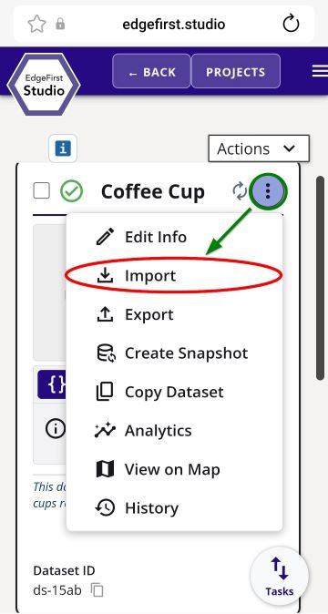
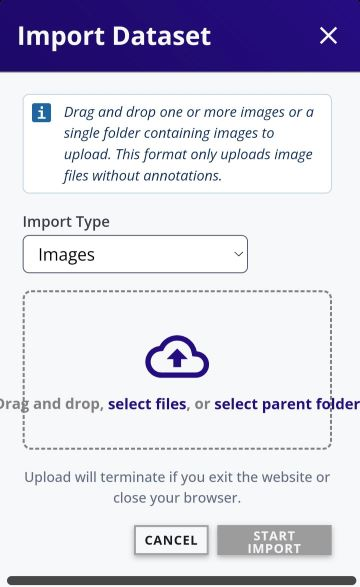
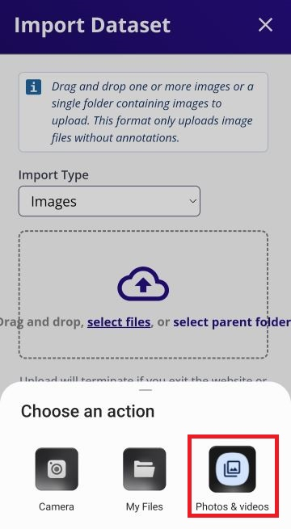
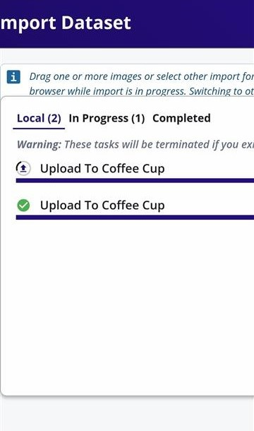

# Upload Images

!!! warning "HEIC is not fully supported"
    Recent Apple devices are seen to capture HEIC image formats by default.  This format has not been fully supported yet in EdgeFirst Studio.  Please make sure to use JPEGs, JPGs, or PNGs for uploading images to EdgeFirst Studio. 

Image files can be uploaded into any dataset container in EdgeFirst Studio.  Choose the dataset container to upload image files.  In this case, the dataset is called "Coffee Cup".  Click on the dataset context menu (three dots) and select import.

<figure markdown="span">
{ align=center }
<figcaption>Dataset Import Option</figcaption>
</figure>

This will bring you to the "Import Dataset" page.

<figure markdown="span">
{ align=center }
<figcaption>Dataset Import</figcaption>
</figure>

Click on "select files".  This will bring up the option to specify the location of the files.

<figure markdown="span">
{ align=center }
<figcaption>Android Mobile Media Picker</figcaption>
</figure>

In my current setup, I have selected "Photos & Videos" from the options above and then I have multi-selected the images I want to import by press and hold on a single image to enable multi-select.  To import, I pressed "Select".

<figure markdown="span">
{ align=center }
<figcaption>Android Multi-select Images</figcaption>
</figure>

Once the image files have been selected, the progress for the image import will be shown. 

<figure markdown="span">
{ align=center }
<figcaption>Image Import Progress</figcaption>
</figure>

Once it completes, you should see the number of images in the dataset increase by the amount of selected images.  If you do not see any changes, refresh your browser.

<figure markdown="span">
{ align=center }
<figcaption>Imported Images</figcaption>
</figure>