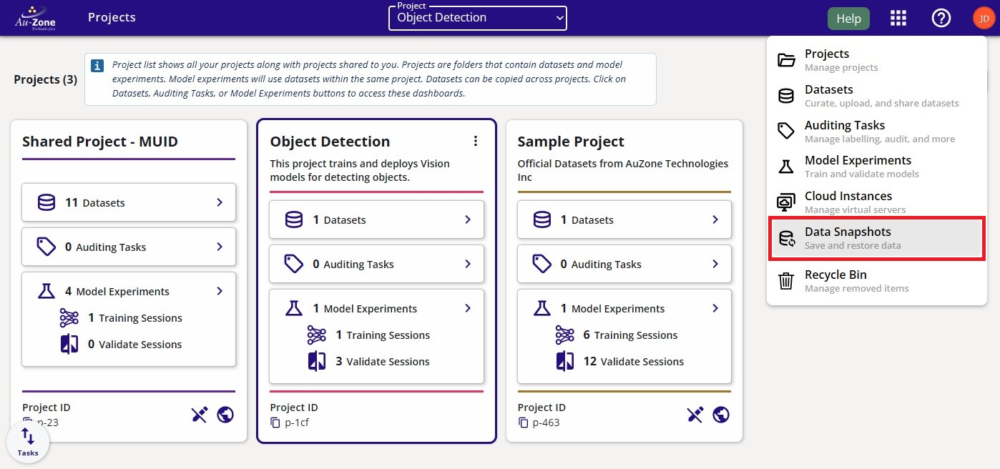
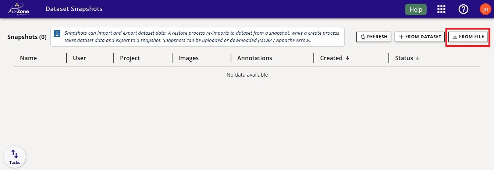
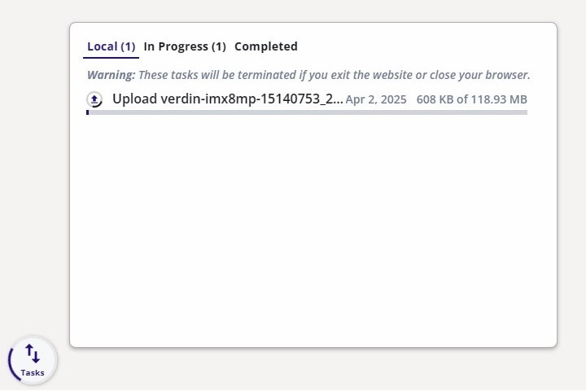
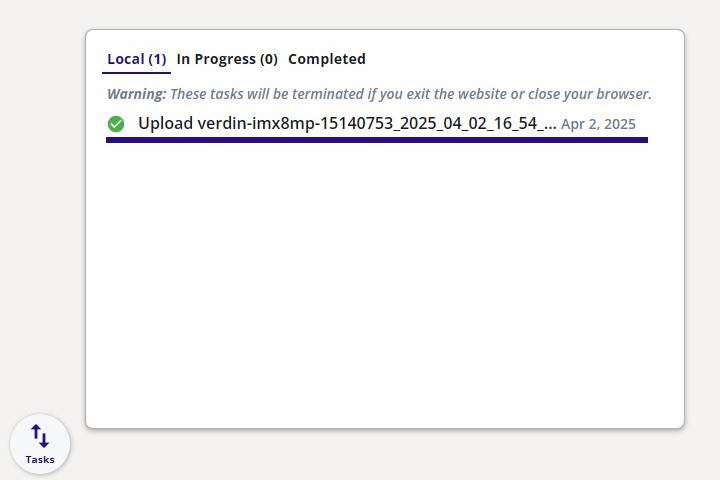

# Upload MCAP

To upload an MCAP Recording into EdgeFirst Studio, first [login][login] to EdgeFirst Studio.  Once logged in to EdgeFirst Studio, navigate to the "Data Snapshots" under the tool options. 

<figure markdown="span">
{ align=center }
<figcaption>Data Snapshots</figcaption>
</figure>

!!! note
    A project has already been created intended for object detection.  This step
    has been covered in [Getting Started](../../getting_started/create_project.md).

Once you are in the "Data Snapshots" page, upload the recorded MCAP by clicking "From File" which opens a new window dialog for selecting the MCAP downloaded in your PC.

!!! note "EdgeFirst Datasets"
    You can also drag and drop [EdgeFirst Datasets](../../datasets/format.md) Zip and Arrow files in the "Data Snapshots".

<figure markdown="span">
{ align=center }
<figcaption>Upload MCAP</figcaption>
</figure>

Once the MCAP file is selected, this would start the upload progress in EdgeFirst Studio.  This upload progress may take several minutes depending on the size of the MCAP. Once the upload is complete, the status will be shown like the figure on the right. 

**Upload Progress** | **Completed Upload** 
:------------------:|:------------------:
 | 

[login]: https://edgefirst.studio/login