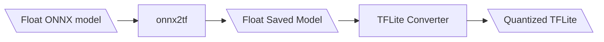

# TFLite Quantization

This guide explains how to quantize Float32 models to TensorFlow Lite (TFLite).  If you plan to deploy the model on a low-power embedded platform such as the NXP i.MX 8M Plus (≈5W), quantization enables efficient inference on the device’s NPU, improving performance and reducing power consumption.

## EdgeFirst Studio Quantization

Once training completes in EdgeFirst Studio, you can convert the SavedModel to TFLite with optional INT8 quantization, per-channel calibration, MLIR quantizer, and configurable split support.  Otherwise, if you are not using EdgeFirst Studio, you can manually quantize [Ultralytics](#manual-ultralytics-quantization-upstream) or [ModelPack](#manual-modelpack-quantization-upstream) models to TFLite.

1. Click on the completed training session

	{{ figure("/models/assets/training/vision-view-train-details.jpg", "Completed Training Session") }}

2. Navigate to the "Artifacts" tab and click on the "TFLite Converter" button under "Converters" on the right

	{{ figure("/models/assets/conversion/tflite-converter-button.jpg", "TFLite Converter") }}

3. Specify the conversion settings.  The Studio converter uses a custom quantization pipeline optimized for edge deployment:

    - **TF-wrapped box normalization**: Box coordinates are normalized to [0,1] inside the DFL decode computation, producing better INT8 accuracy than post-hoc normalization
    - **Split decoder**: Detection outputs are split into separate tensors (boxes, scores, and optionally mask coefficients and protos) so each gets independent per-tensor quantization scales
    - **Generator-based calibration**: Validation images are streamed one at a time for memory-efficient INT8 calibration (~1.3 GB peak RAM vs ~43 GB for upstream)
    - **Per-channel quantization**: Uses TensorFlow's MLIR quantizer for per-channel weight quantization

    Click on "Start App" to start the conversion process

    {{ figure("/models/assets/conversion/tflite-converter-options.jpg", "TFLite Converter Options") }}

### Reference Accuracy

YOLOv8n on COCO val2017 (5000 images, 80 classes, 640x640 RGB input).  Validated with [edgefirst-validator](../../models/validation/vision/user_managed.md):

**Detection (YOLOv8n)**

| Model | mAP@0.5 | mAP@0.5-0.95 | Mean Recall |
|-------|---------|--------------|-------------|
| ONNX float32 | 50.2% | 35.75% | 46.64% |
| TFLite INT8 (EdgeFirst, 10% calibration) | 46.89% | 31.68% | 43.84% |
| TFLite INT8 (upstream full_integer_quant) | 47.51% | 32.03% | 43.83% |

**Instance Segmentation (YOLOv8n-seg)**

| Model | Det mAP@0.5 | Det mAP@0.5-0.95 | Mask mAP@0.5 | Mask mAP@0.5-0.95 |
|-------|-------------|------------------|--------------|-------------------|
| TFLite INT8 (EdgeFirst, 10% calibration) | 41.68% | 27.83% | 40.37% | 24.62% |

EdgeFirst Studio quantized models use split decoder outputs and [0,1] normalized box coordinates for both detection and segmentation. Detection models produce 2 outputs (boxes, scores); segmentation models produce 4 (boxes, scores, mask_coefs, protos). See [Model Metadata](../../models/metadata.md#post-processing-two-layer-outputs) for details.

### Output Format

All Studio-exported TFLite INT8 models use:

- **uint8 input** (raw pixel values)
- **int8 output** with per-tensor quantization scales
- **[0,1] normalized** box coordinates (`normalized: true` in [metadata](../../models/metadata.md#box-coordinate-format-normalized))
- **Split decoder** for per-tensor INT8 quantization of each output component

## Manual Ultralytics Quantization (Upstream)

If you are not using EdgeFirst Studio, you can export a quantized TFLite using the upstream Ultralytics CLI. This uses Ultralytics' built-in export pipeline with `onnx2tf` integrated quantization.

1. Using a command prompt, install the [Ultralytics Framework](https://docs.ultralytics.com/modes/export/)

    ```shell
    $ pip install ultralytics
    ```

2. Download the PyTorch model from Ultralytics

    ```shell
    $ wget https://github.com/ultralytics/assets/releases/download/v8.3.0/yolov8s-seg.pt
    ```

    !!! note "List of Models"
        Here is a list of models that can be fetched from Ultralytics.

        **Detection**
        
        * Nano: "yolov8n.pt"
        * Small: "yolov8s.pt"
        * Medium: "yolov8m.pt"
        * Large: "yolov8l.pt"
        * X: "yolov8x.pt"

        **Segmentation**

        * Nano: "yolov8n-seg.pt"
        * Small: "yolov8s-seg.pt"
        * Medium: "yolov8m-seg.pt"
        * Large: "yolov8l-seg.pt"
        * X: "yolov8x-seg.pt"

3. Convert the PyTorch models to TFLite with the following command

    ```shell
    $ yolo export model=path/to/model.pt format=tflite int8=True
    ```

4. This conversion will generate a SavedModel `yolov8s_saved_model` which contains the quantized TFLite file `yolov8s_full_integer_quant.tflite`.

    !!! warning "Upstream Quantization Limitations"
        The upstream `yolo export` command loads the entire calibration dataset into memory (can exceed 40 GB for large datasets) and produces a monolithic output tensor where boxes and scores share a single quantization scale.  EdgeFirst Studio's custom pipeline addresses both issues with generator-based calibration and split decoder outputs.

    !!! info "Deployment in the i.MX 95 Platform"
        If you plan to deploy a TFLite model on the i.MX 95 EVK Platform, you will need to convert the model to use the Neutron delegate in the platform.  To convert the model, you will need to use the Neutron Converter in NXP's EIQ portal by following the [iMX.95 Neutron Model Conversion instructions](../../models/conversion/neutron.md).

5. Once you have a quantized TFLite, you can follow these instructions for [Deploying Models on the Target](../../models/ultralytics/npu.md).

## Manual ModelPack Quantization (Upstream)

If you are not using EdgeFirst Studio, you can export a quantized TFLite using the `onnx2tf` pipeline as shown. 

Follow along this tutorial to convert your ModelPack Float32 ONNX model into a quantized TFLite.  If you do not have a model available, you can click and download this sample model [coffeecup-modelpack-multitask-t-1f54.onnx](../../models/modelpack/assets/coffeecup-modelpack-multitask-t-1f54.onnx){: download="coffeecup-modelpack-multitask-t-1f54.onnx"} which is needed for this tutorial.

The steps for this conversion process are shown below.



1. Open a command prompt in your PC.

2. Install the following required [dependencies](../../models/modelpack/assets/requirements.txt){: download="requirements.txt"}.

    !!! tip
        You can download the file "requirements.txt" that lists the required dependencies and run `pip install -r requirements.txt` to install these packages.  Otherwise, run each package installation line by line as shown below.

    ```shell
    pip install onnx2tf==1.28.2
    pip install tf_keras==2.19.0
    pip install onnx==1.18.0 
    pip install onnx_graphsurgeon==0.5.8
    pip install psutil==7.0.0
    pip install ai-edge-litert==1.4.0 
    pip install sng4onnx==1.0.4
    pip install tensorflow==2.19.1
    pip install opencv-python==4.12.0.88
    pip install numpy==2.1.3
    ```

    These were the versions of the libraries that were used.

    ```shell
    onnx2tf                      1.28.2
    tf_keras                     2.19.0
    onnx                         1.18.0 
    onnx_graphsurgeon            0.5.8
    psutil                       7.0.0
    ai-edge-litert               1.4.0 
    sng4onnx                     1.0.4
    tensorflow                   2.19.1
    opencv-python                4.12.0.88
    numpy                        2.1.3
    ```

3. Export the ONNX model to TensorFlow saved model.

    `onnx2tf -i path/to/mymodel.onnx -o model_tf --non_verbose`

4. Run the TFLite [converter script](../../models/modelpack/assets/converter.py){: download="converter.py"} below using TensorFlow with this command `python3 converter.py`.

    !!! tip "Download the Python script"
        Download the Python script by clicking on the link above. 

    !!! note "Prepare a set of images"
        This process also requires sample images needed during quantization.
        You can click on the link and download these [set of images with coffee cup samples](../../models/modelpack/assets/coffeecup.zip){: download="coffeecup.zip"} for quantizing a
        coffee cup model as shown in this tutorial.  Unzip this file into a directory.

    !!! note "Modify the file paths"
        In this script, the path to the images and the model are set to the following.  Also ensure that the model input shape is set to the correct dimensions.

        ```python
        model_path = "model_tf" # Path to the TensorFlow saved mdoel
        images_path = "coffeecup/*.jpg" # Conversion requires image samples for quantization.
        input_shape = (480, 270) # Model (width, height) input shape.
        output_path = "coffeecup-modelpack-multitask-t-1f54.tflite" # Path to save the TFLite model. 
        ```

        Make sure to modify these paths specific to your setup. 

    === "converter.py"

        ```python 
        import tensorflow as tf
        import numpy as np
        import glob
        import cv2

        model_path = "model_tf" # Path to the TensorFlow saved mdoel
        images_path = "coffeecup/*.jpg" # Conversion requires image samples for quantization.
        input_shape = (480, 270) # Model (width, height) input shape.
        output_path = "coffeecup-modelpack-multitask-t-1f54.tflite" # Path to save the TFLite model. 

        def representative_data_gen():
            images = glob.glob(images_path)

            for image in images:
                image = cv2.imread(image)
                image = cv2.resize(image, input_shape)
                image = cv2.cvtColor(image, cv2.COLOR_BGR2RGB)
                image = image.astype(np.float32)
                image = image / 255.0
                image = np.expand_dims(image, axis=0)
                yield [image]

        converter = tf.lite.TFLiteConverter.from_saved_model(model_path)
        converter.optimizations = [tf.lite.Optimize.DEFAULT]
        converter.representative_dataset = representative_data_gen
        converter.target_spec.supported_ops = [tf.lite.OpsSet.TFLITE_BUILTINS_INT8]
        converter.inference_input_type = tf.uint8
        converter.inference_output_type = tf.uint8

        tflite_model = converter.convert()
        with open(output_path, "wb") as f:
            f.write(tflite_model)
        ```

5. Once you have a quantized TFLite, you can follow these instructions for [Deploying Models on the Target](../../models/modelpack/npu.md).
