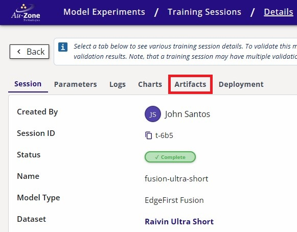
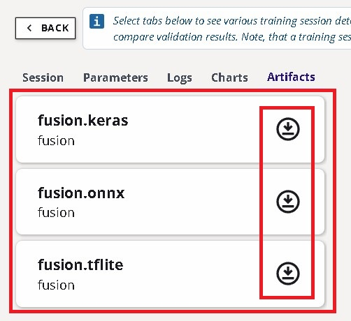

# Download the Model

Download the model from EdgeFirst Studio into the device.  There are two methods for downloading the model.  The first method is to download the model from EdgeFirst Studio and then SCP the model file to the device.  The second method is to use the EdgeFirst Client to download the model directly in the device.

=== "Download using SCP"

    As mentioned under the [Training Outcomes](../../models/training/vision.md#training-outcomes) section, the trained models can be downloaded by clicking the "View Additional Details" button on the training session card in EdgeFirst Studio. 

    {{ figure("/models/assets/training/fusion-training-session-attributes.jpg", "Training Session Attributes") }}

    This will open the session details and the models are listed under the "Artifacts" tab as shown below.  Click on the downward arrow indicated in red to download the models to your PC.  In this example, you will be deploying the TFLite model in the device.

    | Session Details                                                | Artifacts                                                                     |
    |----------------------------------------------------------------|-------------------------------------------------------------------------------|
    |  |  | 

    !!! note "Deployment Tab"
        You may have noticed the "Deployment" tab to the right of the "Artifacts" tab. This is a placeholder for future functionality, so please don't worry about it.

    Once the model is downloaded in your PC, you can [SCP](../../platforms/networking/ssh.md#secure-copy) the model to the device by using this command template.

    ```shell
    scp <path to the downloaded TFLite model> <destination path>
    ```

    An example command is shown below.

    ```shell
    scp modelpack.tflite torizon@verdin-imx8mp-15140753:~
    ```

=== "Download using EdgeFirst Client"

    This method expects you to have already connected to the device via [SSH](../../platforms/networking/ssh.md).  The [EdgeFirst Client](../../perception/studio.md) can be installed via `pip3 install edgefirst-client`.  You can verify the installation with the client version command.

    ```shell
    $ edgefirst-client version
    EdgeFirst Studio Server: 3.7.8-a50429e Client: 1.3.3
    ```

    Next login to EdgeFirst Studio with the command.

    ```shell
    $ edgefirst-client login
    Username: user
    Password: ****
    ```

    You can download the model on the device using the `download-artifact` command as shown below.

    ```shell
    edgefirst-client download-artifact <session ID> <model name>
    ```

    For example `edgefirst-client download-artifact 3928 fusion.tflite`. This command will download to the current working directory.

    The `download-artifact` expects three arguments.

    * session ID: Pass the trainer or validation integer session ID associated with the models.
    * model name: Pass the specific model that will be downloaded to the device.  Usually this is `mymodel.tflite`.

    You can find more information on using the [EdgeFirst Client](../../perception/studio.md) in the command line.
