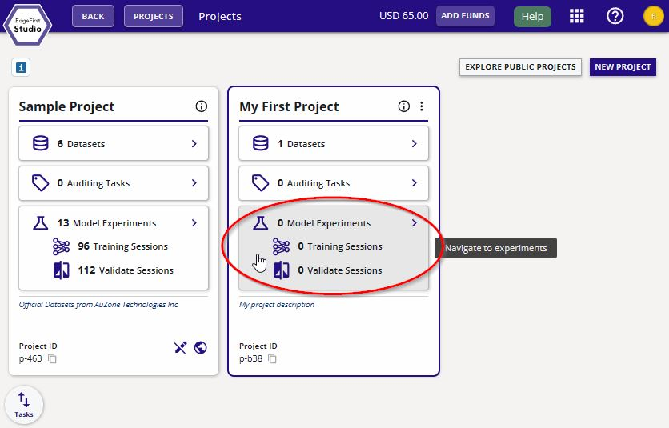
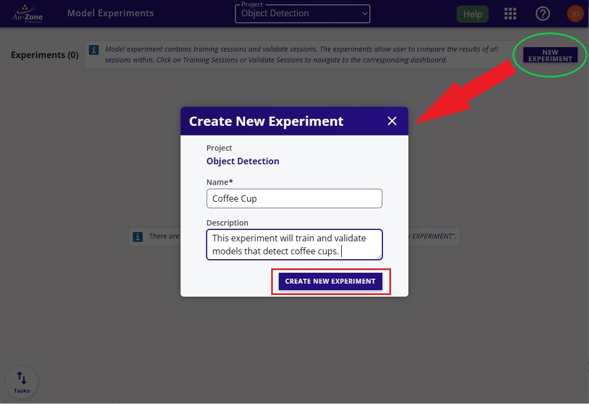
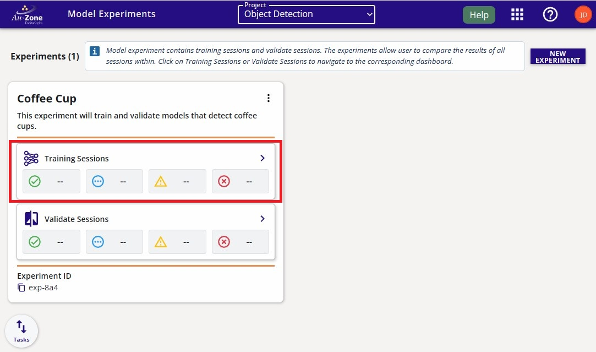
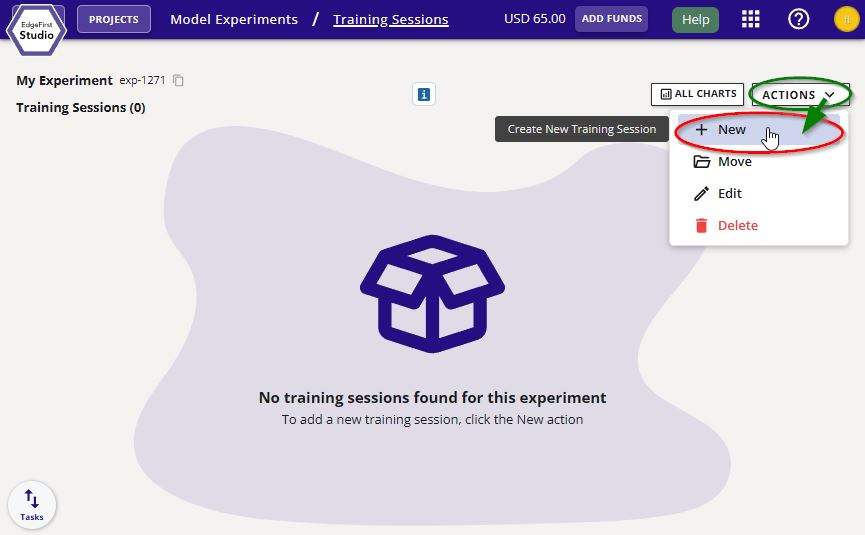
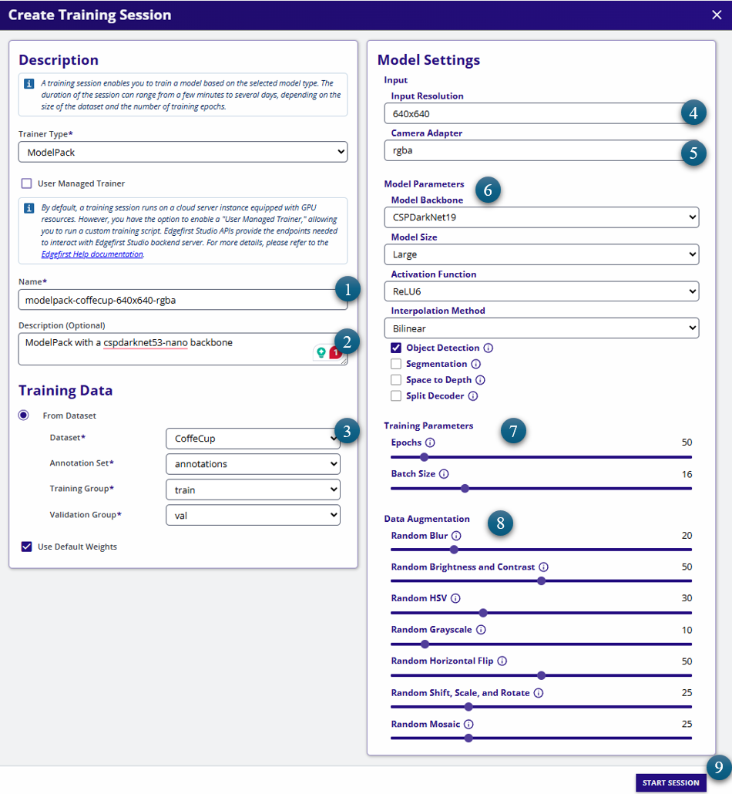
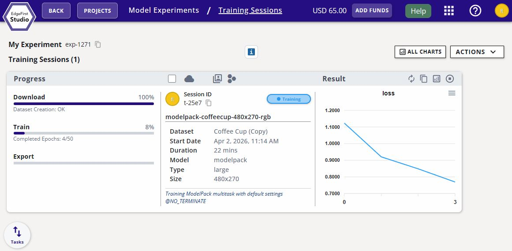
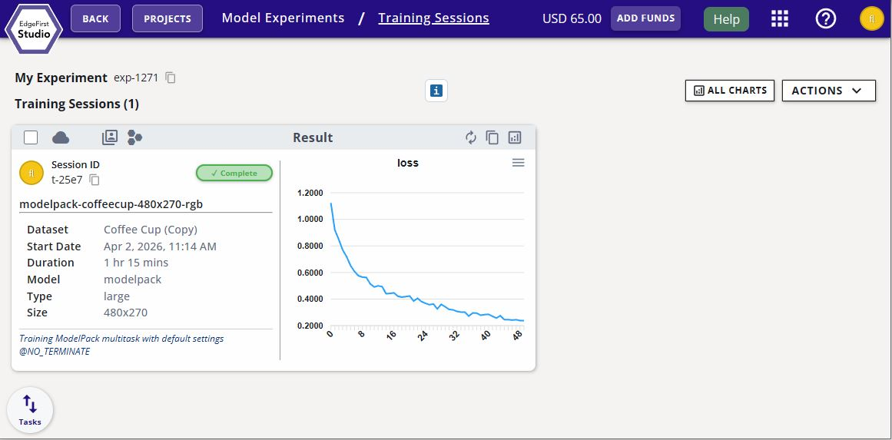
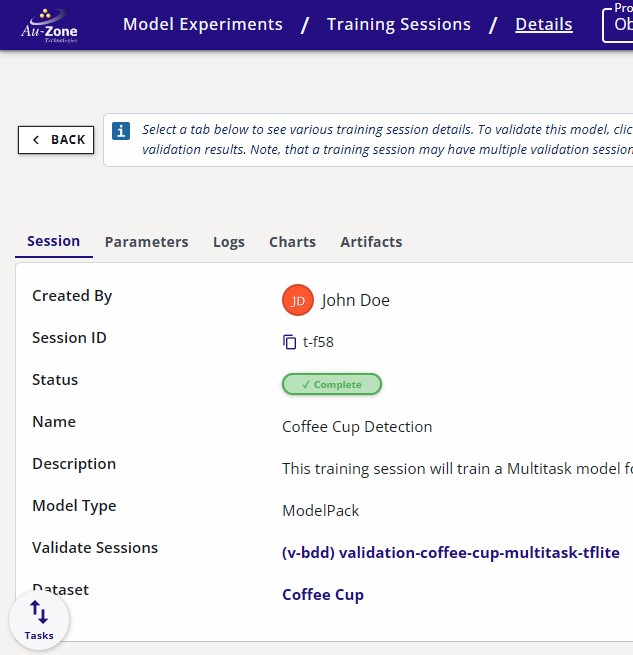
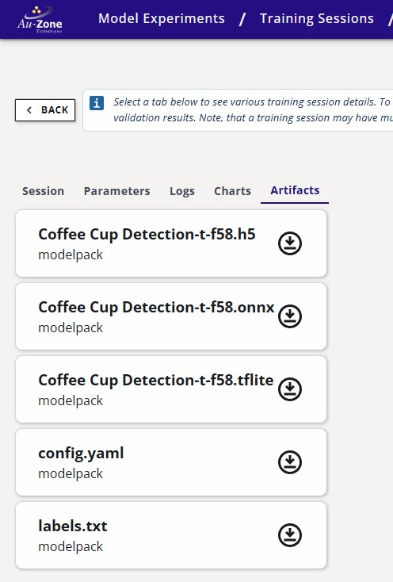

# Train Vision Model

Now that you have a fully annotated dataset that is split into training and validation samples, you can start training a Vision model.  This will briefly show the steps for training a model, but for an in depth tutorial, please see [Training Vision Models](../../models/training/vision.md).

Navigate back to the "Projects" page.  You can go back to the "Projects" page by clicking the Apps Menu waffle button on the top right of the Navigation bar.  Click the first selection to take you to the "Projects page".

<figure markdown="span">
{ align=center }
<figcaption>Apps Menu</figcaption>
</figure>

From the "Projects" page, click on "Model Experiments" of your project. 

<figure markdown="span">
{ align=center }
<figcaption>Model Experiments Page</figcaption>
</figure>

Create a new experiment by clicking "New Experiment" on the top right corner.  Enter the name the description of this experiment.  Click "Create New Experiment".

<figure markdown="span">
{ align=center }
<figcaption>Model Experiments Page</figcaption>
</figure>

Navigate to the "Training Sessions".

<figure markdown="span">
{ align=center }
<figcaption>Training Sessions</figcaption>
</figure>

Create a new training session by clicking on the "New Session" button on the top right corner.

<figure markdown="span">
{ align=center }
<figcaption>New Session Button</figcaption>
</figure>

Follow the settings indicated and keep the rest of the settings by their default.  Click "Start Session" to start the training session. 

!!! warning "Session Name"
    Do not include any forward slash "/" in the session names as this can result in missing model artifacts.

<figure markdown="span">
{ align=center }
<figcaption>Start Training Session</figcaption>
</figure>

!!! warning "No Datasets Available"

    In case there are no datasets visible on the dropdown (3).  Please refresh your browser.

The session progress will be shown like the following below.

<figure markdown="span">
{ align=center }
<figcaption>Training Session Progress</figcaption>
</figure>

Once completed the session card will appear like the following below.

<figure markdown="span">
{ align=center }
<figcaption>Completed Session</figcaption>
</figure>

On the train session card, expand the session details.

<figure markdown="span">
{ align=center }
<figcaption>Training Details</figcaption>
</figure>

The trained models will be listed under "Artifacts".  

| Session Details                                                | Artifacts                                                                     |
|----------------------------------------------------------------|-------------------------------------------------------------------------------|
|  |  | 
