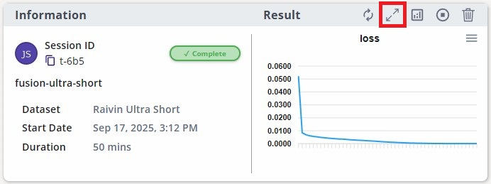
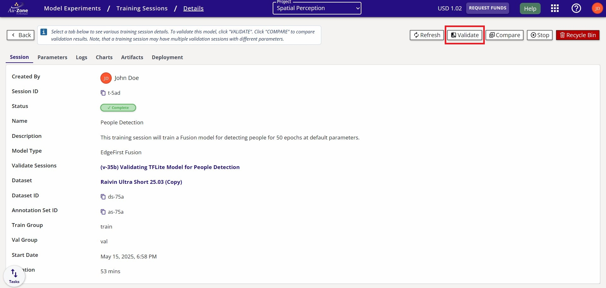
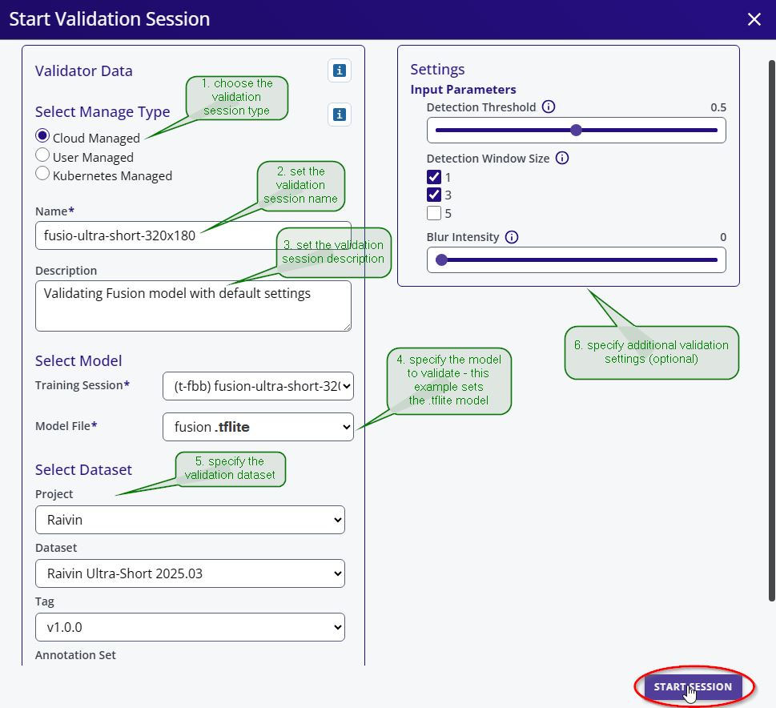
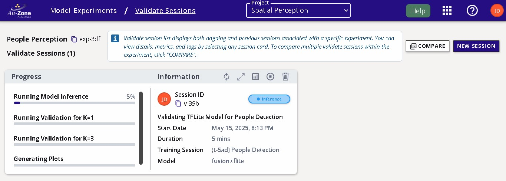
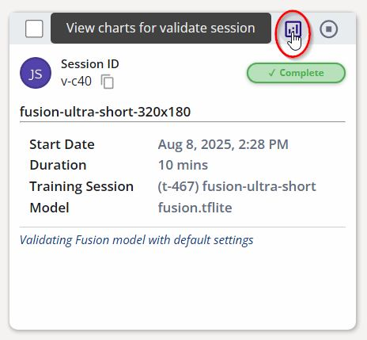
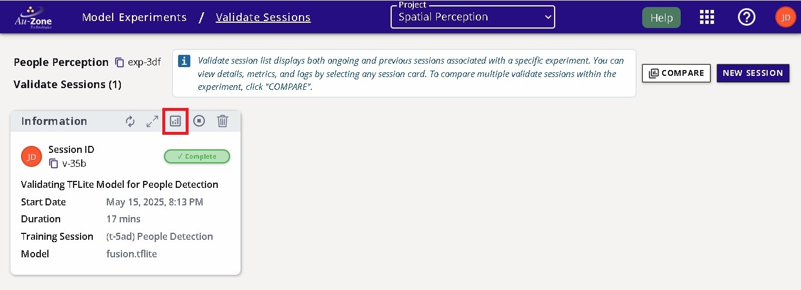
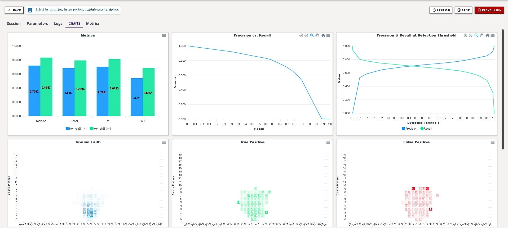

# Validate Fusion Model

Now that you have trained a Fusion model, you can now start validating your model.  This will briefly show the steps for validating a model, but for an in depth tutorial, please see [Validating Fusion Models](../../models/validation/fusion/managed.md).

On the train session card, expand the session details.

<figure markdown="span">
{ align=center }
<figcaption>Training Details</figcaption>
</figure>

Click the "Validate" button.

<figure markdown="span">
{ align=center }
<figcaption>Create Validation Session</figcaption>
</figure>

Specify the name of the validation session and the model and the dataset for validation.  The rest of the settings were kept as defaults.  Click "Start Session" at the bottom to start the validation session.

<figure markdown="span">
{ align=center }
<figcaption>Start Validation Session</figcaption>
</figure>

The validation session progress will appear in the "Validation" page as shown below.

<figure markdown="span">
{ align=center }
<figcaption>Validation Progress</figcaption>
</figure>

Once completed the session card will appear like the following below.

<figure markdown="span">
{ align=center }
<figcaption>Completed Session</figcaption>
</figure>

The validation metrics are displayed as charts which can be found by clicking the validation charts.

<figure markdown="span">
{ align=center }
<figcaption>Validation Charts Button</figcaption>
</figure>

<figure markdown="span">
{ align=center }
<figcaption>Validation Charts</figcaption>
</figure>
