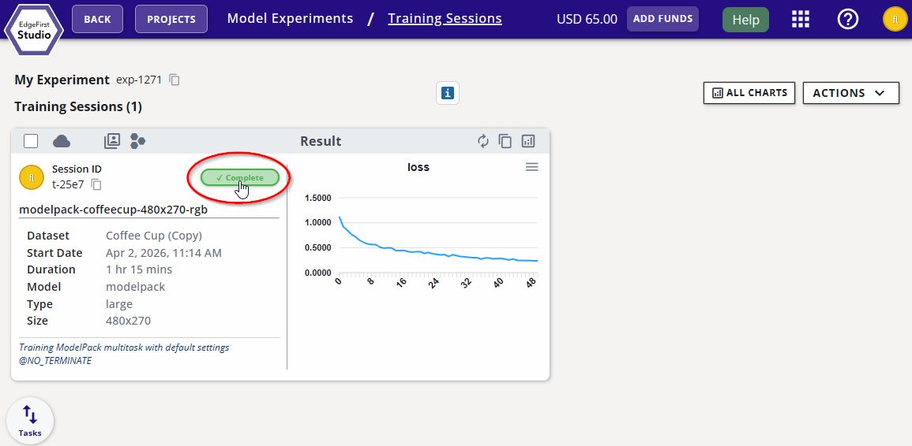
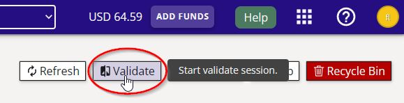
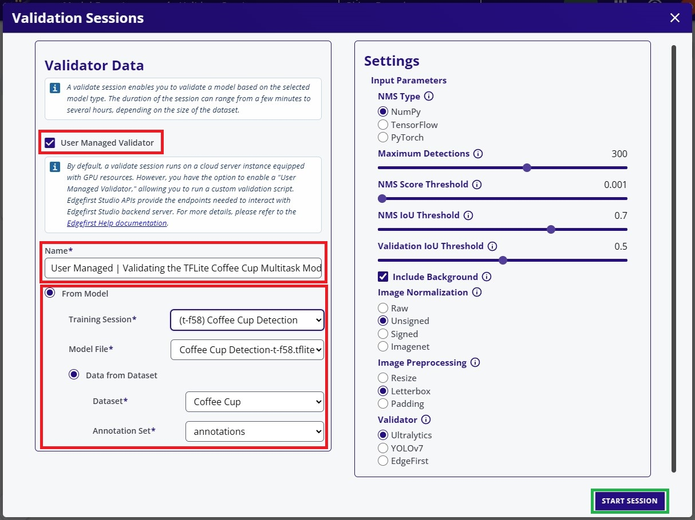
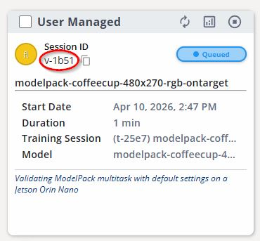
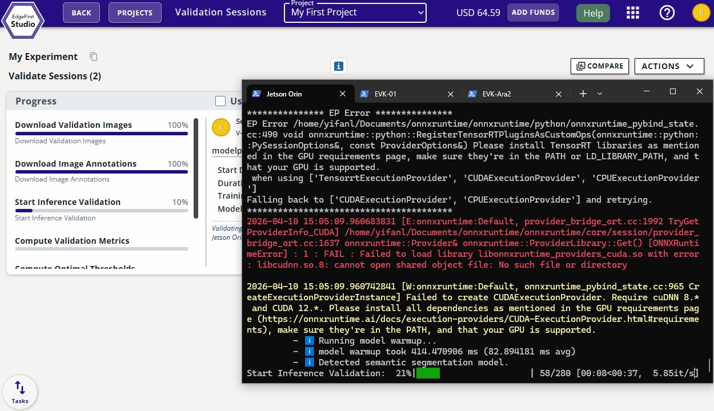
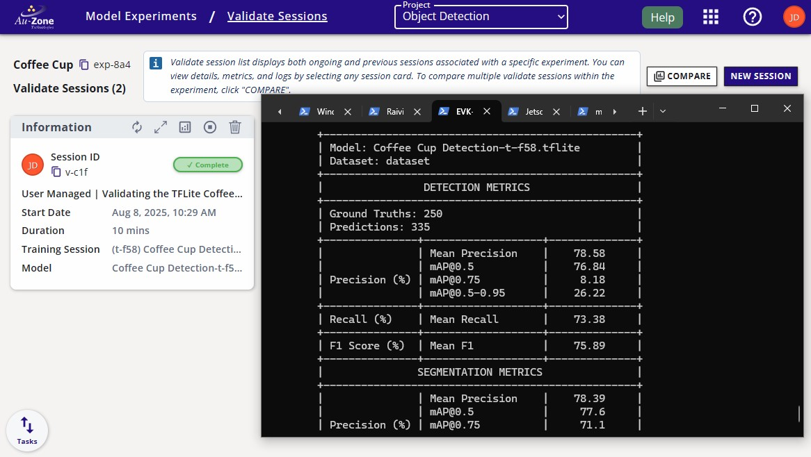
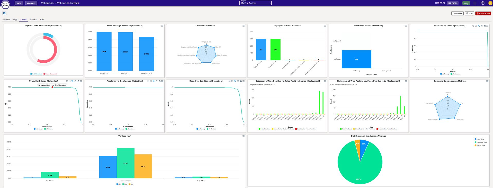

# Validate Vision Model

Now that you have trained a model, you can validate the model's performance on target by following the instructions of this page.

On the training session card, expand the session details.

<figure markdown="span">
{ align=center }
<figcaption>Training Details</figcaption>
</figure>

On the top right corner of the page, click on the "validate" button as indicated.

<figure markdown="span">
{ align=center }
<figcaption>Validate Button</figcaption>
</figure>

Select the "User Managed" option. Specify the name of the validation session and the model and the dataset for validation.  The rest of the settings were kept as defaults.  Click "Start Session" at the bottom to start the validation session.

<figure markdown="span">
{ align=center }
<figcaption>Start Validation Session</figcaption>
</figure>

The validation session card will appear like the following below.  Each session has a session ID.  Make a note of the session ID circled in red below.  In this case it is `v-c1f`.

<figure markdown="span">
{ align=center }
<figcaption>Validation Session ID</figcaption>
</figure>

Once the validation session has been created, [SSH](../../platforms/networking/ssh.md) into the platform and install the following dependencies.

!!! warning "Virtual Environment"
    To avoid re-installation of existing system packages, we recommend setting up a [Python virtual environment](https://docs.python.org/3/library/venv.html#creating-virtual-environments)
    prior to running the pip installations below.  Append `--system-site-packages` when creating the environment to include existing packages in the system.  For example:

    * Linux `python3 -m venv /path/to/myvenv --system-site-packages`
    * Windows `python -m venv /path/to/myenv --system-site-packages`

    Activate the environment via:

    * Linux: `source /path/to/myenv/bin/activate`
    * Windows: `/path/to/myenv/Scripts/activate`

```shell
pip install edgefirst-validator
```

Next login to your account in EdgeFirst Studio by using the [EdgeFirst Client](../../perception/studio.md) which comes installed with the validator package. The command below will prompt you to enter your EdgeFirst Studio credentials.

```shell
edgefirst-client login
```

Once the validator is installed and authenticated, run validation using the following command.  Replace the session ID specific to your session card.

```shell
edgefirst-validator --session-id v-c1f
```

!!! note
    Replace the session ID parameter specific to the validation session ID in your session.

If the model already exists in your system, you can run this command `edgefirst-validator /path/to/mymodel.tflite --session-id v-c1f`.  Otherwise, the model will be downloaded as an artifact from the EdgeFirst Studio training session.

Once entered, the following validation progress should now be indicated in EdgeFirst Studio as shown below.

<figure markdown="span">
{ align=center }
<figcaption>Validation Session</figcaption>
</figure>

The completed session will look as follows with the status set to "Complete".

<figure markdown="span">
{ align=center }
<figcaption>Completed Session</figcaption>
</figure>

Once the validation session completes, you can view the validation metrics by clicking the "View Validation Charts" button at the top of the session card.

<figure markdown="span">
{ align=center }
<figcaption>Validation Charts</figcaption>
</figure>

Now that you have validated the performance of the model, you can move forward to deploying the model on target.
