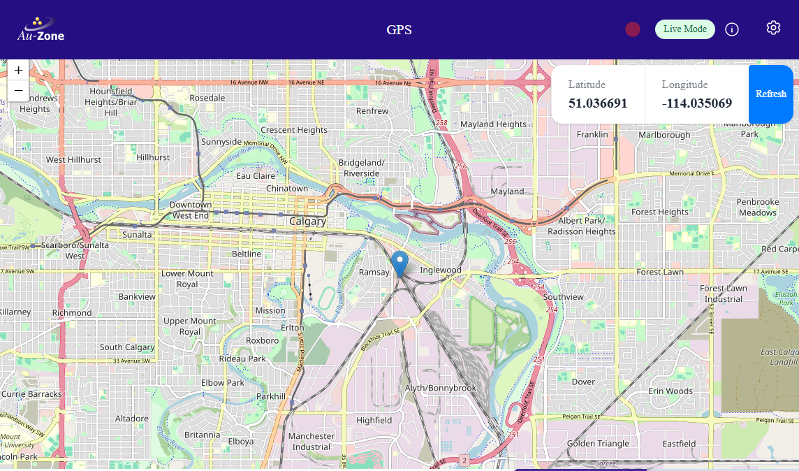
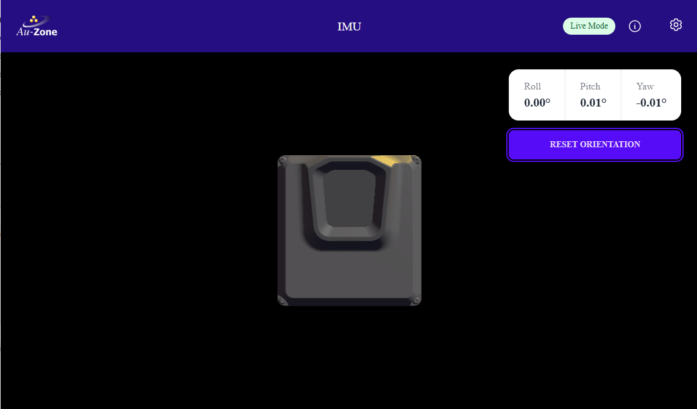

# The GPS Page

The GPS page shows an interactive map centered on the device's location.  

<figure markdown="span">
{align=center}
<figcaption>GPS Page</figcaption>
</figure>

This should be familiar to anyone who has used standard map web interfaces.  The map can be moved by dragging with left-mouse button (or touch with a touchscreen-enabled device).  The "+" and "-" buttons on the left will zoom-in and zoom-out on the map.  The "Refresh" button will re-center the map on the device's location.  The latitude and longitude are also reported on the web interface.

# The IMU Page

The IMU page shows the device's orientation in 3D.  

<figure markdown="span">
{align=center}
<figcaption>IMU Page</figcaption>
</figure>

By physically moving the device, it's virtual counterpart should move the same way.  Roll, pitch, and yaw values are reported.  If the device's virtual orientation does not match the physical orientation, keep the device's bottom flat and hit the "Reset Orientation" button.
