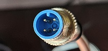
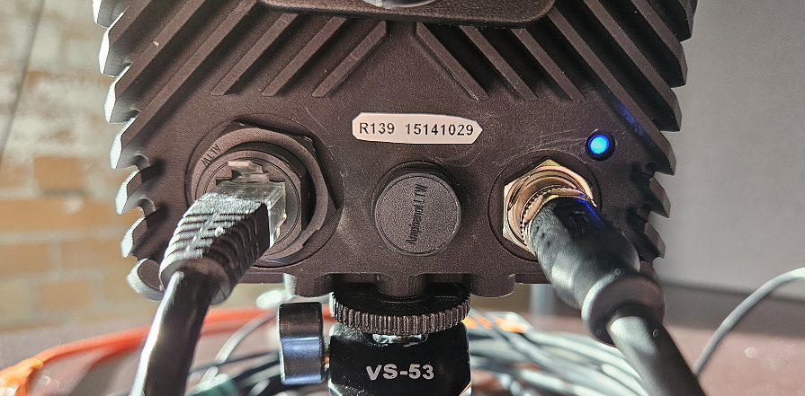

# Connecting the Device

If you wish to mount your device to the tripod, it should be done now before connecting any of the other cables.  There are three mount points on the bottom of the device and one on each side.  Screw the tripod into the center bottom mount point.

Next, connect a standard Category 5 network cable (not included) from your shared network into the device.

Optionally, you can connect an antenna to the SMA connector on the top-right corner of the back of the device to enhance GPS reception.

Chose the proper power adapter plug from your region and connect it to the power cable.  Then connect the M12 connector of the power cable to the connection at the back of the module, making sure to align the tab at the top of the connector to its corresponding slot.  

<figure markdown="span">
{align=center}
<figcaption>M12 Connector</figcaption>
</figure>

The device should boot up as soon as it is connected.  A blue light above and to the right of the power connector should start blinking.  

<figure markdown="span">
{align=center}
<figcaption>Device showing network connection (left), eight-digit ID number (middle), tripod connected (bottom), and power connection with blue status light on (right)</figcaption>
</figure>

!!! Danger
    The Raivin may get hot during operation.  Do not handle while operating.  Temperature can be measured with the `cat /dev/carrier_temp` command, which will output device temperature in millidegree Celsius.
