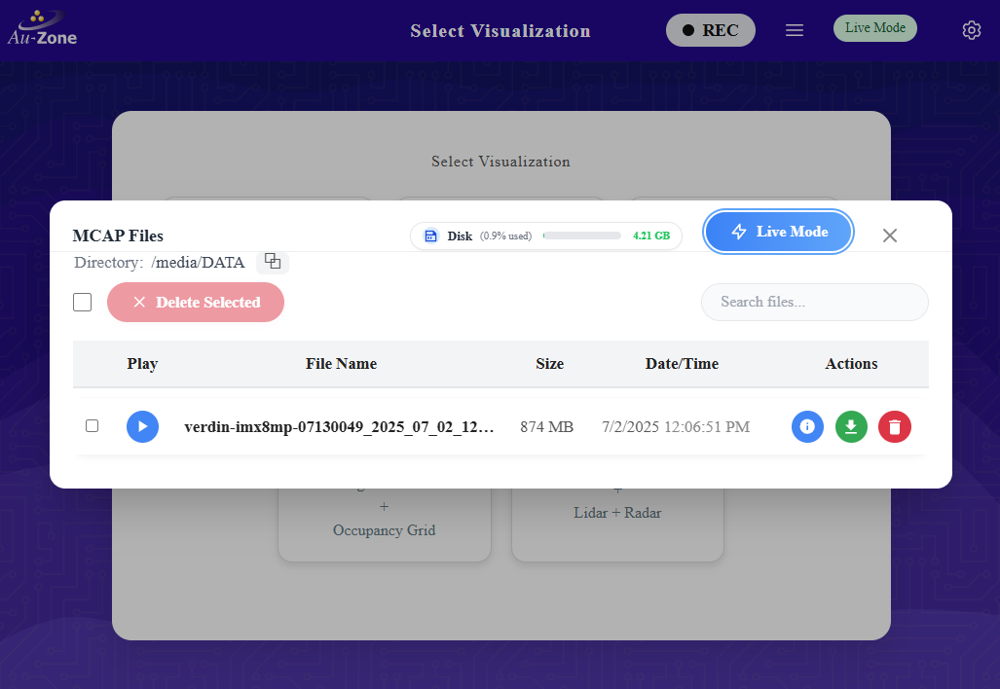
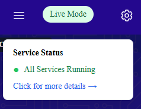
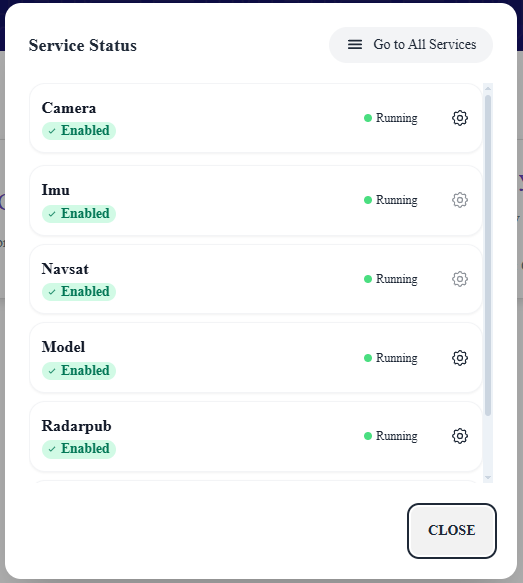

# The Top Ribbon

The ribbon at the top of the web interface is available on every page of the web interface.  The following six elements are available on every page of the device's web interface.

1. On the left, the "Home" button with the Au-Zone icon, which will return the user to the Main Page
2. In the middle, the title of the current page
3. On the right side, we first have the Recording Indicator, shown as a gray oval with "REC" when not recording from the sensors and a red oval when recording
4. The MCAP Details Modal button, which opens the MCAP Modal
5. The System Status Indicator and Dropdown button
6. The farthest rightmost button, with the gear icon, is the Settings Button which will take you to the [Settings Page](../../platforms/configuration/index.md)

# The MCAP Modal

The MCAP Modal is the interface to manage MCAP recordings, including getting information about recorded MCAP files, disk usage, deletion and downloading files.  More information about the MCAP Modal and recording MCAPs is in the [Recording section](../../perception/data_collection/recording.md)

<figure markdown="span">
{align=center}  
<figcaption>A recorded MCAP file</figcaption>
</figure>

# System Status Indicator

Mousing over the System Status Indicator field will give a brief summary of any problems.  

<figure markdown="span">
{align=center}  
<figcaption>Everything is good!</figcaption>
</figure>

<figure markdown="span">
{align=center}  
<figcaption>The Radar Publishing service is down.</figcaption>
</figure>

More on these status can be found in the [Status Monitoring section](../../perception/data_collection/replay.md#status-monitoring).

Clicking on the indicator will bring up the Service Status Modal, which contains a list of services and, if available, clickable gear icons that link to the service's configuration page.

<figure markdown="span">
{align=center}  
<figcaption>Service Status Modal</figcaption>
</figure>
