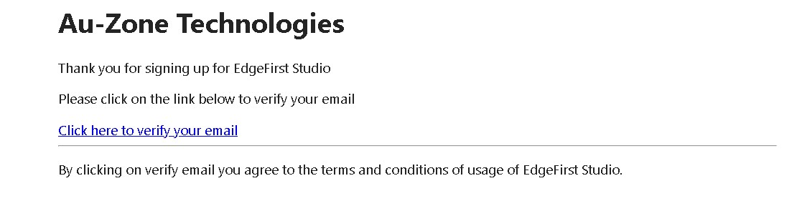

# Sign Up 

1. If you haven't already created an EdgeFirst Studio Account, start by [creating an account][signup].  If you've already created an account, but you [forget your password](../studio/user/profile.md#forgot-password), click on the link for instructions to reset your password.

2. When creating your account, enter the required fields denoted by the asterisk (*) and then create your account once completed.

    <figure markdown="span">
    { align=center }
    <figcaption>Create a New Account</figcaption>
    </figure>

    When you first sign up to EdgeFirst Studio, you will also automatically create your own organization.  You can specify the name of your organization when you first sign up denoted by the "Organization" field.  An organization allows multiple users to access your projects, but at the start, you will be the only user in your organization.  However, you can create multiple users/profiles in your organization to allow collaboration between members in your team.  In this way, multiple members can be assigned to your organization.  You can find more information for [managing your organization](../studio/user/organization.md).

    A new organization is given $20.00 worth of credits to allow trials of the features in EdgeFirst Studio.  The credits in the organization will be shared amongst the members.  You can find more information on the [billing details](../studio/user/billing.md). 

3. An email will be sent to verify the email you provided.  Go ahead and click on the link provided to verify your email.

    <figure markdown="span">
    { align=center }
    <figcaption>Email Verification</figcaption>
    </figure>

4. Once the email is verified, you can now [login][login] to EdgeFirst Studio.

[signup]: https://stage.edgefirst.studio/#/signup
[login]: https://stage.edgefirst.studio/#/login