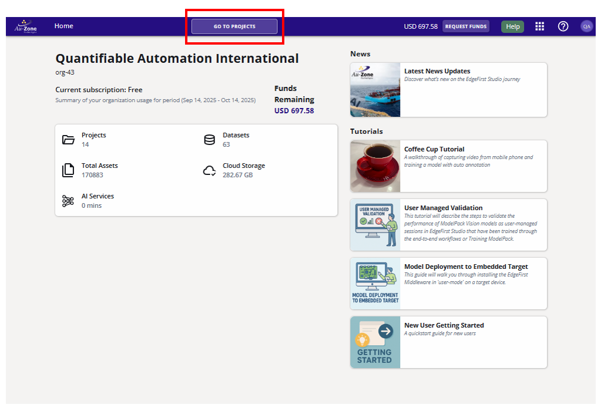
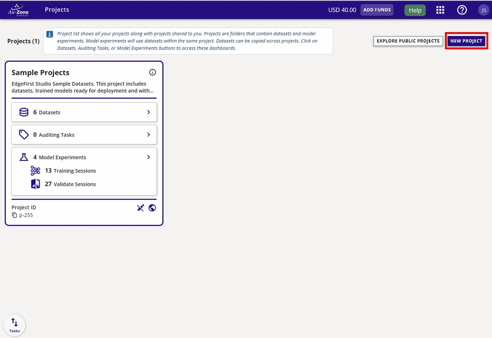
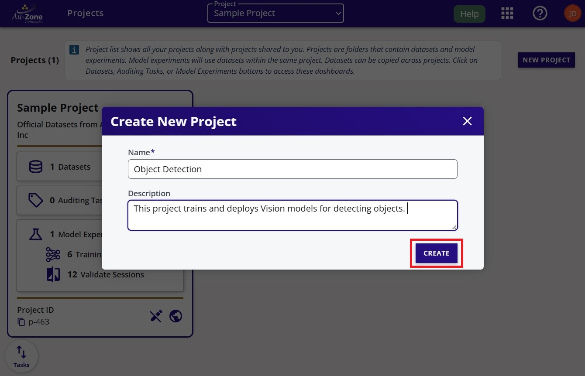

# Create Project

1. From the [User Home Page](../../studio/home.md) screen, click the "Go To Projects" button.

    <figure markdown="span">
    { align=center }
    <figcaption>The location of the "Projects" button</figcaption>
    </figure>

2. Now that you are in the "Projects" page, create your first project by clicking on the "New Project" button on the top-right corner of the page.

    <figure markdown="span">
    { align=center }
    <figcaption>The location of the "New Project" button</figcaption>
    </figure>

3. Provide a name and a description of the project as shown in the example below.  Click the "Create" button to create your new project.

    <figure markdown="span">
    { align=center }
    <figcaption>Project Details</figcaption>
    </figure>

4. Your created project will be shown like the example below.  

    <figure markdown="span">
    { align=center }
    <figcaption>Both Projects</figcaption>
    </figure>
    