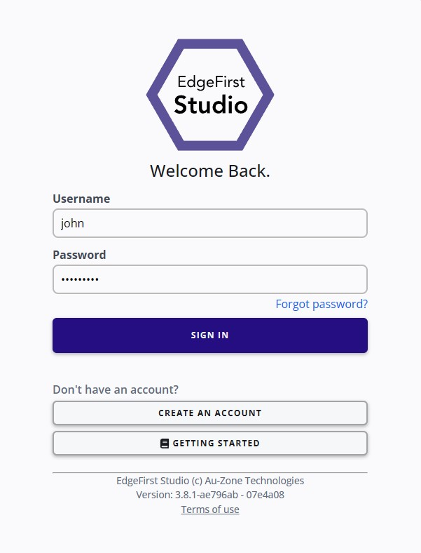
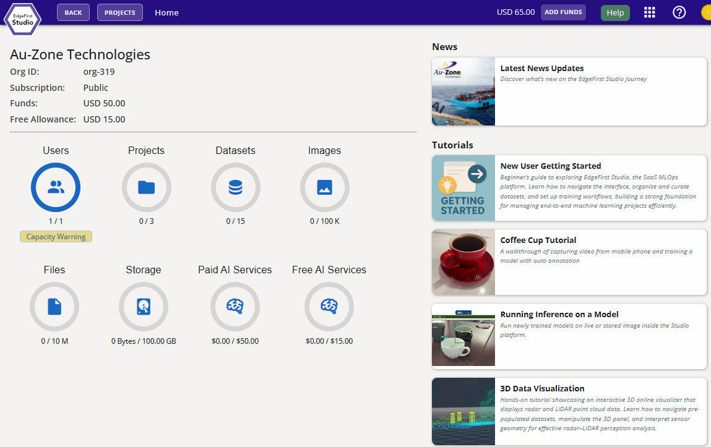

Once you've signed up for EdgeFirst Studio, you can log in to begin.

!!! warning "Verification Email"
    If you log in but your credentials are not accepted, you may not have clicked the "Verify Email" link in the email.  Please confirm you have done this.

1. When logging in, enter your username and password you specified.  Next click the "Sign In" button to sign in.

    <figure markdown="span">
    { align=center }
    <figcaption>Login Page</figcaption>
    </figure>

2. Once logged in to EdgeFirst Studio, you will be greeted with the following [User Home Page](../../studio/home.md). Click that link for more information regarding the User Home Page.

    <figure markdown="span">
    { align=center }
    <figcaption>User Home Page</figcaption>
    </figure>
