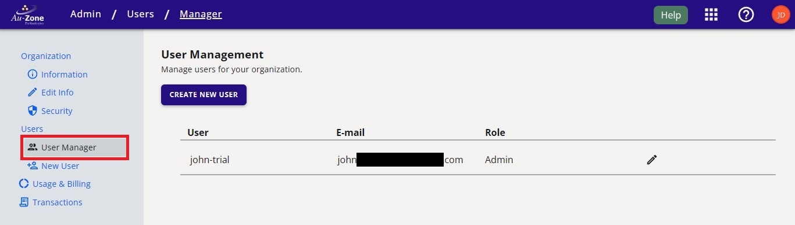
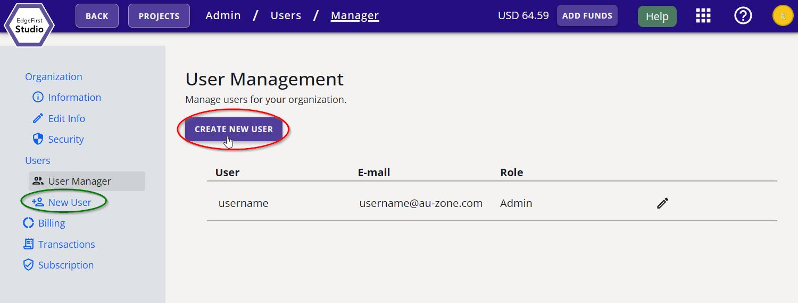
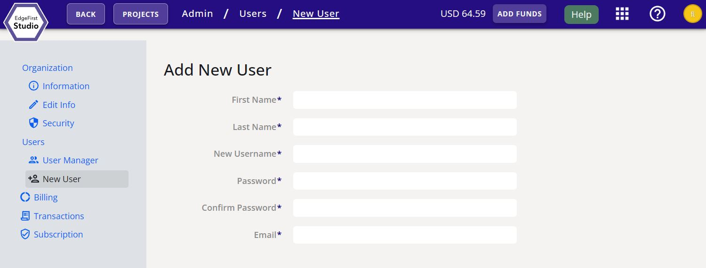
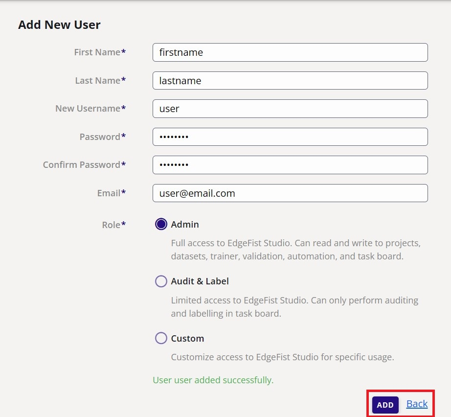

# Add New Users

Navigate to the "User Manager" page by clicking on "User Manager" as shown below.

<figure markdown="span">
{ align=center }
<figcaption>User Manager</figcaption>
</figure>

From the "User Manager" page, we can create new accounts/profiles for new users by clicking either the "Create New User" button or the "New User" button as shown below.

<figure markdown="span">
{ align=center }
<figcaption>New User</figcaption>
</figure>

This will bring you to the page that allows you to specify the new user's information as shown below.  Here you can specify the new user's first and last name, their login credentials such as their username and password.  Finally you will need to specify their email and their [role in the organization](../../studio/user/organization.md#roles). 

<figure markdown="span">
{ align=center }
<figcaption>New User Fields</figcaption>
</figure>

Once the fields have been entered, go ahead and click "Add" on the bottom right to add the new user as shown below.  Otherwise, click "Back" to abort the operation.

<figure markdown="span">
{ align=center }
<figcaption>Added User</figcaption>
</figure>

Now that you have created the account of your new user, share the login credentials to the person assigned to this account.  Next prompt them to [change their password](../../studio/user/profile.md#change-password) or [make any changes to their profiles](../../studio/user/profile.md#edit-information) as necessary. 