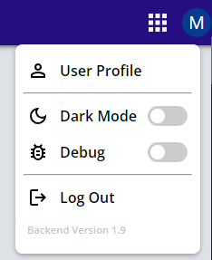
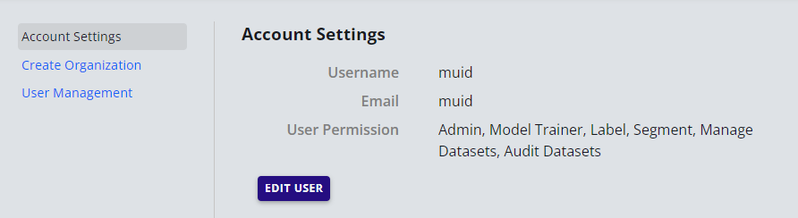
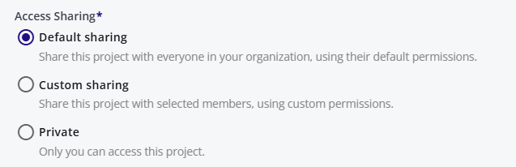

# Access Management

## User Credentials

When initially deployed, the portal has one admin user for the organization.  The user credentials are provided by the AuZone Team. After login, the user can change the password. The organization information may not exist at this stage. The admin user can create the organization and its information. 

The admin user can add other users with different permissions. 

## User Management
To manage users, click on the user icon and select User Profile:

This opens the user management panel:

The account setting is used to see user information and permissions. 

Edit user is used to update email or change password.

### Change Password
- Click on the user icon on the top right corner. 
- Select User Profile.
- Select Account Settings.
- Click on Edit User.
- Enter the new password.
- Click update.

### Add New User
- Click on the user icon on the top right corner. 
- Select User Profile.
- Select User Management.
- Enter the username/password/email for the new user.
- Check the roles to be enabled.
- Click Add.

#### Note: 
The admin user that creates other users is responsible for the usage bills of the users.

### List, Edit and Delete Users
- Click on the user icon on the top right corner.
- Select User Profile.
- Select User Management.
- The lists of users under this admin user will be displayed.
- Click on the X to delete user and the edit icon to edit user. 

#### Note: 
Admin user can change the password of the users connect to this account.

## Create Organization
An admin user can still add users without creating an organization. However creating an organization prints the organization information on the bills and provides information for other users.

To create organization:

- Click on the user icon on the top right corner. 
- Select User Profile.
- Select Organization.
- Enter the organization information.
 

#### Video Tutorial:
[Getting Started Video](https://youtu.be/DJabdEHaZ8E)

Access management works on project or dataset level.

There are two levels of access:

1. View Only - User can see the dataset, annotation and look at the training and validation results
2. Edit - User can edit datasets, perform training and validation and add/delete annotations.

There are three categories of access control

### Default Sharing
All the resources in the project are viewable and editable to all members of the organization 

### Custom Sharing

User can selectively add other users as viewers and editors. A users can be in one of the three3 modes with respect to a dataset.

- No Access if the user iss not in the list of the allowed users.
- View only if the user is in the list with Viewer permissions
- Edit if the user is in the list with Edit permissions.  

### Private

Available to the creator of the projects only

