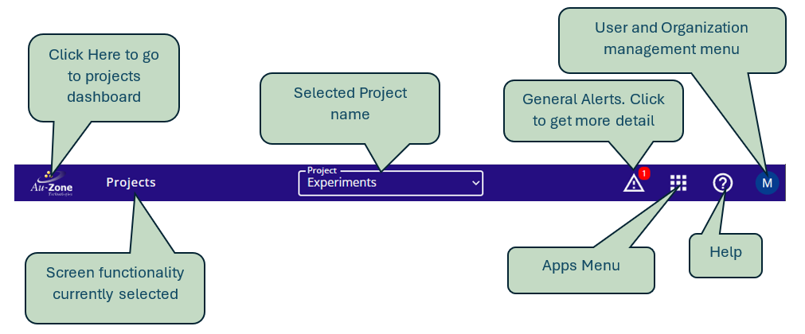
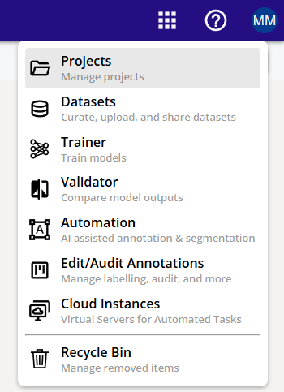
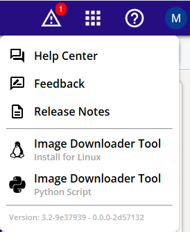
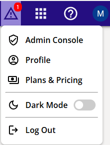

# Navigation

Navigating  to different functionalities in the DVE portal is facilitated through the top navigation bar

## Apps Menu

### Projects
Click on Projects to go to the projects dashboard. This operation is same a click on teh Au-Zone Icon.

### Datasets
Clicking on the Datasets takes to the dataset dashboard for the currently selected project.

### Trainer
Clicking on the Trainer takes to the trainer dashboard for the currently selected project.

### Automation
Clicking on the Automation takes to the auto annotation page.

### Edit / Audit Annotations
This page provide functionality to creates tasks for editing or auditing annotations. 

### Cloud Instances
 This screen allows user to view the currently running cloud instances, start a new one or stop and a running cloud instance.

### Recycling Bin

This screen is used for managing the recycling bin. The deletions of teh following items can be reverted of confirmed to be purged:

1. Project
2. Dataset
3. Annotation Set
4. Training Experiment
5. Training Session
6. Automation Task
7. Validation Session

## Alerts

This link provides information about general alerts (if present)

## Help

This submenu provided teh ability to go to the hep pages, submit feedback, view release notes, download image downloader tool and also look at the currently deployed version. 

## User and Organization Management

This menu has teh following options:

### Admin Console

An admin user can manage organizational users, Edit organizational details and vew billing information 

### Profile

Any use can manage their profile and change password

### Plans and Pricing

View Plans and proving models

### Dark Mode
Toggle Dark Mode

### Logout

Logout

