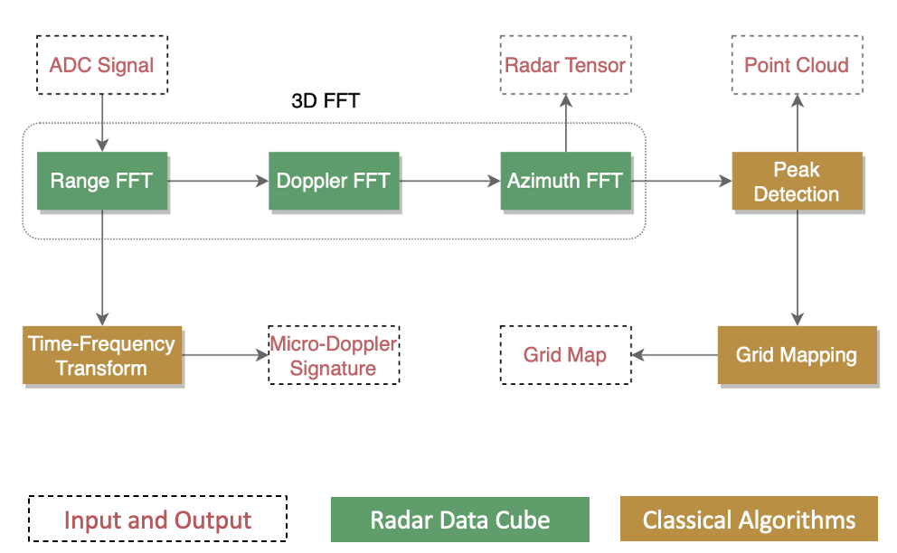
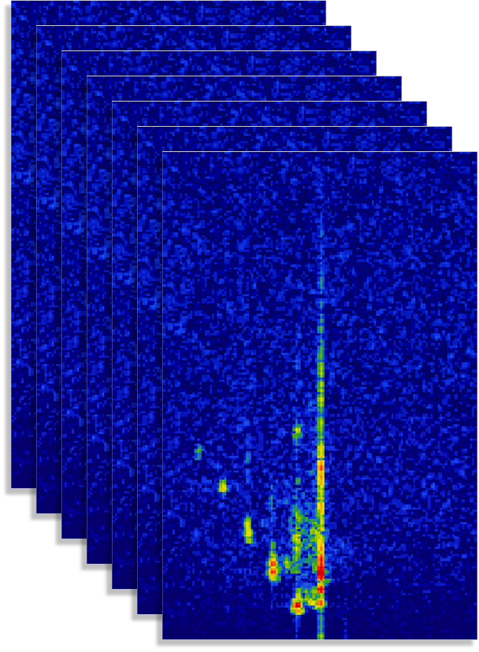

# Fusion Overview

The EdgeFirst Fusion provides a framework for training and deploying camera+radar fusion models.  The framework includes middleware for dataset capture, tooling for calibration, and the runtime for the low-level fusion model and integration with higher level sensor abstractions; such as painting radar PCD with classes identified by the low-level fusion model.

The EdgeFirst Fusion model performs early fusion using the low-level raw radar range-doppler data cube along with the camera input.  The middleware stack also allows for mid-level fusion using radar PCD.  Which is best suited depends on the target application, generally speaking the low-level fusion model provides the most robust performance in scenarios where camera degradation is expected.  By contrast the mid-level fusion requires the camera to be operating, but does not require specialized training as the model is trained only on camera data with the radar data fused later in the pipeline.

## Low-Level Fusion

The EdgeFirst Fusion model is an early low-level fusion model, it takes as input the low-level radar data cube and, optionally, the camera data.  The fusion of the inputs is performed within the main model before any object detection is performed on either input, this means the model predictions are always based on the combination of the inputs. This model is trained to predict object locations using a bird’s eye view, that is top-down 2D world coordinates.  Using cartesian coordinates, targets are described by label (person, car, etc.) range in meters, and their x-location (left/right) relative to the sensor.

The primary benefit of using low-level radar is the ability to make object detections with classification even without the camera.  This is critical for operation in adverse weather or lighting conditions where the camera cannot operate or is operating in a severely reduced capacity.  Another benefit of this model is in detecting objects in the radar signal which would normally be filtered out by traditional processing, for example detecting people very near strong radar reflectors such as heavy equipment or metallic structures.

This video is an example of camera degradation and how the fusion model is robust to this type of occlusion.

<iframe width="560" height="315" src="https://www.youtube.com/embed/P0oT5CMXZro?si=pz4q8ehUxJi4byyi" title="Sunrise Camera Degradation" frameborder="0" allow="accelerometer; autoplay; clipboard-write; encrypted-media; gyroscope; picture-in-picture; web-share" referrerpolicy="strict-origin-when-cross-origin" allowfullscreen></iframe>

The low-level fusion model is trained to generate a 2D occupancy grid of recognized objects, which requires training against a ground truth of bird’s eye view object annotations.  The EdgeFirst Studio tooling provides an AI-assisted workflow for creating these challenging annotations nearly autonomously, only requiring the user to guide the system by clicking examples of objects and the class to which they belong then letting the AI algorithms create the dataset for visual segmentation and bird’s eye view annotations automatically.

## Data Cube

The radar data cube is a 4D complex tensor containing the radar response after the initial range and doppler FFTs.  The EdgeFirst Fusion model can be trained for various cube configurations, details are covered in the EdgeFirst Fusion Model Training Guide.  Radar data cubes vary greatly between various modules and vendors, it is a key limitation of the proliferation of radar and especially low-level radar models in the public domain.  While an image captured on various models of an iPhone or Android could be used to train and test an imaging model without much worry about the details of the optical parameters, such is not the case with radar data cubes; the models are tightly coupled with the radar modules.  EdgeFirst Fusion has well parameterized inputs to allow training with various sensor configurations, once trained the model is locked in to the particular radar module and configuration.  This also affects the dataset, care should be taken to keep datasets using compatible radar configurations, not mixing long and ultra-short range captures within a dataset for example.

While the radar data cube adds complexity to the dataset capture and model training, the benefits are significantly richer input features for the model.  While radar point clouds have very few scalar features (speed, power, noise, RCS) the radar cube offers a large 4D complex tensor as input to the AI models.  This allows the model to learn to detect and discriminate objects which would not be possible with only radar point clouds.

The data cube is not easily interpreted, it is visually not intuitive without much experience.  Special handling is required by AI models as the input representation is unlike images, there is no direct correlation between the input and output representations. A good example of the difficulty of handling the radar cube is when locating objects according to azimuth and elevation, these must be calculated through the timing differences of the same signal returns across multiple receive antennas.  This is handled automatically by EdgeFirst Fusion but classical algorithms would need to handle this directly along with knowledge of the antenna array's physical dimensions.

The radar data cube contains a pair of sequences (A/B) each of which contains the receiving antenna’s range-doppler matrix as complex values.  The sequences represent different TX patterns, most notably the A sequence runs a single transmitter while the B sequence runs all transmitters.  So generally a model will be trained on the B sequence, or possibly the A/B sequence, while the A sequence would be reserved for special cases where we do not require resolving multiple objects at the same range.

The cube can be thought of as 8 range-doppler matrices.  The shape of the cube is therefore [seq, rx, range, doppler, complex] where complex is the pair of real and imaginary values, these pairs can either be interpreted as separate values or as first-class complex numbers depending on the programming language and framework used to perform calculations.   In the case of EdgeFirst Fusion the AI model training and inferencing is done by treating complex values as pairs of values instead of complex therefore we do not require special complex number handling of the AI frameworks or model optimizers.

## Occupancy Grid Encoding

The EdgeFirst Fusion model is trained to produce an occupancy grid.  The occupancy grid is effectively a segmentation mask, we use segmentation loss functions and present the ground truth as a segmentation task.  The resolution of the segmentation mask represents the occupancy grid, each pixel is a cell in the occupancy grid.  For binary classification, such as pedestrian detection, each cell or pixel is a single scalar giving a score from 0..1 where 0 is background and 1 is target object.  For multi-label classification each cell is a vector of the possible labels with their respective scores, these can be used to select a top label for the cell or to report all the scores; this is use case dependent.

Using the occupancy grid a user application can determine the location, including the range, of detected objects.  The occupancy grid only provides location and label, but we can use the occupancy grid along with the radar targets, or clusters, to match targets within the occupancy cell and determine some additional parameters such as speed, power, and RCS.

<iframe width="560" height="315" src="https://www.youtube.com/embed/rhGED20Ewww?si=fFFYC3IFwQqX6r9M" title="YouTube video player" frameborder="0" allow="accelerometer; autoplay; clipboard-write; encrypted-media; gyroscope; picture-in-picture; web-share" referrerpolicy="strict-origin-when-cross-origin" allowfullscreen></iframe>
