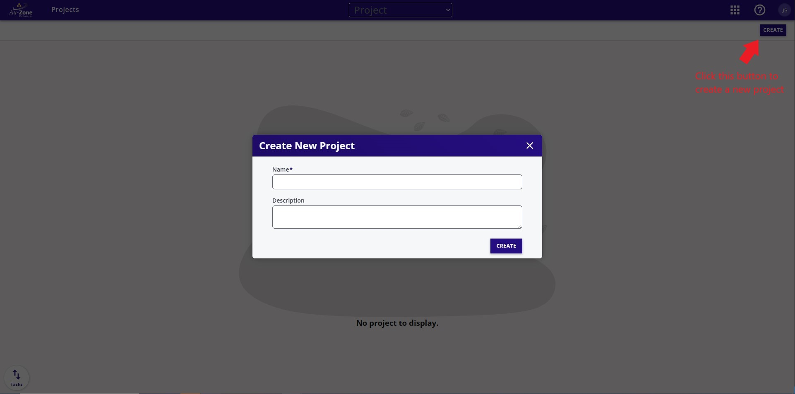

# Getting Started

Welcome to EdgeFirst Studio, this tutorial will walk you through the full end-to-end workflow.
Though not required, we urge you to follow along with an appropriate edge device to test the
models on the actual hardware.  If you don't have such a device, that's okay, we'll show you
how to run the models on a PC using the same applications and APIs you would be using on the
embedded device so you may get familiar with this environment.

If you have recently received one of these EdgeFirst Modules you may want to first start with
the EdgeFirst Modules Quickstart then come back once you're ready to get started with the
cloud tools.

## Quickstart

### 1. Sign up

Start by creating your [EdgeFirst Studio Account](https://dveml.com/#/login?initialMode=new-user).

### 2. Create a project

Once you're logged in, create your first project. Provide a name and description of the project 
that reflects your goals. 

<figure markdown="span">
{ align=center }
<figcaption>Create a New Project</figcaption>
</figure>

### 3. Try our dataset

### 4. Train a model

### 5. Validate the model

### 6. Deploy the model

## Create Your Own Experiment

### 1. Record your dataset

### 2. Label your dataset

### 3. Combine your dataset

### 4. Train your model

### 5. Validate your model

### 6. Deploy your model

