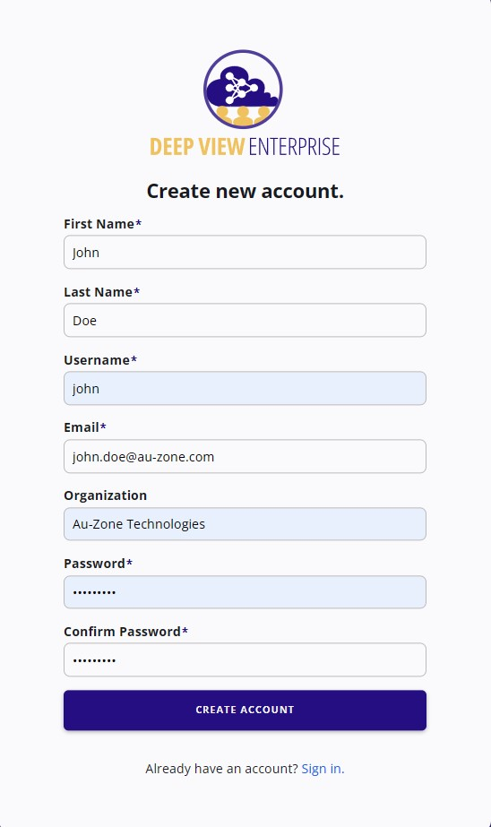
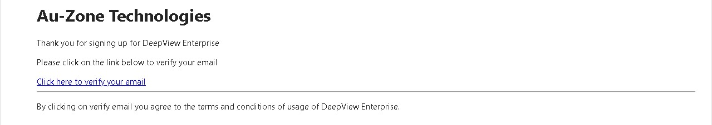
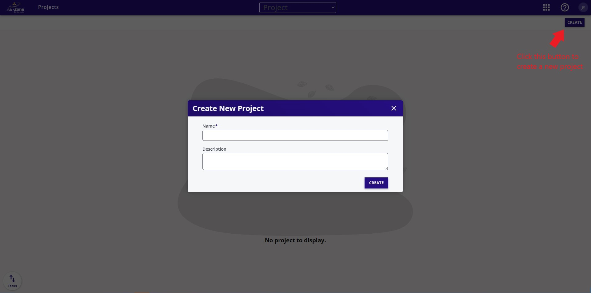
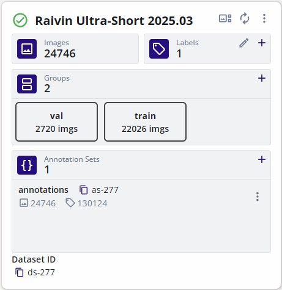
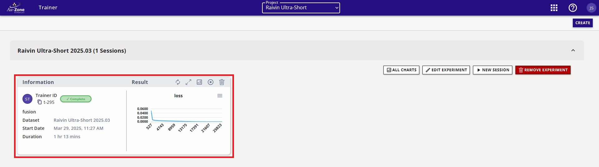
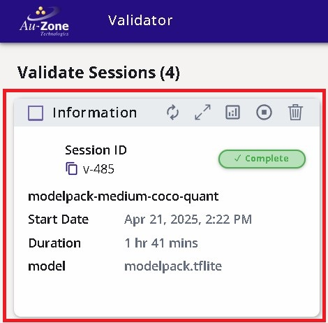

# Getting Started

Welcome to EdgeFirst Studio, this tutorial will walk you through the full end-to-end workflow.
Though not required, we urge you to follow along with an appropriate edge device to test the
models on the actual hardware.  If you don't have such a device, that's okay, we'll show you
how to run the models on a PC using the same applications and APIs you would be using on the
embedded device so you may get familiar with this environment.

If you have recently received one of these EdgeFirst Modules you may want to first start with
the EdgeFirst Modules Quickstart then come back once you're ready to get started with the
cloud tools.

## Quickstart

### 1. Sign up

Start by creating your [EdgeFirst Studio Account](https://dveml.com/#/login?initialMode=new-user).

Enter the required fields denoted by the asterisk (*) and then create your account once completed.

<figure markdown="span">
{ align=center }
<figcaption>Create a New Account</figcaption>
</figure>

Next an email will be sent to you to verify the email you provided. Go ahead and click the link provided to verify your email.

<figure markdown="span">
{ align=center }
<figcaption>Email Verification</figcaption>
</figure>

### 2. Getting Started with Deep View Enterprise (DVE)

The following figure provides a general overview of DVE's layout. 

<figure markdown="span">
{ align=center }
<figcaption>DVE Navigation</figcaption>
</figure>

Please see the overview of [Navigation in Enterprise](../enterprise/navigation/nav.md) for more details.

### 2. Create a project

Using the account you just created, sign in to DVE. 
Once you're logged in, create your first project. Provide a name and description of the project 
that reflects your goals. 

<figure markdown="span">
{ align=center }
<figcaption>Create a New Project</figcaption>
</figure>

### 3. Explore dataset

Try our sample Raivin dataset for training a Fusion Model.

<figure markdown="span">
{ align=center }
<figcaption>Raivin Dataset</figcaption>
</figure>

Please see the overview of the [Datasets Dashboard](../datasets/index.md) for more details regarding the 
dataset attributes in DVE.

### 4. Train model

The following training session is a completed session from training a Fusion model
from the dataset provided. 

<figure markdown="span">
{ align=center }
<figcaption>Sample Training Session</figcaption>
</figure>

For more details regarding deploying training sessions, please see 
[Training Modelpack](../models/modelpack/training.md) for training Vision models and 
[Training Fusion](../models/fusion/training.md) for training Fusion models.

### 5. Validate model

The following validation session is a completed session from validating a Fusion model
from the dataset provided.

<figure markdown="span">
{ align=center }
<figcaption>Sample Validation Session</figcaption>
</figure>

For more details regarding deploying validation sessions, please see 
[Validating Modelpack](../models/modelpack/validation.md) for validating Vision models and 
[Validating Fusion](../models/fusion/validation.md) for validating Fusion models.
