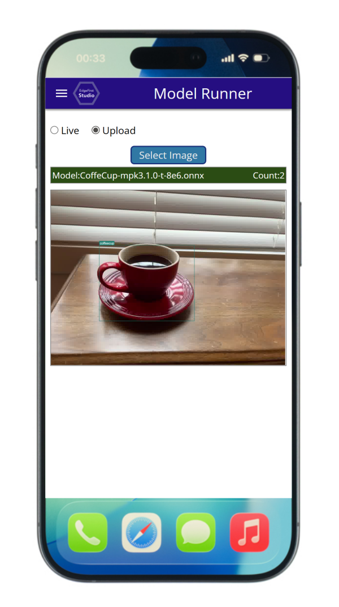
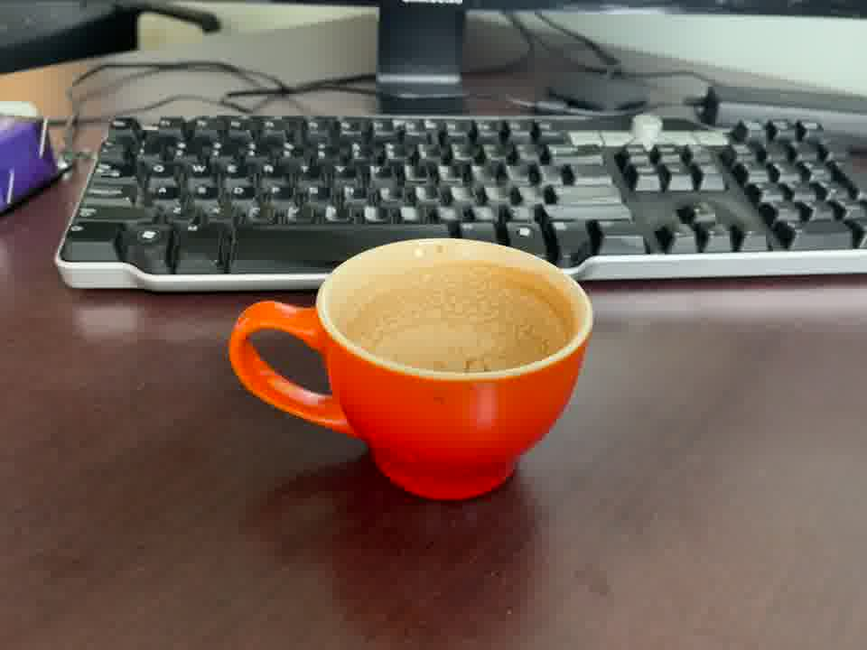
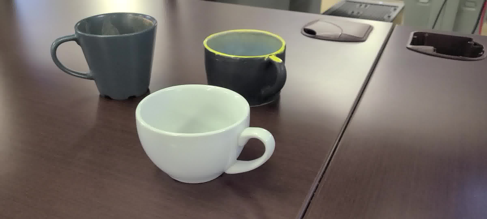

# Running Pre-trained Models in EdgeFirst Studio

EdgeFirst Studio includes a built-in model runner that allows you to quickly run models on a live camera feed or on stored images, providing an instant live preview of model results.  This guide walks you through running pre-trained models in EdgeFirst Studio.

## Supported Platforms

| Platforms & Model Support | Preview |
|:--------------------------|:-------:|
| - **PC:** Windows, Linux, MacOS - **Mobile:** iOS, Android - **Web:** Chrome browser - **Models:** ModelPack (.onnx format) | { width=400px } |

---

## 1. If you haven't already, log in to EdgeFirst Studio

1. Go to {{ studio_link("EdgeFirst Studio") }}
2. If you do not have an account, {{ studio_link("create a free account", "signup") }} on the landing page
3. Log in with your username and password

## 2. Locate a Model to Run

EdgeFirst Studio provides several pre-trained models in the **Sample Projects** section.

1. On the landing page after login, click **PROJECTS** at the top next to "Home".  This opens the Projects Dashboard

    {{ figure("/studio/assets/user/home-page-goto-projects.png", "Go To Projects") }}

2. Find the **Sample Projects** card and click **Model Experiments**

    {{ figure("assets/run_model/sample-projects.png", "Sample Projects", "400") }}

    On the [Experiments page](../studio/models.md), each card represents an experiment with multiple training and validation sessions.

3. Click on the **Training Sessions** for the "Coffee Cup Segmentation" Experiment to view available sessions.  Each session will have a model in different formats if training completed successfully

    {{ figure("assets/run_model/coffeecup-experiment-sample-project.png", "Coffee Cup Experiment") }}

4. Click the training session **CoffeCup-mpk3.1.0** to open its details page

    {{ figure("assets/run_model/coffeecup-training-session.png", "Coffee Cup Training Card") }}

5. Click on the Artifacts tab and click "Run Model" to run the ONNX model in this training session

    {{ figure("assets/run_model/trainer_details_page.png", "Training Session Details") }}

6. Click the **Run Model** button.  If the model is not supported or the ONNX file is missing, this button will not appear.  This opens the Model Runner dashboard

---

## 3. Test with Static Images

Download these images to test the model (on PC: right-click and select "Save Image As"; on mobile: tap and hold):

In the Model Runner Dashboard, upload any of these images to see the model results:

{{ figure("assets/run_model/model_results_pc.png", "Model Results") }}

---

## 4. Running Model on Live Camera Stream

1. In the Model Runner dashboard, select **Live**
2. Choose your camera and allow access when prompted
3. The model will start running on the live stream.  Point the camera at coffee cups to see results in real time

The next step is to dive into the full MLOps workflow in EdgeFirst Studio!  Every workflow begins with creating your own project, which serves as the foundation for everything that follows.
