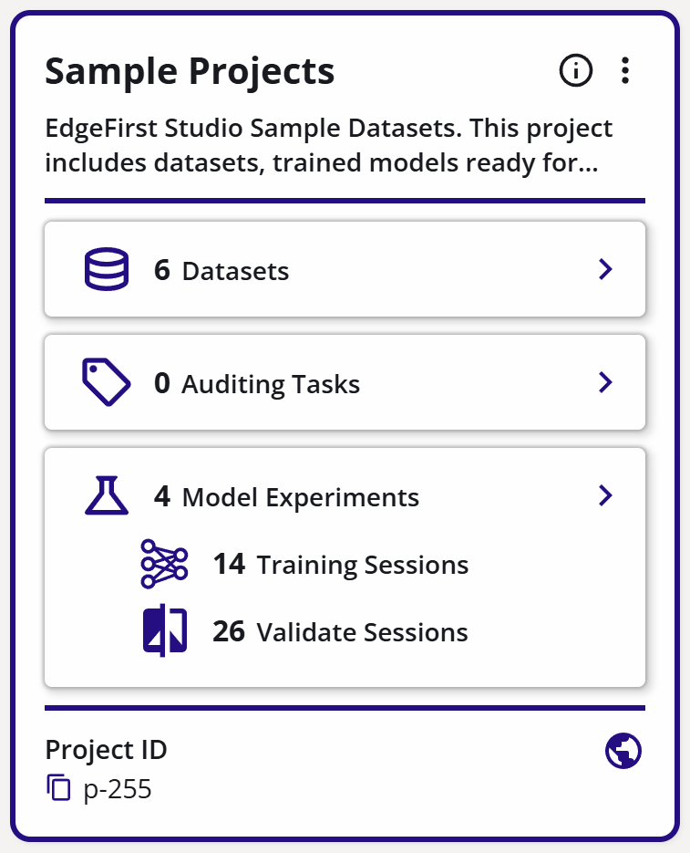
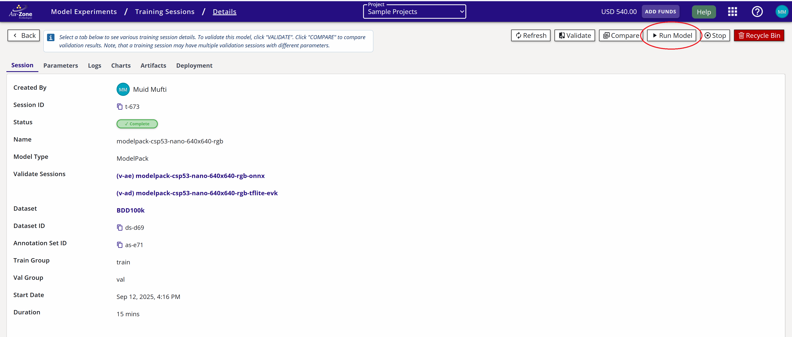
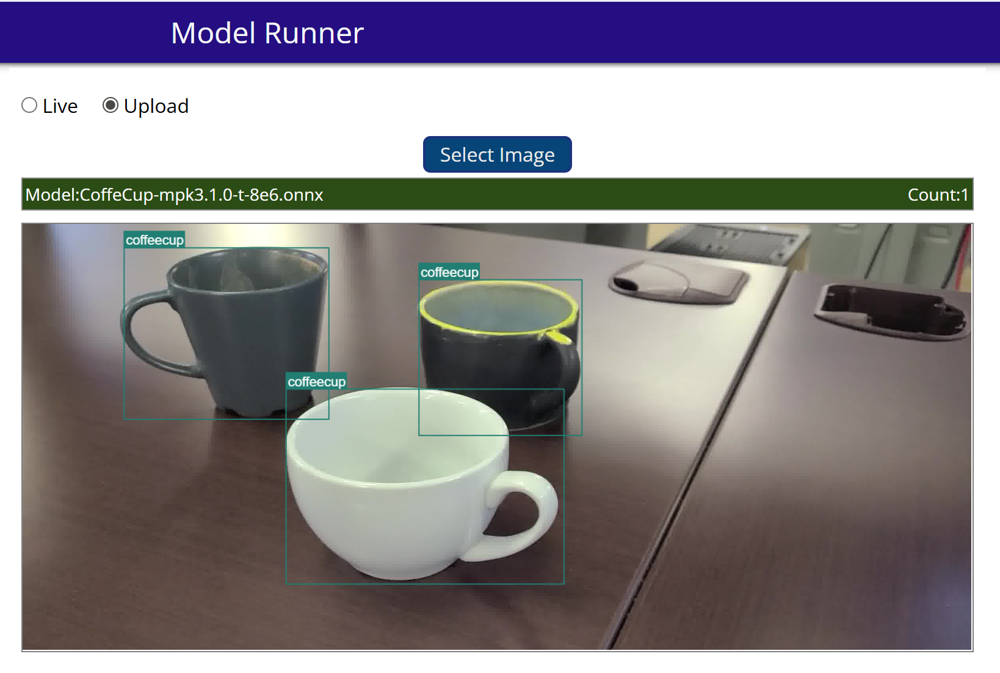

# Running Pre-trained Models in Edgefirst Studio

Edgefirst Studio includes a built-in model runner that allows you to quickly run models on a live camera feed or on stored images, providing an instant live preview of model results. This guide walks you through running pre-trained models in Edgefirst Studio.

## Supported Platforms

| Platforms & Model Support | Preview |
|:-------------------------|:-------:|
| - **PC:** Windows, Linux, MacOS - **Mobile:** iOS, Android - **Web:** Chrome browser - **Models:** Modelpack (.onnx format) | { width=400px } |

---

## 1. Log in to Edgefirst Studio

1. Go to [https://edgefirst.studio](https://edgefirst.studio)
2. If you do not have an account, create a free account on the landing page.
3. Log in with your username and password.

## 2. Locate a Model to Run

Edgefirst Studio provides several pre-trained models in the **Sample Projects** section.

1. On the landing page after login, click **GO TO PROJECTS**. This opens the Projects Dashboard.
2. Find the **Sample Projects** card and click **Model Experiments**.

	{ width=400px }

3. On the Experiments page, each card represents an experiment with multiple training and validation sessions.
4. Click on the **Training Sessions** for the Coffee Cup Experiment to view available sessions. Each session will have a model in different formats if training completed successfully.
5. Click the training session **CoffeCup-mpk3.1.0** to open its details page.

	

6. Click the **Run Model** button. If the model is not supported or the ONNX file is missing, this button will not appear. This opens the Model Runner dashboard.

---

## 3. Test with Static Images

Download these images to test the model (on PC: right-click and select "Save Image As"; on mobile: tap and hold):

In the Model Runner Dashboard, upload any of these images to see the model results:

---

## 4. Running Model on Live Camera Stream

1. In the Model Runner dashboard, select **Live**.
2. Choose your camera and allow access when prompted.
3. The model will start running on the live stream. Point the camera at coffee cups to see results in real time.
