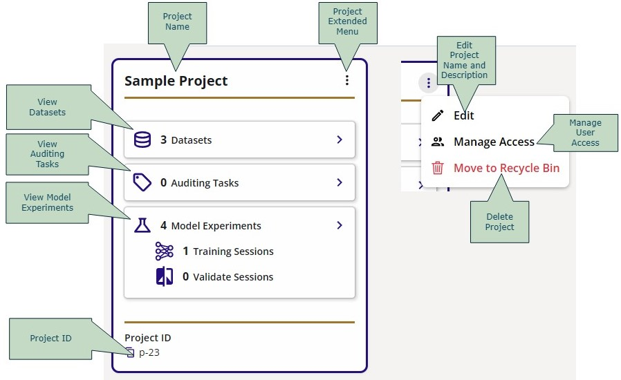
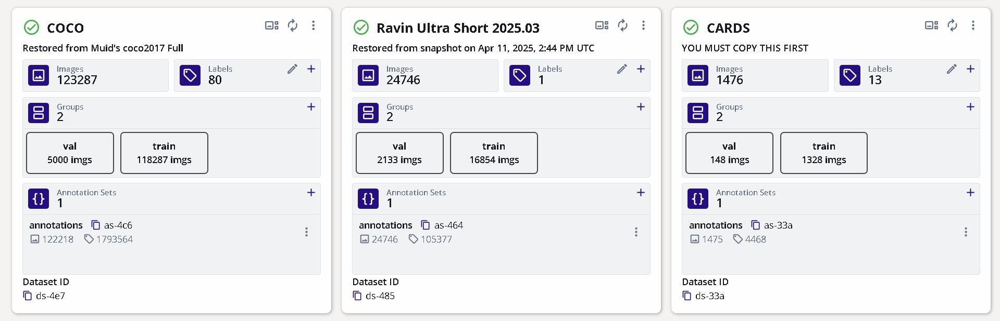
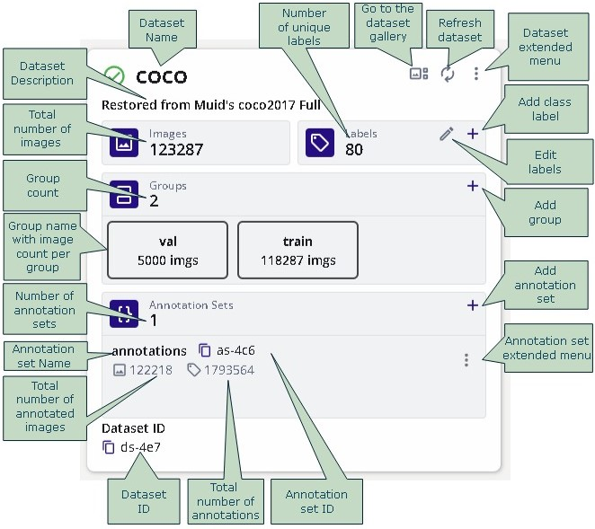
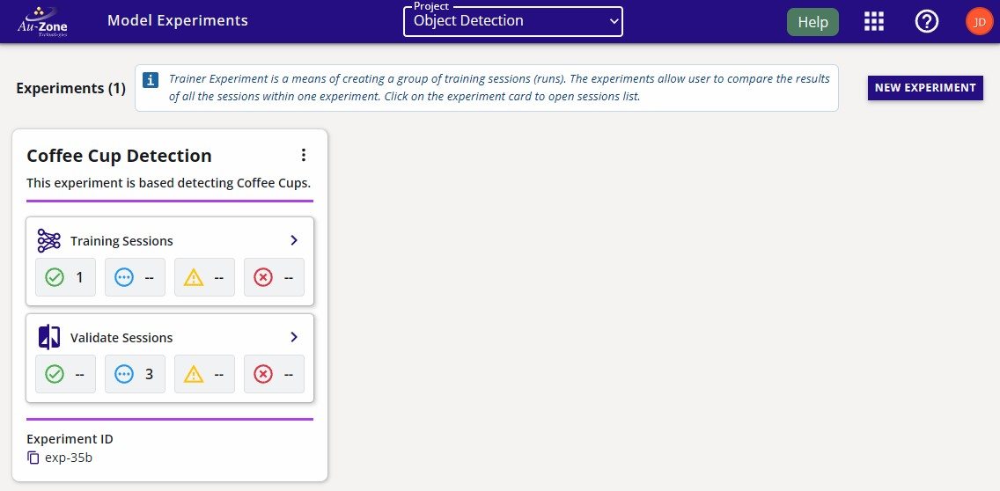
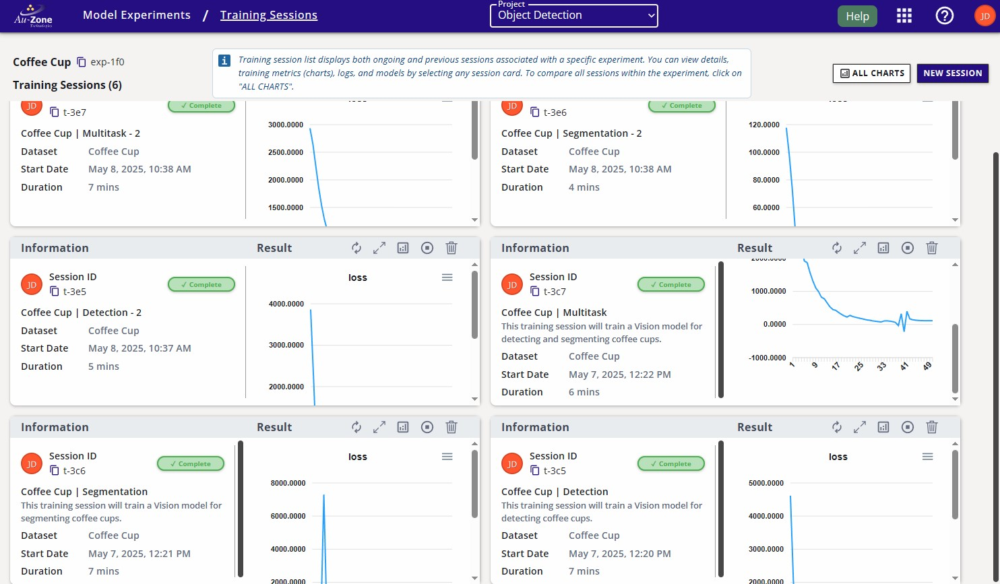
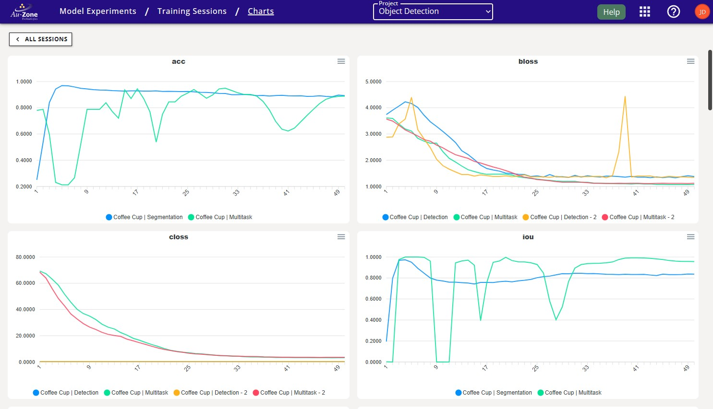
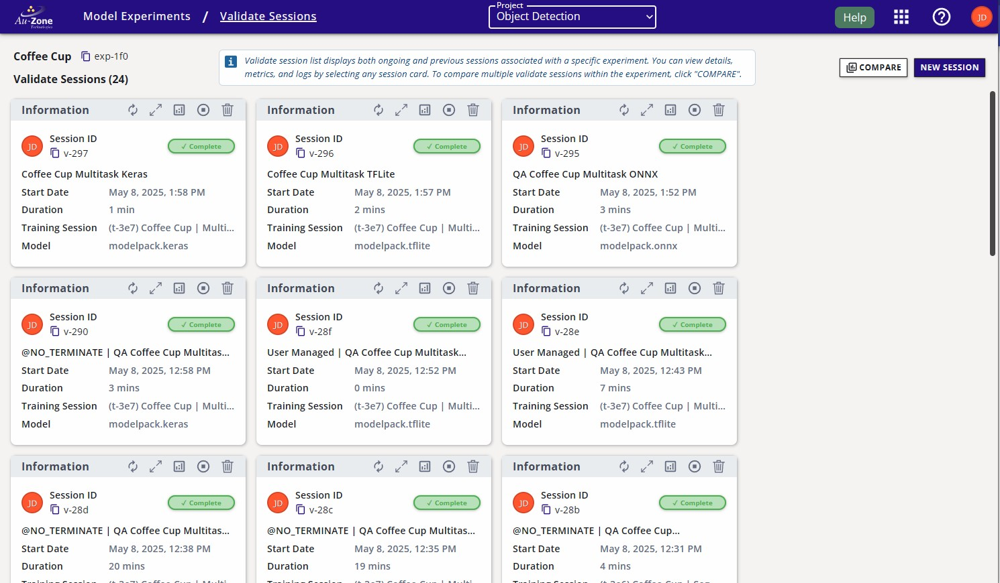
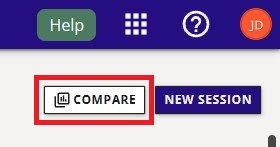
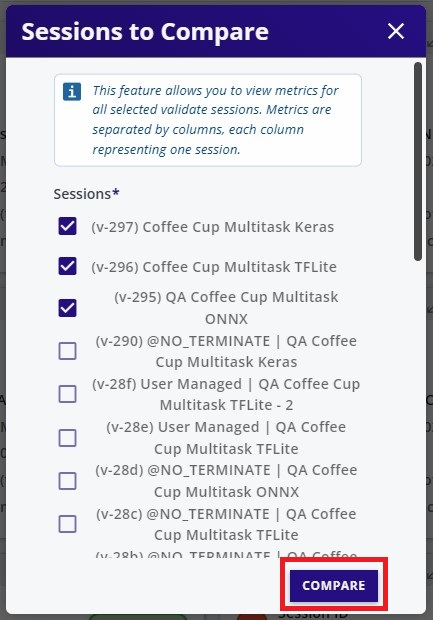
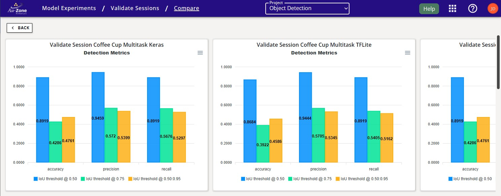

# EdgeFirst Studio: Overview

This page will describe the structure and layout of EdgeFirst Studio.  The elements and sub-elements of any given project is based on an hierarchical structure that will be described in detail below. 

This page breaks down important concepts used in EdgeFirst Studio, namely:

- *projects*: high-level collections of sensor datasets, model experiments, and other automation and management tasks associated with the dataset inputs and model outputs.  
- *datasets*: a collection of sensor data, such as images, videos, radar cubes, etc. logically grouped together by the user.  Usually, each dataset contained within a project will come from a single recording session.
- *model experiments*: high-level collections of training and validation sessions.
- *training sessions*: the functionality to convert datasets recorded into vision- and radar-based models that can be deployed back to the edge platforms/devices.
- *validation sessions*: the functionality to take a model and determine its accuracy against other models or a standardized validation dataset to see if it is ready for deployment.

## Project Structure

As you saw from the [initial steps](../index.md#log-in), when you first login, you will be greeted by the "Projects" page which contains a sample project called "Sample Project". 

To return to this splash page from any other page, you can:

* click your browser's "Back" button until back here.
* click the Apps  waffle button and select the "Projects" menu item.
* click on the "Au-Zone" Home button in the top-left corner.

The following figure describes the UI elements of the "Project" card.  Take special note of the project attributes (datasets, auditing tasks, etc.) as these are the buttons that lead into further parts of the project.  The "Sample Project" project has three datasets, zero auditing tasks, and four model experiments associated with it.

<figure markdown="span">
{ align=center }
<figcaption>Project UI Breakdown</figcaption>
</figure>

A project will contain datasets and model experiments.  A model experiment will contain training and validation sessions.  The project structure hierarchy is shown below.

<div style="text-align: center;">
    ```mermaid
    ---
    title: Project Hierarchy
    ---
    graph TD
    project[Project] --> datasets[Datasets]
    datasets --> audit[Auditing Tasks]
    project --> model[Model Experiments]
    model --> train[Training Sessions]
    train --> validation[Validation Sessions]
    ```
</div>

This hierarchy describes the span of deletion of the project attributes.  When a project is deleted, all elements in the project including datasets and model experiments will be deleted.  When a dataset is deleted, only its child element such as auditing tasks will be deleted.  When a model experiment is deleted, only its child elements will be deleted such as training and validation sessions.

### Datasets

From the "Projects" page, we can click on the "Datasets"  button to see the three datasets associated with this project: "COCO", "Ravin Ultra Short 2025.03", and "CARDS".  These public datasets are readily available for user onboarding and trials, but these datasets are **READ-ONLY** datasets.  By default, users can [view the datasets](../datasets/tutorials/management.md#viewing-datasets).  Otherwise, in order to have full access to the dataset, users **MUST** [copy the dataset](../datasets/tutorials/management.md#copying-datasets) into the project they've created. 

<figure markdown="span">
{ align=center }
<figcaption>Public Datasets</figcaption>
</figure>

The "Raivin Ultra Short 2025.03" dataset contains 3D bounding box annotations which are used only for [training Fusion models](../models/fusion/training.md).  The "COCO" and "CARDS" dataset contains 2D bounding box annotations which are only valid for [training Vision models](../models/modelpack/training.md).

The following figure breaks down the elements of a "Dataset" card.

<figure markdown="span">
{ align=center }
<figcaption>Dataset Card UI Breakdown</figcaption>
</figure>

For an in-depth tutorial for managing datasets in EdgeFirst Studio from capture and annotation to export and deployment, see our [Dataset Tutorials](../datasets/tutorials/index.md).

### Model Experiments

A model experiment is a container of the training and validation sessions in the experiment.  The following figure shown is the "Model Experiments" page.  This page will contain all the experiments that were started by the user. 

<figure markdown="span">
{ align=center }
<figcaption>Project Experiments</figcaption>
</figure>

The following figure breaks down the elements of an "Experiment" card.

<figure markdown="span">
{ align=center }
<figcaption>Experiment Card UI Breakdown</figcaption>
</figure>

An experiment will contain child training and validation sessions.  The training sessions and validation sessions will be described in more detail in the sections below. 

#### Training Sessions

Training sessions take in datasets and synthesize from them new AI models -- for object recognition (Vision) or object perception (Fusion).

From the "Model Experiments" page, we can click on the "Training Sessions" button with the icon  to see the training sessions in the experiment.  The figure below shows the layout of the training session cards under the "Training Sessions" page.

<figure markdown="span">
{ align=center }
<figcaption>Training Sessions</figcaption>
</figure>

The following figure describes the attributes of any given training session.

<figure markdown="span">
{ align=center }
<figcaption>Training Session Attributes</figcaption>
</figure>

To compare all the training charts of each session, click on "All Charts" at the top right corner of the "Training Sessions" page.  This will show the charts from each session overlayed on top of one another for a quick comparison. 

<figure markdown="span">
{ align=center }
<figcaption>All Charts</figcaption>
</figure>

All the training charts will be displayed with a legend that indicates the training session.

<figure markdown="span">
{ align=center }
<figcaption>All Charts</figcaption>
</figure>

For more details regarding deploying training sessions, please see [Training ModelPack](../models/modelpack/training.md) for training Vision models and [Training Fusion](../models/fusion/training.md) for training Fusion models.

#### Validation Sessions

The validation sessions will assess the performance of the models in the training sessions.  A training session can have any number of validation sessions.  From the "Model Experiments" page, we can click on the "Validation Sessions" button with the icon  to see the validation sessions in the experiment.  The figure below shows the layout of the validation session cards under the "Validation Sessions" page.

<figure markdown="span">
{ align=center }
<figcaption>Validation Sessions</figcaption>
</figure>

The following figure describes the attributes of any given validation session.

<figure markdown="span">
{ align=center }
<figcaption>Validation Session Attributes</figcaption>
</figure>

To compare the validation charts of each session, click on "Compare" at the top right corner of the "Validate Sessions" page.  This will show the charts of each validation session side-by-side for a quick comparison.

<figure markdown="span">
{ align=center }
<figcaption>Compare Validation Sessions</figcaption>
</figure>

Next select the validation session results you wish to compare.  Once select, click "Compare" to show the validation charts side-by-side.

<figure markdown="span">
{ align=center }
<figcaption>Select Validation Sessions</figcaption>
</figure>

Now the charts for each session are displayed side-by-side.  All the charts for a single training session will be shown in one column.  A new column indicates another session. 

<figure markdown="span">
{ align=center }
<figcaption>Comparing Validation Sessions</figcaption>
</figure>

For more details regarding deploying validation sessions, please see [Validating ModelPack](../models/modelpack/validation.md) for validating Vision models and [Validating Fusion](../models/fusion/validation.md) for validating Fusion models.

## Next Steps

Now that you are familiar with the layout of EdgeFirst Studio including the element definitions and it's hierarchy, checkout our end-to-end [User Workflows](workflows/index.md) to start experimenting with data capture, model training, and model deployment. 

It is also recommended for new users to visit the following tutorials for more details in the layout and features of EdgeFirst Studio.

* [Navigating EdgeFirst Studio](../studio/navigation.md)
* [Project Dashboard](../studio/projects.md)
* [Dataset Dashboard](../studio/datasets/index.md)
