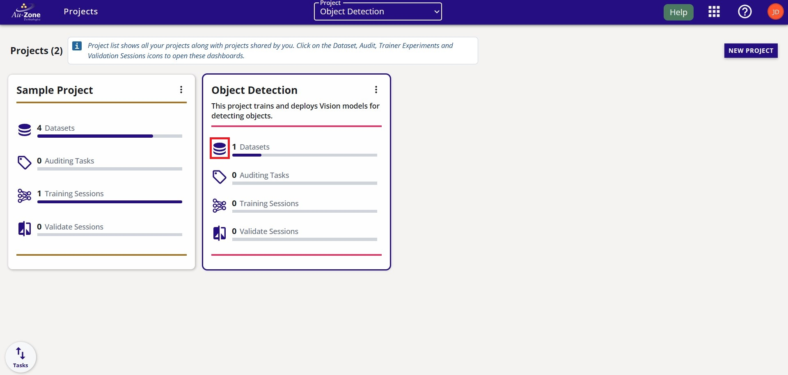
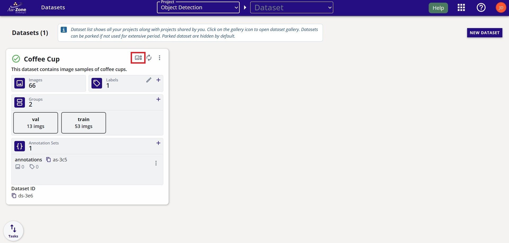
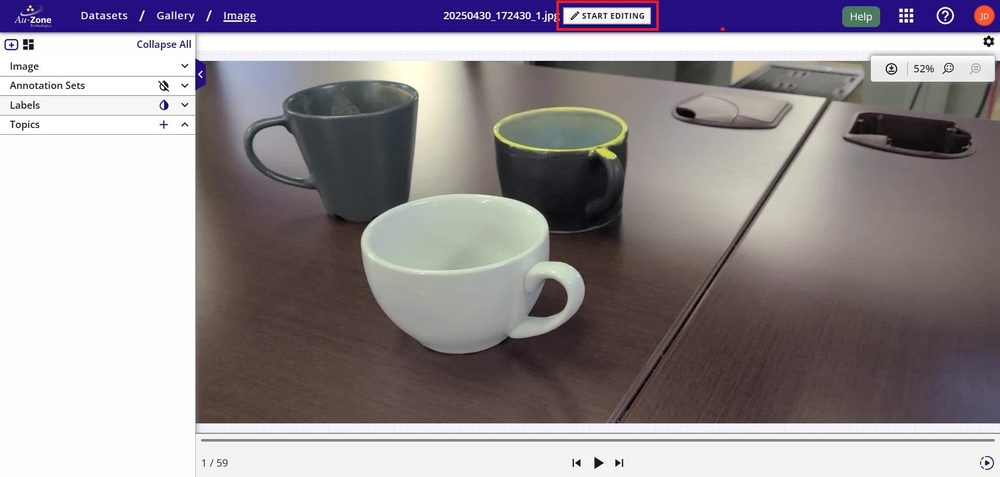

# Web-Based Workflow

In this workflow, we will explore recording a video or capturing images using a mobile device and then upload the captured data into EdgeFirst Studio for annotation, model training, model validation, and then model deployment using the PC. This workflow requires the user to have signed up and logged in to EdgeFirst Studio and followed the initial steps described in the [EdgeFirst Studio Quickstart](../index.md#edgefirst-studio-quickstart).

!!! warning
    It is recommended to use a mobile device connected to a Wifi network. A device connected to mobile data might be subject to intense usage when uploading files as video files or image files can be large in size. In the examples below, the video file used was ~15MB and the image files were ~2MB.

## 1. Capture Data Using a Mobile Device

In this workflow, we will be exploring capturing data with samples of coffee cups for training a detection model that detects coffee cups. However, you can choose any type of objects in your dataset, but be mindful that the label for these objects remains consistent for all samples. 

In this workflow, we will be recording a 5 second video on coffee cups as shown below. 

<figure markdown="span">
{ align=center }
<figcaption>Android Mobile Video Capture</figcaption>
</figure>

Furthermore, we will also capture images of coffee cups as shown below. 

<figure markdown="span">
{ align=center }
<figcaption>Android Mobile Image Capture</figcaption>
</figure>

## 2. Visit EdgeFirst Studio

Once you have captured your video and some sample images for your dataset on your mobile device, next navigate to a web browser on your mobile device and [login][login] to EdgeFirst Studio. Once logged in to EdgeFirst Studio, navigate to the "Object Detection" project that was created in the [EdgeFirst Studio Quickstart](../index.md#edgefirst-studio-quickstart) and click on the datasets icon that is indicated in red.

<figure markdown="span">
{ align=center }
<figcaption>Object Detection Project</figcaption>
</figure>

This will bring you to the Datasets page of the selected project. Create a new dataset container by clicking on "NEW DATASET".

<figure markdown="span">
{ align=center }
<figcaption>New Dataset</figcaption>
</figure>

Add the dataset and annotation container name, labels, and dataset description as indicated by the fields below. This information can be specified by the user and does not have to strictly follow the example shown below. Click the "CREATE" button once the fields have been filled.

<figure markdown="span">
{ align=center }
<figcaption>Dataset Fields</figcaption>
</figure>

Your created dataset will look as follows.

<figure markdown="span">
{ align=center }
<figcaption>Created Dataset</figcaption>
</figure>

## 3. Upload Data to EdgeFirst Studio

Once the dataset container has been created, click on the dataset extended menu (three vertical dots) and select import.

<figure markdown="span">
{ align=center }
<figcaption>Dataset Import Option</figcaption>
</figure>

This will bring your to the "Import Dataset" page.

<figure markdown="span">
{ align=center }
<figcaption>Dataset Import</figcaption>
</figure>

First we will be importing the video recording. Click on the dropdown that says "Select an Import Type" and then specify "Video" and then click "Done" as shown below. 

<figure markdown="span">
{ align=center }
<figcaption>Dataset Video Import</figcaption>
</figure>

Now that the import type is specified to a video file, click on "Select File" as indicated. 

<figure markdown="span">
{ align=center }
<figcaption>Select Video File</figcaption>
</figure>

On an android device, this will bring up the option to specify the location of the files.

<figure markdown="span">
{ align=center }
<figcaption>Android Select File Options</figcaption>
</figure>

In my current setup, I have selected "My Files" from the options above and then "Videos" which will allow me to pinpoint the location of the video I have recorded. 

<figure markdown="span">
{ align=center }
<figcaption>Android File Manager</figcaption>
</figure>

Once the video file has been selected, go ahead and click "START IMPORT" to start importing the video file. 

<figure markdown="span">
{ align=center }
<figcaption>Import Fields</figcaption>
</figure>

This will start the import process and once it is completed, you should see the number of images in the dataset increased. If you do not see any changes, refresh the browser. 

<figure markdown="span">
{ align=center }
<figcaption>Imported Video</figcaption>
</figure>

Next we will import the captured images from [step 1](#1-capture-data-using-a-mobile-device). 
Navigate back to the "Import Dataset" page.

<figure markdown="span">
{ align=center }
<figcaption>Dataset Import</figcaption>
</figure>

Click on "Click to select images". This will bring up the option to specify the location of the files.

<figure markdown="span">
{ align=center }
<figcaption>Android Mobile Media Picker</figcaption>
</figure>

In my current setup, I have selected "Media Picker" from the options above and then I have multi-seleted the images I want to import.

<figure markdown="span">
{ align=center }
<figcaption>Android Multiselect Images</figcaption>
</figure>

Once the image files have been selected, the progress for the image import will be shown. 

<figure markdown="span">
{ align=center }
<figcaption>Image Import Progress</figcaption>
</figure>

Once it completes, you should see the number of images in the dataset increase by the amount of selected images.

<figure markdown="span">
{ align=center }
<figcaption>Imported Images</figcaption>
</figure>

Once all the captured data has been uploaded to the dataset container, we will now assign groups to the data to split the data into training and validation sets. First delete the empty default groups that were created. Follow the [tutorial for creating groups](../datasets/tutorials.md#splitting-datasets) with an 80% partition to training and 20% partition to validation. The final outcome for the groups should look as follows.

<figure markdown="span">
{ align=center }
<figcaption>Dataset Groups</figcaption>
</figure>

Now that we have imported some data into EdgeFirst Studio and have split the captured data into training and validation partitions, we can now start annotating our data as shown in the next section below.

## 4. Annotate Data in EdgeFirst Studio

In this step, we will be using a personal computer with access to Wifi to [log in][login] to EdgeFirst Studio for annotating the captured data. When annotating the dataset, we will be using AI assistance to annotate the ground truth to perform auto segmentation and bounding boxes on the objects of interest in the frame. Once logged in to EdgeFirst Studio, we can start by enabling an AI Assisted Ground Truth server by navigating to the Cloud Instances under the tool options.

<figure markdown="span">
{ align=center }
<figcaption>Cloud Instances</figcaption>
</figure>

Start and launch a new server to host the auto-segmentation backend.

<figure markdown="span">
{ align=center }
<figcaption>Start a Server</figcaption>
</figure>

navigate to the "Object Detection" project that was created in the [EdgeFirst Studio Quickstart](../index.md#edgefirst-studio-quickstart) and click on the datasets icon that is indicated in red.

<figure markdown="span">
{ align=center }
<figcaption>Object Detection Project</figcaption>
</figure>

This will bring you to the Datasets page of the selected project. Click on the gallery indicated in red of the dataset with imported data from the previous steps.

<figure markdown="span">
{ align=center }
<figcaption>Object Detection Datasets</figcaption>
</figure>

This will bring you to the dataset gallery. You will see the imported video file and images in the gallery.

<figure markdown="span">
{ align=center }
<figcaption>Coffee Cup Gallery</figcaption>
</figure>

We will start with annotating the video file. First click on the video file card on the gallery. This will open the video for playback. To add annotations to the video, click on "START EDITING" indicated in red.

<figure markdown="span">
{ align=center }
<figcaption>Video Sequence</figcaption>
</figure>

## 5. Train a Model from the Annotated Data

## 6. Validate the Trained Model

## 7. Deploy the Model

[login]: #