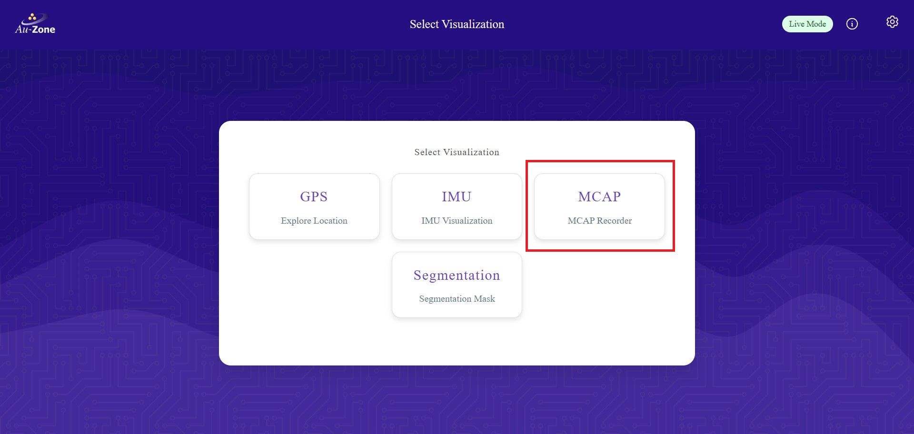
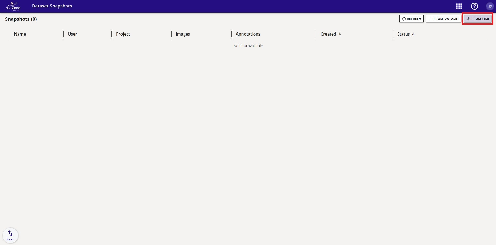
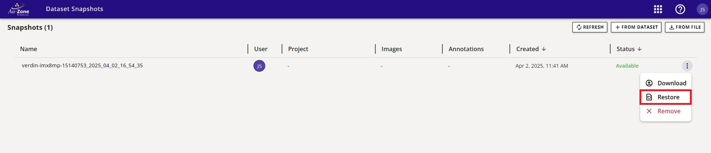
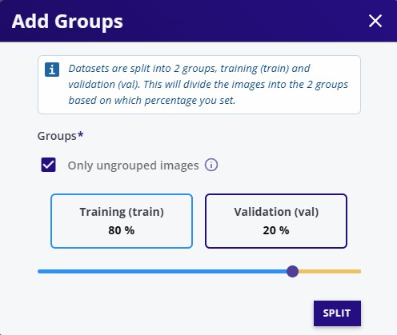
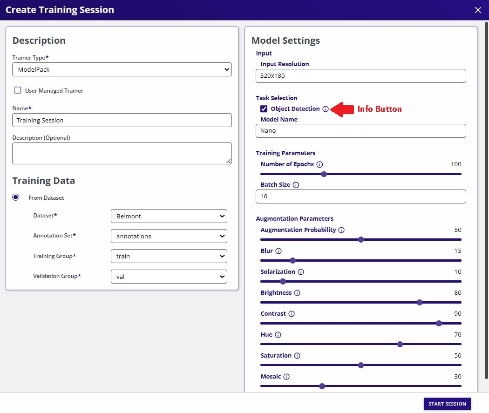

# EdgeFirst Studio: From Start to Deployment

This page will walk you through a high-level overview of getting started with EdgeFirst Studio by introducing the concepts used in Studio and their corresponding UI elements and then using those concepts and elements as part of an high-level workflow from collecting and curating datasets to training, validating, and deploying EdgeFirst models.

    <iframe width="560" height="315" src="https://www.youtube.com/embed/MmoDCXj72jk?si=I8gTw2VCtcts69ks" title="EdgeFirst Studio Overview" frameborder="0" allow="accelerometer; autoplay; clipboard-write; encrypted-media; gyroscope; picture-in-picture; web-share" referrerpolicy="strict-origin-when-cross-origin" allowfullscreen></iframe>

## Projects, Datasets, and Training Session

This section breaks down important concepts used in EdgeFirst Studios, namely:

- *projects*: high-level collections of sensor datasets, training sessions, and other automation and management tasks associated with the dataset inputs and model outputs.  
- *datasets*: a collection of sensor data, such as images, videos, radar cubes, etc. logically grouped together by the user. Usually, each dataset contained within a project will come from a single recording session.
- *training sessions*: the functionality to convert datasets recorded into vision- and radar-based models that can be deployed back to the edge devices.
- *validation sessions*: the functionality to take a model and determine its accurary against other models or a standardized validation dataset.

These concepts and their respective UI elements will be used in guided workflow below, and follow from the steps shown in [Getting Started](../index.md#edgefirst-studio-quickstart).  Additional UI breakdowns of EdgeFirst Studio can be found in [Navigating EdgeFirst Studio](../studio/navigation.md).

### Projects

As you saw from the initial workflow, when you first login, you will be greeted by the "Projects" page which contains a sample project called "Sample Datasets". The following figure describes the UI elements of the "Project" card.  Take special note of the icons to the left of the project attributes (datasets, trainers, etc.) as these are the buttons that lead into further parts of the project.

<figure markdown="span">
{ align=center }
<figcaption>Project UI Breakdown</figcaption>
</figure>

A project will contain datasets and information about the operations done with those datasets, such as: training sessions, automation tasks, labeling/annotation tasks, and validation sessions.  The "Sample Datasets" project has two datasets and two training sets associated with it.

To return to this splash page from any other page, you can:
* click your browser's "Back" button until back here
* click the Apps  waffle button and select the "Projects" menu item.
* click on the "Au-Zone" Home button in the top-left corner.

### Datasets

From the "Projects" page, we can click on the "Datasets"  button to see the two datasets associated with this project: "Raivin Pedestrians (ultra-short range) 2025.03" and "COCO 2017".  These public datasets are readily available for user onboarding and trials, but these datasets are **READ-ONLY** datasets. By default, users can [view the datasets](../datasets/tutorials.md#viewing-datasets). Otherwise, in order to have full access to the dataset, users **MUST** [copy the dataset](../datasets/tutorials.md#copying-datasets) into the project they've created. 

<figure markdown="span">
{ align=center }
<figcaption>Public Datasets</figcaption>
</figure>

The "Raivin Pedestrians (ultra-short range) 2025.03" dataset contains 3D bounding box annotations which are use only for [training Fusion models](../models/fusion/training.md). The "COCO 2017" dataset contains 2D bounding box annotations which are only valid for [training Vision models](../models/modelpack/training.md).

The following figure breaks down the elements of a "Dataset" card.

<figure markdown="span">
{ align=center }
<figcaption>Dataset Card UI Breakdown</figcaption>
</figure>

For an in-depth tutorial for managing datasets in EdgeFirst Studio from capture and annotation to export and deployment, see our [Dataset Tutorials](../datasets/tutorials.md).

### Training Sessions

Training sessions take in datasets and synthesize from them new AI models -- for object detection, object segmentation, and radar 3

"Trainers"  button

The sample project will contain completed training sessions using the public datasets provided. The training session shown below is based on training a Fusion model from the public dataset *Raivin Pedestrians (ultra-short range) 2025.03*.

<figure markdown="span">
{ align=center }
<figcaption>Sample Training Session</figcaption>
</figure>

The following figure describes the attributes of any given training session.

<figure markdown="span">
{ align=center }
<figcaption>Training Session Attributes</figcaption>
</figure>

For more details regarding deploying training sessions, please see 
[Training Modelpack](../models/modelpack/training.md) for training Vision models and 
[Training Fusion](../models/fusion/training.md) for training Fusion models.

### Validation Sessions

The sample project will contain completed validation sessions using the models trained in the training sessions. The validation session shown belows is based on the training session from training a Fusion model using the dataset *Raivin Pedestrians (ultra-short range) 2025.03*.

<figure markdown="span">
{ align=center }
<figcaption>Sample Validation Session</figcaption>
</figure>

The following figure describes the attributes of any given validation session.

<figure markdown="span">
{ align=center }
<figcaption>Validation Session Attributes</figcaption>
</figure>

For more details regarding deploying validation sessions, please see 
[Validating Modelpack](../models/modelpack/validation.md) for validating Vision models and 
[Validating Fusion](../models/fusion/validation.md) for validating Fusion models.

## Hands-on Workflow

This workflow continues from the steps shown in [Getting Started](../index.md#edgefirst-studio-quickstart) which requires the user to have signed up for
EdgeFirst Studio, logged in to EdgeFirst Studio, and created their first project.

This workflow is a tutorial for showing the process of recording data from scratch, annotating data
in EdgeFirst Studio, training and validating models, and then finally deploying 
models in an EdgeFirst Platform. 

!!! note
    This tutorial will provide examples on training, validating, and deploying
    *Vision models* described in [Modelpack Tutorials](models.md#modelpack-tutorials).

If you have an EdgeFirst Platform, please proceed to step 1. Otherwise, proceed to step 5 for using a provided public dataset. However, feel free to follow along all the steps laid out to become familiar with the workflow.

### 1. Record Data

When starting from scratch, it is common to start recording your own data to build your own dataset. This step requires an [EdgeFirst Platform](../platforms/quickstart.md) for recording data. However, we also provide [Public Datasets](#public-datasets) for users without an EdgeFirst Platform. 

Deploying an EdgeFirst Platform will allow users access to the following page for recording data.

<figure markdown="span">
{ align=center }W
<figcaption>Preview: WebUI Service</figcaption>
</figure>

For instructions on capturing and recording data, refer to the [Capture/Record Data Tutorial](../datasets/tutorials.md#capturerecord-data).

### 2. Download Recorded Data

Once data is recorded which is stored as an MCAP file, download the MCAP file.

<figure markdown="span">
{ align=center }
<figcaption>Preview: Download MCAP</figcaption>
</figure>

For instructions on downloading the recorded MCAP file, refer to the [Download Captured Data Tutorial](../datasets/tutorials.md#download-recorded-data).

### 3. Upload Recorded Data to EdgeFirst Studio

Once an MCAP file has been downloaded, upload the MCAP recording to EdgeFirst Studio.

<figure markdown="span">
{ align=center }
<figcaption>Preview: Upload Feature</figcaption>
</figure>

For instructions on uploading the recorded MCAP file to EdgeFirst Studio, refer to the [Upload Recorded Data Tutorial](../datasets/tutorials.md#upload-recorded-data-to-edgefirst-studio).

### 4. Annotate Dataset

Once an MCAP recording has been uploaded to EdgeFirst Studio, we can then run auto-annotations on the recording to reduce the effort needed from the user. Otherwise, the user can manually annotate the dataset.

<figure markdown="span">
{ align=center }
<figcaption>Preview: Restore for Auto-Annotations Feature</figcaption>
</figure>

For instructions on annotating the uploaded data, refer to the [Annotating Data Tutorial](../datasets/tutorials.md#data-dataset-annotating-data).

### 5. Combine Multiple Datasets

This step utilizes the [copy dataset feature](../datasets/tutorials.md#copying-datasets) in EdgeFirst Studio. This feature
allows copying of *read-only* datasets into your own dataset to give write permissions. This feature can also copy multiple datasets into a single container to expand the overall dataset. 

<figure markdown="span">
{ align=center }
<figcaption>Preview: Copy Datasets</figcaption>
</figure>

For users that do not have an EdgeFirst Platform, but would like to use the public *read-only* datasets provided, follow the instructions for [Copying Datasets](../datasets/tutorials.md#copying-datasets) into
a dataset container with write access.

For users that followed steps 1-4 and would like to expand their dataset, follow the
instructions for [Combining Datasets](../datasets/tutorials.md#combining-datasets)

### 6. Split Dataset

Before training your model, it is highly suggested to split your dataset into
dedicated training and validation groups. This intention is to reserve samples 
only for training and samples only for validation.

<figure markdown="span">
{ align=center }
<figcaption>Preview: Dataset Split</figcaption>
</figure>

For instructions on splitting the dataset in train and validation groups, refer to the [Splitting Datasets Tutorial](../datasets/tutorials.md#splitting-datasets)

### 7. Train Model

Once you have a proper dataset that is fully annotated and split into training and validation groups, you can now start training your model.

<figure markdown="span">
{ align=center }
<figcaption>Preview: Training Options</figcaption>
</figure>

Since the dataset provided in the demo contains 2D annotations (bounding boxes and segmentation masks) we can train a Vision model using Modelpack. For instructions to train a Vision model, please refer to [Training Modelpack Tutorial](../models/modelpack/training.md)

### 8. Validate Model

Once the model is trained, you can now start validating the performance of the model to verify if the model is ready for deployment. 

<figure markdown="span">
{ align=center }
<figcaption>Preview: Validation Options</figcaption>
</figure>

For instructions to validate a Vision model, please refer to [Validating Modelpack Tutorial](../models/modelpack/validation.md)

### 9. Deploy Model

Once the model has been validated and deemed the performance to be reasonable for deployment, you can now deploy the model on an EdgeFirst Platform and start running inference on the model. 

*coming soon*