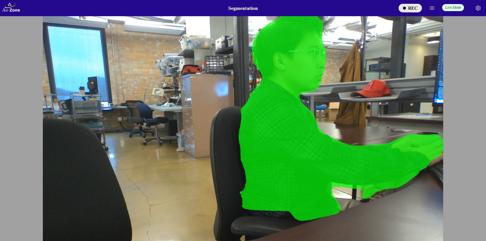
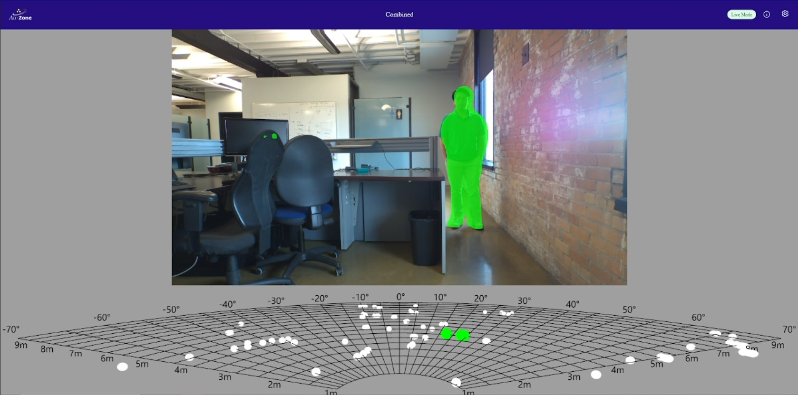

# EdgeFirst Platform Workflow

This page will walk you through a high-level overview of EdgeFirst Studio by introducing a high-level workflow from collecting and curating datasets using an [EdgeFirst Platform](../../platforms/index.md) to training, validating, and deploying EdgeFirst models.

This workflow follows from the steps in the [Getting Started](../../index.md) which requires the user to have signed up to EdgeFirst Studio, logged in to EdgeFirst Studio, and created their first project.

This workflow is a tutorial for showing the process of recording data from scratch using an EdgeFirst Platform, annotating data
in EdgeFirst Studio from a PC, training and validating models, and then finally deploying models in an EdgeFirst Platform. 

!!! note
    This tutorial will provide examples on training, validating, and deploying *Vision models* described in [ModelPack Tutorials](../../models/index.md). 

If you have an EdgeFirst Platform, please proceed to step 1. Otherwise, proceed to step 5 for using a provided public dataset. However, feel free to follow along all the steps laid out to become familiar with the workflow.

### 1. Record Data

When starting from scratch, it is common to start recording your own data to build your own dataset. This step requires an [EdgeFirst Platform](../../platforms/quickstart.md) for recording data. However, we also provide [Public Datasets](../studio.md#datasets) for users without an EdgeFirst Platform. 

For instructions on capturing and recording data, refer to the [Capture/Record Data Tutorial](../../datasets/tutorials/capture.md#capture-with-an-edgefirst-platform).

### 2. Download Recorded Data

Once data is recorded which is stored as an MCAP file, download the MCAP file.

For instructions on downloading the recorded MCAP file, refer to the [Download Captured Data Tutorial](../../datasets/tutorials/capture.md#download-mcap).

### 3. Upload Recorded Data to EdgeFirst Studio

Once an MCAP file has been downloaded, upload the MCAP recording to EdgeFirst Studio.

For instructions on uploading the recorded MCAP file to EdgeFirst Studio, refer to the [Upload Recorded Data Tutorial](../../datasets/tutorials/capture.md#upload-mcap).

### 4. Annotate Dataset

Once an MCAP recording has been uploaded to EdgeFirst Studio, we can then run [auto-annotations](../../datasets/tutorials/annotations/automatic.md#fully-automatic-ground-truth-generation) on the recording to reduce the effort needed from the user. Otherwise, the user can manually annotate [2D](../../datasets/tutorials/annotations/manual.md#manual-2d-annotations) or [3D](../../datasets/tutorials/annotations/manual.md#manual-3d-annotations) annotations on the dataset.

### 5. Combine Multiple Datasets

This step utilizes the [copy dataset feature](../../datasets/tutorials/management.md#copying-datasets) in EdgeFirst Studio. This feature
allows copying of *read-only* datasets into your own dataset to give write permissions. This feature can also copy multiple datasets into a single container to expand the overall dataset. 

For users that do not have an EdgeFirst Platform, but would like to use the public *read-only* datasets provided, follow the instructions for [Copying Datasets](../../datasets/tutorials/management.md#copying-datasets) into
a dataset container with write access.

For users that followed steps 1-4 and would like to expand their dataset, follow the
instructions for [Combining Datasets](../../datasets/tutorials/management.md#combining-datasets)

### 6. Split Dataset

Before training your model, it is highly suggested to split your dataset into dedicated training and validation groups. This intention is to reserve samples only for training and samples only for validation.

For instructions on splitting the dataset in train and validation groups, refer to the [Splitting Datasets Tutorial](../../datasets/tutorials/management.md#splitting-datasets)

### 7. Train Model

Once you have a proper dataset that is fully annotated and split into training and validation groups, you can now start training your model.

Since the dataset provided in the demo contains 2D annotations (bounding boxes and segmentation masks) we can train a Vision model using ModelPack. For instructions to train a Vision model, please refer to the [Training ModelPack Tutorial](../../models/modelpack/training.md). For instructions to train a Fusion model, please refer to the [Training Fusion Tutorial](../../models/fusion/training.md).

### 8. Validate Model

Once the model is trained, you can now start validating the performance of the model to verify if the model is ready for deployment. 

For instructions to validate a Vision model, please refer to the [Validating ModelPack Tutorial](../../models/modelpack/validation/user_managed.md). For instructions to validate a Fusion model, please refer to the [Validating Fusion Tutorial](../../models/fusion/validation.md).

### 9. Deploy Model

Once the model has been validated and deemed the performance to be reasonable for deployment, you can now deploy the model on a Maivin Platform and start running inference on the model. 

To deploy ModelPack on a Maivin Platform, please see the [ModelPack Deployment](../../models/modelpack/deployment/maivin.md) instructions.

<figure markdown="span">
{ align=center }
<figcaption>Preview: Segmentation Inference</figcaption>
</figure>

To deploy Fusion models on an EdgeFirst Platform, please see the [Fusion Deployment](../../models/fusion/deployment/raivin.md) instructions.

<figure markdown="span">
{ align=center }
<figcaption>Preview: Fusion Inference</figcaption>
</figure>