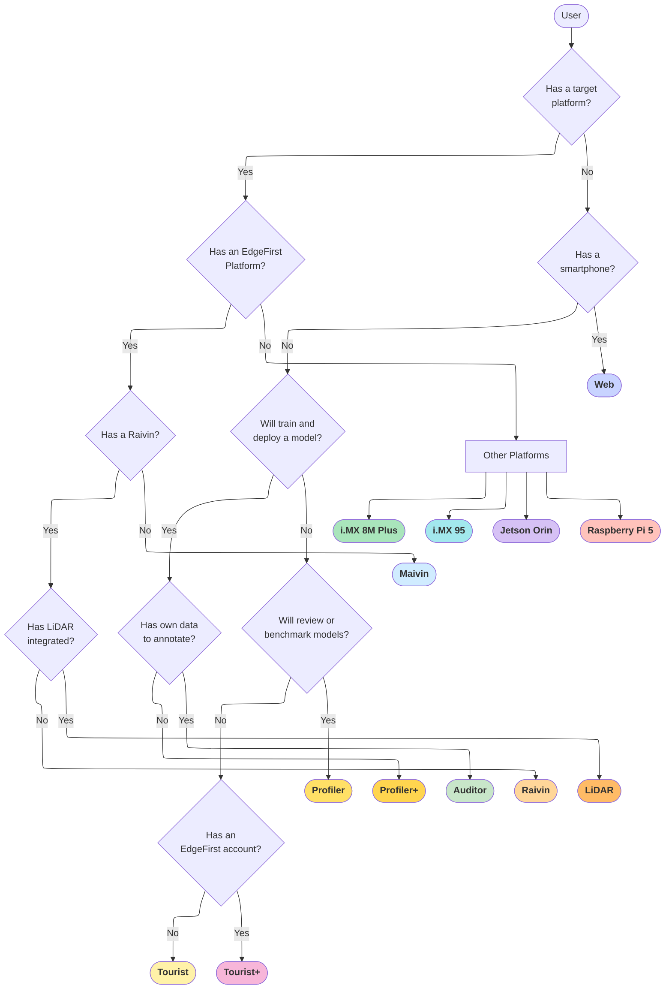

# User Workflows

EdgeFirst Studio offers workflows tailored to your hardware and resources.

!!! tip "Free Credits"
    New accounts receive **\$50 USD in free credits** upon sign-up, plus **\$15 USD in free credits every month**. No credit card required to get started.

    <iframe width="560" height="315" src="https://www.youtube.com/embed/MmoDCXj72jk?si=I8gTw2VCtcts69ks" title="EdgeFirst Studio Overview" frameborder="0" allow="accelerometer; autoplay; clipboard-write; encrypted-media; gyroscope; picture-in-picture; web-share" referrerpolicy="strict-origin-when-cross-origin" allowfullscreen></iframe>

## User Personas

The following diagram describes the workflow for identifying the user personas depending on the hardware requirements.

!!! warning "PC Requirement"
    It is expected that for all personas identified above, the user has a PC with Wi-Fi access.

We've identified the following workflows that any user can follow starting from the most basic to the most features.  The hardware requirements and the available features increases starting with the Tourist as the most basic.

* **Cloud Personas**: General-purpose cloud-based MLOps workflows designed for PC users.
* **Hardware Personas**: Hardware-specific (specialized) MLOps workflows tailored for deployment, validation, and optimization on supported target devices.

!!! note "About these workflows"
    The hardware workflows use the **Coffee Cup** sample dataset and train a **ModelPack** vision model. Cost estimations shown in the table reflect this specific configuration — actual costs will vary depending on your dataset size, the model type and training configurations.

### Cloud Personas

| Persona | Hardware | Features | Cost |
|---------|----------|----------|------|
| [Tourist](tourist.md) | PC | Explore {{ studio_link("EdgeFirst Studio") }} Landing Page and Feature Overview | Free |
| [Tourist+](tourist_plus.md) | PC | {{ studio_link("Sign Up", "signup") }}, {{ studio_link("Login", "login") }}, Browse {{ studio_link("Public Datasets and Models", "project") }} | Free |
| [Profiler](profiler.md) | PC | Browse [Hugging Face Model Zoo](https://huggingface.co/spaces/EdgeFirst/Models), Review Training and Validation Sessions | Free |
| [Profiler+](profiler_plus.md) | PC | Copy Sample Dataset, Retrain, Revalidate, Compare Against Hugging Face Model Zoo, Deploy on Browser or on Target (if available) | TBA |
| [Auditor](auditor.md) | PC | Copy Dataset, Annotate 2D, Train, Validate, Deploy on Browser | TBA |
| [Web](web.md) | PC + Smartphone | Record, Annotate 2D, Train, Validate, Deploy on Browser | TBA |

### Hardware Personas

| Persona | Hardware | Features | Cost |
|---------|----------|----------|------|
| [Maivin](hardware.md) | PC + Maivin | Record MCAP, Annotate 2D, Train, Validate, Deploy on Maivin | TBA |
| [Raivin](hardware.md) | PC + Raivin w/ Radar | Record MCAP, Annotate 2D + 3D, Train, Validate, Deploy on Raivin | TBA |
| [LiDAR](hardware.md) | PC + Raivin w/ LiDAR | Record MCAP, Annotate 2D + 3D (enhanced), Train, Validate, Deploy on Raivin | TBA |
| [i.MX 8M Plus](hardware.md) | PC + i.MX 8M Plus | Copy Dataset, Train, Validate, Deploy on i.MX 8M Plus | ~\$8 USD |
| [i.MX 95](hardware.md) | PC + i.MX 95 | Copy Dataset, Train, Validate, Deploy on i.MX 95 | ~\$8 USD |
| [Jetson Orin](hardware.md) | PC + Jetson Orin | Copy Dataset, Train, Validate, Deploy on Jetson Orin | ~\$8 USD |
| [Raspberry Pi 5](hardware.md) | PC + Raspberry Pi 5 | Copy Dataset, Train, Validate, Deploy on Raspberry Pi 5 | ~\$8 USD |

## User Journey

The following diagram describes the workflows for each user persona identified above.

```mermaid
%%{init: {"flowchart": {"defaultRenderer": "elk", "nodeSpacing": 60, "rankSpacing": 80}, "elk": {"algorithm": "layered", "elk.spacing.nodeNode": 40, "elk.layered.spacing.nodeNodeBetweenLayers": 80}, "themeVariables": { "fontSize": "60px" }} }%%
flowchart LR
    %% ---------------- USERS ----------------
    subgraph Users
    direction TB
    users_pad[" "]:::invisible
    tourist([Tourist]):::yellow
    click tourist "tourist" "Open Tourist Workflow"

    tourist_plus([Tourist+]):::pink
    click tourist_plus "tourist_plus" "Open Tourist Plus Workflow"

    profiler_user([Profiler]):::gold
    click profiler_user "profiler" "Open Profiler Workflow"

    profiler_plus_user([Profiler+]):::amber
    click profiler_plus_user "profiler_plus" "Open Profiler Plus Workflow"

    auditor_user([Auditor]):::sage
    click auditor_user "auditor" "Open Auditor Workflow"

    web_user([Web]):::indigo
    click web_user "web" "Open Web Workflow"

    maivin_user([Maivin]):::blue
    click maivin_user "/platforms/quickstart/maivin/" "Open Maivin Workflow"

    raivin_user([Raivin]):::orange
    click raivin_user "/platforms/quickstart/raivin/" "Open Raivin Workflow"

    raivin_lidar_user([Raivin + LiDAR]):::darker_orange

    imx8mp_user([i.MX 8M Plus]):::green
    click imx8mp_user "/platforms/quickstart/imx8mplus/" "Open i.MX 8M Plus Workflow"

    imx95_user([i.MX 95]):::teal
    click imx95_user "/platforms/quickstart/imx95/" "Open i.MX 95 Workflow"

    orin_user([Jetson Orin]):::purple
    click orin_user "/platforms/quickstart/jetson_orin/" "Open Jetson Orin Workflow"

    pi_user([Raspberry Pi 5]):::coral
    click pi_user "/platforms/quickstart/raspberrypi/" "Open Raspberry Pi Workflow"
    end

    %% ---------------- HARDWARE ----------------
    subgraph Hardware
    direction TB
    setup_pad[" "]:::invisible
    raivin_lidar_setup[Setup Raivin + LiDAR]:::darker_orange
    click raivin_lidar_setup "../../platforms/quickstart/raivin/setup" "Open Raivin Setup"

    raivin_setup[Setup Raivin]:::orange
    click raivin_setup "../../platforms/quickstart/raivin/setup" "Open Raivin Setup"

    maivin_setup[Setup Maivin]:::blue
    click maivin_setup "../../platforms/quickstart/maivin/setup" "Open Maivin Setup"

    imx8mp_setup[Setup i.MX 8M Plus]:::green
    click imx8mp_setup "../../platforms/quickstart/imx8mplus/setup" "Open i.MX 8M Plus Setup"

    imx95_setup[Setup i.MX 95]:::teal
    click imx95_setup "../../platforms/quickstart/imx95/setup" "Open i.MX 95 Setup"

    orin_setup[Setup Jetson Orin]:::purple
    click orin_setup "../../platforms/quickstart/jetson_orin/setup" "Open Jetson Orin Setup"

    pi_setup[Setup Raspberry Pi 5]:::coral
    click pi_setup "../../platforms/quickstart/raspberrypi/setup" "Open Raspberry Pi Setup"
    end

    %% ---------------- DATA ----------------
    subgraph Dataset
    direction TB
    record_mcap[Record MCAP]
    click record_mcap "../../datasets/tutorials/capture/#record-mcap" "Record MCAP"

    capture[Capture Phone Video/Images]
    click capture "../../datasets/tutorials/capture/#capture-with-a-phone" "Capture Phone Video/Images"
    
    snapshot[Upload MCAP]
    click snapshot "../../datasets/tutorials/capture/#upload-mcap" "Upload MCAP"

    copy_dataset[Copy Public Dataset]
    click copy_dataset "../copy_dataset" "Copy Public Dataset"

    audit_2d[Auto Annotate 2D]
    click audit_2d "../../datasets/tutorials/annotations/automatic/" "Auto Annotate 2D"

    audit_3d[Auto Annotate 3D]
    click audit_3d "../../datasets/tutorials/annotations/automatic/" "Auto Annotate 3D"

    browse_studio[Browse Studio]
    end

    %% ---------------- TRAINING + CONVERSION ----------------
    subgraph TrainConvert[" "]
    direction TB
        %% ---------------- TRAINING ----------------
        subgraph Training
        direction TB
        training_pad[" "]:::invisible
        train_2d[Train Vision Model]
        click train_2d "../../models/training/vision" "Open Training Vision"

        ara2{Device has ARA2 processor?}
        validate_2d[Validate Vision Model]
        click validate_2d "../../models/validation/vision/user_managed" "Open Validating Vision"

        train_3d[Train Fusion Model]
        click train_3d "../../models/training/fusion" "Open Training Fusion"

        validate_3d[Validate Fusion Model]
        click validate_3d "../../models/validation/fusion/managed" "Open Validating Fusion"
        training_pad_bottom[" "]:::invisible
        end

        %% ---------------- CONVERSION ----------------
        subgraph Conversion
        direction TB
        conversion_pad[" "]:::invisible
        tflite_converter[TFLite Converter]
        click tflite_converter "../../models/conversion/tflite/" "Open TFLite Converter"

        hailo_converter[Hailo Converter]
        click hailo_converter "../../models/conversion/hailo/" "Open Hailo Converter"

        tensorrt_converter[TensorRT Converter]
        click tensorrt_converter "../../models/conversion/tensorrt/" "Open TensorRT Converter"

        neutron_converter[Neutron Converter]:::teal
        click neutron_converter "../../models/conversion/neutron/" "Open Neutron Converter"

        kinara_converter[Kinara Converter]
        click kinara_converter "../../models/conversion/ara2/" "Open Kinara Converter"

        validate_tflite[Validate TFLite Model]
        click validate_tflite "../../models/validation/vision/user_managed" "Open Validating Vision"

        validate_hailo[Validate Hailo Model]
        click validate_hailo "../../models/validation/vision/user_managed" "Open Validating Vision"

        validate_tensorrt[Validate TensorRT Model]
        click validate_tensorrt "../../models/validation/vision/user_managed" "Open Validating Vision"

        validate_ara2[Validate ARA-2 Model]
        click validate_ara2 "../../models/validation/vision/user_managed" "Open Validating Vision"

        validate_imx95[Validate Converted Model]:::teal
        click validate_imx95 "../../models/validation/vision/user_managed" "Open Validating Vision"
        conversion_pad_bottom[" "]:::invisible
        end
    end

    %% ---------------- DEPLOYMENT ----------------
    subgraph Deployment
    direction LR
    deploy_pad[" "]:::invisible
    raivin((Raivin)):::orange
    click raivin "../../platforms/quickstart/raivin/deploy" "Open Raivin Deploy"

    maivin((Maivin)):::blue
    click maivin "../../platforms/quickstart/maivin/deploy" "Open Maivin Deploy"

    imx8mp((i.MX 8M Plus)):::green
    click imx8mp "../../platforms/quickstart/imx8mplus/deploy" "Open i.MX 8M Plus Deploy"

    orin((Jetson Orin)):::purple
    click orin "../../platforms/quickstart/jetson_orin/deploy" "Open Jetson Orin Deploy"

    pi((Raspberry Pi 5)):::coral
    click pi "../../platforms/quickstart/raspberrypi/deploy" "Open Raspberry Pi Deploy"

    browser((Browser))
    click browser "../../models/deployment/studio/" "Open Browser Deploy"

    imx95((i.MX 95)):::teal
    click imx95 "../../platforms/quickstart/imx95/deploy" "Open i.MX 95 Deploy"
    deployment_pad_bottom[" "]:::invisible
    end

    %% ---------------- USER → SETUP ----------------
    raivin_lidar_user --> raivin_lidar_setup
    raivin_user --> raivin_setup
    maivin_user --> maivin_setup
    imx8mp_user --> imx8mp_setup
    imx95_user --> imx95_setup
    orin_user --> orin_setup
    pi_user --> pi_setup

    %% ---------------- SETUP → DATA ----------------
    raivin_lidar_setup --> record_mcap
    raivin_setup --> record_mcap
    maivin_setup --> record_mcap
    web_user --> capture

    imx8mp_setup --> copy_dataset
    imx95_setup --> copy_dataset
    orin_setup --> copy_dataset
    pi_setup --> copy_dataset
    tourist --> browse_studio
    tourist_plus --> browse_studio
    auditor_user --> copy_dataset
    profiler_plus_user --> copy_dataset

    %% ---------------- DATA FLOW ----------------
    record_mcap --> snapshot
    snapshot --> audit_2d --> train_2d
    snapshot -- LiDAR Only --> audit_3d --> train_3d

    capture --> audit_2d
    copy_dataset --> train_2d
    copy_dataset -- Auditor --> audit_2d

    %% ---------------- TRAINING PIPELINE ----------------
    train_2d --> ara2
    ara2 -- Yes --> kinara_converter --> validate_ara2
    ara2 -- No --> validate_2d

    train_2d --> neutron_converter --> validate_imx95
    train_2d --> tflite_converter --> validate_tflite
    train_2d --> hailo_converter --> validate_hailo
    train_2d --> tensorrt_converter --> validate_tensorrt
    train_3d --> validate_3d

    %% ---------------- DEPLOYMENT ----------------
    validate_2d --> browser
    validate_tflite --> maivin
    validate_tflite --> imx8mp
    validate_tflite --> pi
    validate_tflite --> raivin

    validate_hailo --> pi

    validate_tensorrt --> orin

    validate_ara2 --> imx8mp
    validate_ara2 --> imx95

    validate_3d --> raivin
    validate_imx95 --> imx95

    %% ---------------- STYLES ----------------
    classDef yellow fill:#fff2a8,font-weight:bold;
    classDef pink fill:#f7b6d9,font-weight:bold;
    classDef indigo fill:#c8d3ff,font-weight:bold;
    classDef blue fill:#d0ecff,font-weight:bold;
    classDef teal fill:#a2e8ed,font-weight:bold;
    classDef orange fill:#ffd699,font-weight:bold;
    classDef darker_orange fill:#ffbb66,font-weight:bold;
    classDef green fill:#a9e5bb,font-weight:bold;
    classDef purple fill:#d6c1f5,font-weight:bold;
    classDef coral fill:#ffc2bb,font-weight:bold;
    classDef gold fill:#ffe066,font-weight:bold;
    classDef amber fill:#ffd54f,font-weight:bold;
    classDef sage fill:#c8e6c9,font-weight:bold;
    classDef invisible fill:transparent,stroke:transparent;
    style TrainConvert fill:transparent,stroke:transparent;
```

!!! note
    Labeled arrows indicate that only certain types of users can enter the stages they point to. For example, only Raivin and LiDAR users can "Auto Annotate 3D".

### Cloud Workflows

1. [Tourist Workflow](tourist.md)

    This workflow is intended for users who want to explore EdgeFirst Studio and get an overview of the platform's features — no account required.

2. [Tourist+ Workflow](tourist_plus.md)

    This workflow is intended for users who are ready to sign up, log in, and browse the public datasets and models available in EdgeFirst Studio.

3. [Profiler Workflow](profiler.md)

    This workflow is intended for users who want to browse and review model benchmarks in the [EdgeFirst Model Zoo on Hugging Face](https://huggingface.co/spaces/EdgeFirst/Models) and review training and validation sessions in EdgeFirst Studio — no training required.

4. [Profiler+ Workflow](profiler_plus.md)

    This workflow extends the Profiler workflow with hands-on experimentation: copy a sample dataset, retrain a model, revalidate, and compare results against the Hugging Face Model Zoo baselines.  Models can be deployed on a browser or on a compatible target device.

5. [Auditor Workflow](auditor.md)

    This workflow is intended for users who want to annotate their own datasets, train a custom model, validate it, and deploy on the browser — all in the cloud without requiring target hardware.

6. [Web Workflow](web.md)

    This workflow is intended for users with a personal computer and a mobile device with a camera with access to Wi-Fi and a web browser.  The examples shown in this workflow will be from a Windows computer and an Android phone for recording images.  Proceed to this workflow to see capturing and annotating datasets that will be used to train, validate, and deploy Vision models.

### Hardware Workflows

7. [Hardware Persona Workflows](hardware.md)

    Hardware-specific workflows for users with an EdgeFirst target device.  Each platform has its own step-by-step workflow covering device setup, dataset acquisition, model training, conversion, on-target validation, and deployment.

!!! note "Future Work"

    The workflows with missing links are a work in progress and currently unavailable.
    