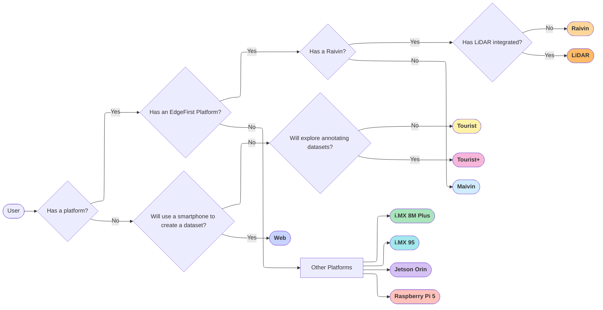

# User Workflows

EdgeFirst Studio offers workflows tailored to your hardware and resources.

    <iframe width="560" height="315" src="https://www.youtube.com/embed/MmoDCXj72jk?si=I8gTw2VCtcts69ks" title="EdgeFirst Studio Overview" frameborder="0" allow="accelerometer; autoplay; clipboard-write; encrypted-media; gyroscope; picture-in-picture; web-share" referrerpolicy="strict-origin-when-cross-origin" allowfullscreen></iframe>

## User Personas

The following diagram describes the workflow for identifying the user personas depending on the hardware requirements.

!!! warning "PC Requirement"
    It is expected that for all personas identified above, the user has a PC with Wifi access.

We've identified ten workflows: Tourist, Tourist+, Web, i.MX 8M Plus, i.MX 95, Jetson Orin, Raspberry Pi 5, Maivin, Raivin, LiDAR.  The hardware requirements and the available features increases starting with the Tourist as the most basic.

| Persona                        | Hardware             | Features                                                               | Cost |
|--------------------------------|----------------------|------------------------------------------------------------------------|------|
| [Tourist](tourist.md)          | PC                   | Copy Dataset, Train, Validate, Deploy Offline or Browser               | TBA  |
| [Tourist+](tourist_plus.md)    | PC                   | Annotate 2D, Train, Validate, Deploy Offline or Browser                | TBA  |
| [Web](web.md)                  | PC + Smartphone      | Record, Annotate 2D, Train, Validate, Deploy Offline or Browser        | TBA  |
| i.MX 8M Plus (*coming soon*)   | PC + i.MX 8M Plus    | Copy Dataset, Train, Validate, Deploy on i.MX 8M Plus                  | TBA  |
| i.MX 95 (*coming soon*)        | PC + i.MX 95         | Copy Dataset, Train, Validate, Deploy on i.MX 95                       | TBA  |
| [Jetson Orin](jetson.md)       | PC + Jetson Orin     | Copy Dataset, Train, Validate, Deploy on Jetson Orin                   | TBA  |
| Raspberry Pi 5 (*coming soon*) | PC + Raspberry Pi 5  | Copy Dataset, Train, Validate, Deploy on Raspberry Pi 5                | TBA  |
| [Maivin](maivin.md)            | PC + Maivin          | Record, Annotate 2D, Train, Validate, Deploy on Maivin                 | TBA  |
| [Raivin](raivin.md)            | PC + Raivin w/ Radar | Record, Annotate 2D + 3D, Train, Validate, Deploy on Raivin            | TBA  |
| LiDAR (*coming soon*)          | PC + Raivin w/ LiDAR | Record, Annotate 2D + 3D (enhanced), Train, Validate, Deploy on Raivin | TBA  |

## User Journey

The following diagram describes the workflows for each user persona identified above.

```mermaid
%%{init: {"flowchart": {"defaultRenderer": "elk", "nodeSpacing": 60}, "themeVariables": { "fontSize": "60px" }} }%%
flowchart LR
    %% ---------------- USERS ----------------
    subgraph Users
    direction TB
    users_pad[" "]:::invisible
    tourist([Tourist]):::yellow
    click tourist "tourist" "Open Tourist Workflow"

    tourist_plus([Tourist+]):::pink
    click tourist_plus "tourist_plus" "Open Tourist Plus Workflow"

    web_user([Web]):::indigo
    click web_user "web" "Open Web Workflow"

    maivin_user([Maivin]):::blue
    click maivin_user "maivin" "Open Maivin Workflow"

    raivin_user([Raivin]):::orange
    click raivin_user "raivin" "Open Raivin Workflow"

    raivin_lidar_user([Raivin + LiDAR]):::darker_orange
    imx8mp_user([i.MX 8M Plus]):::green
    imx95_user([i.MX 95]):::teal

    orin_user([Jetson Orin]):::purple
    click orin_user "jetson" "Open Jetson Orin Workflow"

    pi_user([Raspberry Pi 5]):::coral
    end

    %% ---------------- HARDWARE ----------------
    subgraph Hardware
    direction TB
    setup_pad[" "]:::invisible
    raivin_lidar_setup[Setup Raivin + LiDAR]:::darker_orange
    click raivin_lidar_setup "../../platforms/quickstart/raivin/setup" "Open Raivin Setup"

    raivin_setup[Setup Raivin]:::orange
    click raivin_setup "../../platforms/quickstart/raivin/setup" "Open Raivin Setup"

    maivin_setup[Setup Maivin]:::blue
    click maivin_setup "../../platforms/quickstart/maivin/setup" "Open Maivin Setup"

    imx8mp_setup[Setup i.MX 8M Plus]:::green
    click imx8mp_setup "../../platforms/quickstart/imx8mplus/setup" "Open i.MX 8M Plus Setup"

    imx95_setup[Setup i.MX 95]:::teal
    click imx95_setup "../../platforms/quickstart/imx95/setup" "Open i.MX 95 Setup"

    orin_setup[Setup Jetson Orin]:::purple
    click orin_setup "../../platforms/quickstart/jetson_orin/setup" "Open Jetson Orin Setup"

    pi_setup[Setup Raspberry Pi 5]:::coral
    click pi_setup "../../platforms/quickstart/raspberrypi/setup" "Open Raspberry Pi Setup"
    end

    %% ---------------- DATA ----------------
    subgraph Dataset
    direction TB
    record_mcap[Record MCAP]
    click record_mcap "../../datasets/tutorials/capture/#record-mcap" "Record MCAP"

    capture[Capture Phone Video/Images]
    click capture "../../datasets/tutorials/capture/#capture-with-a-phone" "Capture Phone Video/Images"
    
    snapshot[Upload MCAP]
    click snapshot "../../datasets/tutorials/capture/#upload-mcap" "Upload MCAP"

    copy_dataset[Copy Public Dataset]
    click copy_dataset "../copy_dataset" "Copy Public Dataset"

    audit_2d[Auto Annotate 2D]
    click audit_2d "../../datasets/tutorials/annotations/automatic/" "Auto Annotate 2D"

    audit_3d[Auto Annotate 3D]
    click audit_3d "../../datasets/tutorials/annotations/automatic/" "Auto Annotate 3D"
    end

    %% ---------------- TRAINING ----------------
    subgraph Training
    direction TB
    train_2d[Train Vision Model]
    click train_2d "../../models/training/vision" "Open Training Vision"

    ara2{Device has ARA2 processor?}
    validate_2d[Validate Vision Model]
    click validate_2d "../../models/validation/vision/user_managed" "Open Validating Vision"

    train_3d[Train Fusion Model]
    click train_3d "../../models/training/fusion" "Open Training Fusion"

    validate_3d[Validate Fusion Model]
    click validate_3d "../../models/validation/fusion/managed" "Open Validating Fusion"
    end

    %% ---------------- CONVERSION ----------------
    subgraph Conversion
    direction TB
    neutron_converter[Neutron Converter]:::teal
    click neutron_converter "../../models/ultralytics/neutron" "Open Neutron Converter"

    kinara_converter[Kinara Converter]
    validate_imx95[Validate Converted Model]:::teal
    click validate_imx95 "../../models/validation/vision/user_managed" "Open Validating Vision"
    end

    %% ---------------- DEPLOYMENT ----------------
    subgraph Deployment
    direction LR
    deploy_pad[" "]:::invisible
    raivin((Raivin)):::orange
    click raivin "../../platforms/quickstart/raivin/deploy" "Open Raivin Deploy"

    maivin((Maivin)):::blue
    click maivin "../../platforms/quickstart/maivin/deploy" "Open Maivin Deploy"

    imx8mp((i.MX 8M Plus)):::green
    click imx8mp "../../platforms/quickstart/imx8mplus/deploy" "Open i.MX 8M Plus Deploy"

    orin((Jetson Orin)):::purple
    click orin "../../platforms/quickstart/jetson_orin/deploy" "Open Jetson Orin Deploy"

    pi((Raspberry Pi 5)):::coral
    click pi "../../platforms/quickstart/raspberrypi/deploy" "Open Raspberry Pi Deploy"

    browser((Browser))

    imx95((i.MX 95)):::teal
    click imx95 "../../platforms/quickstart/imx95/deploy" "Open i.MX 95 Deploy"
    end

    %% ---------------- USER → SETUP ----------------
    raivin_lidar_user --> raivin_lidar_setup
    raivin_user --> raivin_setup
    maivin_user --> maivin_setup
    imx8mp_user --> imx8mp_setup
    imx95_user --> imx95_setup
    orin_user --> orin_setup
    pi_user --> pi_setup

    %% ---------------- SETUP → DATA ----------------
    raivin_lidar_setup --> record_mcap
    raivin_setup --> record_mcap
    maivin_setup --> record_mcap
    web_user --> capture

    imx8mp_setup --> copy_dataset
    imx95_setup --> copy_dataset
    orin_setup --> copy_dataset
    pi_setup --> copy_dataset
    tourist --> copy_dataset
    tourist_plus --> copy_dataset

    %% ---------------- DATA FLOW ----------------
    record_mcap --> snapshot
    snapshot --> audit_2d --> train_2d
    snapshot -- LiDAR Only --> audit_3d --> train_3d

    capture --> audit_2d
    copy_dataset --> train_2d
    copy_dataset -- Tourist+ --> audit_2d

    %% ---------------- TRAINING PIPELINE ----------------
    train_2d --> ara2
    ara2 -- Yes --> kinara_converter --> validate_2d
    ara2 -- No --> validate_2d

    train_2d --> neutron_converter --> validate_imx95
    train_3d --> validate_3d

    %% ---------------- DEPLOYMENT ----------------
    validate_2d --> browser
    validate_2d --> maivin
    validate_2d --> imx8mp
    validate_2d --> orin
    validate_2d --> pi
    validate_2d --> raivin

    validate_3d --> raivin
    validate_imx95 --> imx95

    %% ---------------- STYLES ----------------
    classDef yellow fill:#fff2a8,font-weight:bold;
    classDef pink fill:#f7b6d9,font-weight:bold;
    classDef indigo fill:#c8d3ff,font-weight:bold;
    classDef blue fill:#d0ecff,font-weight:bold;
    classDef teal fill:#a2e8ed,font-weight:bold;
    classDef orange fill:#ffd699,font-weight:bold;
    classDef darker_orange fill:#ffbb66,font-weight:bold;
    classDef green fill:#a9e5bb,font-weight:bold;
    classDef purple fill:#d6c1f5,font-weight:bold;
    classDef coral fill:#ffc2bb,font-weight:bold;
    classDef invisible fill:transparent,stroke:transparent;
```

!!! note
    Labeled arrows suggests that only certain type of users can enter the stages pointed by the arrow.  For example, only Raivin and LiDAR users can "Auto Annotate 3D".

1. [Tourist Workflow](tourist.md)

    This workflow is intended for users with a personal computer with access to Wifi that want to use the sample datasets available for training, validating, and deploying Vision models.

2. [Tourist Plus Workflow](tourist_plus.md)

    This workflow is intended for users with a personal computer with access to Wifi that want to use the same datasets available for annotating, training, validating, and deploying Vision models.

3. [Web Workflow](web.md)

    This workflow is intended for users with a personal computer and a mobile device with a camera with access to Wifi and a web browser.  The examples shown in this workflow will be from a Windows computer and an Android phone for recording images.  Proceed to this workflow to see capturing and annotating datasets that will be used to train, validate, and deploy Vision models.

4. [Jetson Orin Workflow](jetson.md)

    This workflow is intended for users with a personal computer with access to Wifi and a web browser and a [Jetson Orin Super Nano](https://www.nvidia.com/en-us/autonomous-machines/embedded-systems/jetson-orin/nano-super-developer-kit/) platform. To proceed to this workflow, click on the link above.

5. [Maivin Workflow](maivin.md)

    This workflow is intended for users with a personal computer with access to Wifi and a web browser and a Maivin platform.  To proceed to this workflow, click on the link above.

6. [Raivin Workflow](raivin.md)

    This workflow is intended for users with a personal computer with access to Wifi and a web browser and a Raivin platform.  To proceed to this workflow, click on the link above.

!!! note "Future Work"

    The workflows with missing links are a work in progress and currently unavailable. 
    