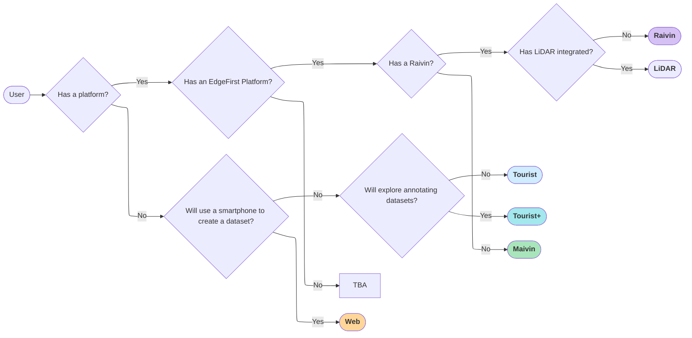
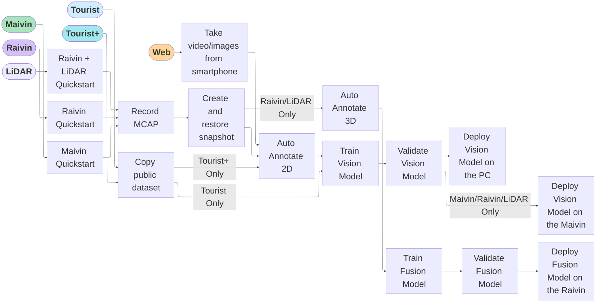

# User Workflows

Edgefirst Studio provides specific workflows tailored towards various user personas depending on the hardware requirements and resources available to the user.

    <iframe width="560" height="315" src="https://www.youtube.com/embed/MmoDCXj72jk?si=I8gTw2VCtcts69ks" title="EdgeFirst Studio Overview" frameborder="0" allow="accelerometer; autoplay; clipboard-write; encrypted-media; gyroscope; picture-in-picture; web-share" referrerpolicy="strict-origin-when-cross-origin" allowfullscreen></iframe>

## User Personas 

The following diagram describes the workflow for identifying the user personas depending on the hardware requirements.

!!! warning "PC Requirement"
    It is expected that for all personas identified above, the user has a PC with Wifi access.

We've identified six workflows: Tourist, Tourist+, Web, Maivin, Raivin, LiDAR.  The hardware requirements and the available features increases starting with the Tourist as the most basic. 

| Persona        | Hardware              | Features                                                                |
|----------------|-----------------------|-------------------------------------------------------------------------|
| Tourist        | PC                    | Train, Validate, Deploy Offline                                         |
| Tourist+       | PC                    | Annotate 2D, Train, Validate, Deploy Offline                            |
| Web            | PC + Smartphone       | Record, Annotate 2D, Train, Validate, Deploy Offline                    |
| Maivin         | PC + Maivin           | Record, Annotate 2D, Train, Validate, Deploy on Device                  |
| Raivin         | PC + Raivin w/ Radar  | Record, Annotate 2D + 3D, Train, Validate, Deploy on Device             |
| LiDAR          | PC + Raivin w/ LiDAR  | Record, Annotate 2D + 3D (enhanced), Train, Validate, Deploy on Device  |

## User Journey

The following diagram describes the workflows for each user persona identified above.

!!! note
    Labeled arrows suggests that only certain type of users can enter the stages pointed by the arrow.  For example, only Raivin and LiDAR users can "Auto Annotate 3D".

1. [Web Workflow](web.md)

    This workflow is intended for users with a personal computer and a device with a camera with access to Wifi and a web browser.  The examples shown in this workflow will be from a Windows computer and an Android phone for recording images.  To proceed to this workflow, click on the link above.

2. [EdgeFirst Platform Workflow](edgefirst.md)

    This workflow is intended for users with a personal computer with access to Wifi and a web browser and a Maivin or a Raivin platform.  To proceed to this workflow, click on the link above.

!!! note

    The maivin, raivin, and LiDAR persona are currently based on the EdgeFirst Platform Workflow identified as the second workflow above.  Future work will introduce separate workflows for each of these personas to highlight their differences. 