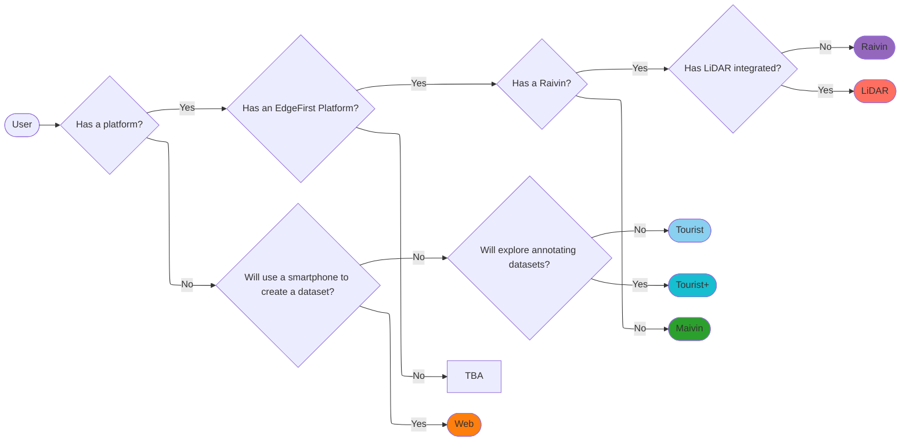
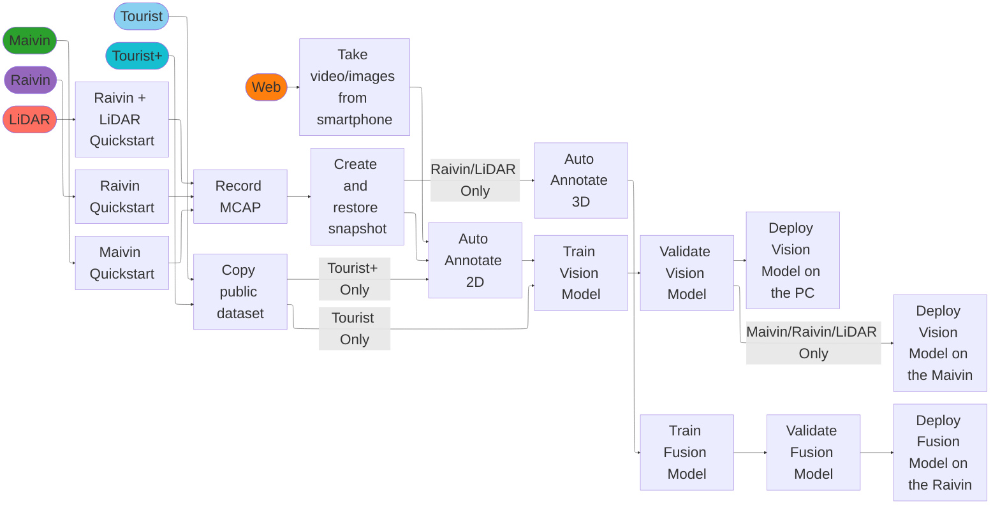

# Getting Started

Welcome to EdgeFirst Studio (formerly Deep View Enterprise)!  This guide will introduce you to the components of the EdgeFirst AI Ecosystem.

!!! tip "Need Help?"
    📬 Have questions or ran into an issue?  
    Feel free to [email our support team](mailto:support@edgefirst.ai) — we’re here to help!

    <iframe width="560" height="315" src="https://www.youtube.com/embed/HaiYg6Dk57Y" title="EdgeFirst Studio Introduction" frameborder="0" allow="accelerometer; autoplay; clipboard-write; encrypted-media; gyroscope; picture-in-picture; web-share" referrerpolicy="strict-origin-when-cross-origin" allowfullscreen></iframe>

## EdgeFirst Platforms Quickstart

If you have recently received one of these EdgeFirst Platforms, you should first start with
the [EdgeFirst Platforms Quickstart](platforms/quickstart.md) and then come back once you're ready to get started with EdgeFirst Studio.

**[Maivin 1](platforms/index.md)** | **[Maivin 2](platforms/index.md)** | **[Raivin](platforms/index.md)**
:------------------:|:------------------:|:------------------:
 |  | 

!!! tip
    Though not required, where appropriate, we recommend you to follow along with an appropriate edge device to test the models on the actual hardware.

## EdgeFirst Studio Quickstart

This section describes the steps for onboarding new users to EdgeFirst Studio by creating their account, logging into EdgeFirst Studio, and creating their first project. 

### Sign Up and Log In

1. If you haven't already created an EdgeFirst Studio Account, start by [creating an account][signup]. If you've already created an account, but you [forget your password](studio/access.md#forgot-password), click on the link for instructions to reset your password.

2. When creating your account, enter the required fields denoted by the asterisk (*) and then create your account once completed.

    <figure markdown="span">
    { align=center }
    <figcaption>Create a New Account</figcaption>
    </figure>

3. An email will be sent to verify the email you provided. Go ahead and click on the link provided to verify your email.

    <figure markdown="span">
    { align=center }
    <figcaption>Email Verification</figcaption>
    </figure>

4. Once the email is verified, you can now [login][login] to EdgeFirst Studio.

5. When logging in, enter your username and password you specified. Next click the *SIGN IN* button to sign in.

    <figure markdown="span">
    { align=center }
    <figcaption>Login Page</figcaption>
    </figure>

6. Once logged in to EdgeFirst Studio, you will be greeted with the following [Projects](./studio/projects.md) page.

    <figure markdown="span">
    { align=center }
    <figcaption>Projects Splash Page</figcaption>
    </figure>

### Initial Steps

Now that you are in the *Projects* or Main page, you will see a public project called "Sample Project" containing public datasets and completed experiments. More information about this project will be provided in the [EdgeFirst Studio Overview](getting_started/studio.md). 

For now, let's start by creating your first project since this is required in future tutorials. You can create a new project by clicking on the "New Project" button on the top-right corner of the page.

<figure markdown="span">
{ align=center }
<figcaption>The location of the "New Project" button</figcaption>
</figure>

Provide a name and a description of the project that reflects your goals.  In this example, the project will be named "Object Detection", which will be used in all future tutorials requiring a user-created project. Click "CREATE" to create your new project.

<figure markdown="span">
{ align=center }
<figcaption>Project Details</figcaption>
</figure>

Your newly created project will be placed next to the public project named "Sample Project". This public project contains public datasets for users to become familiar with [how datasets are managed](getting_started/datasets.md) in EdgeFirst Studio. 

!!! Warning
    The "Sample Project" project is **READ ONLY**.  Significant Studios functionality will need write-access to a project and will fail when attempted to be run on this project!

<figure markdown="span">
{ align=center }
<figcaption>Both Projects</figcaption>
</figure>

In this Quickstart guide, you have created your EdgeFirst Studio Account, logged in to EdgeFirst Studio, and created your very first project. Proceed to the section below for a deeper dive into EdgeFirst Studio workflows. 

### Next Steps

For these next steps, it is recommended for new users to be familiar with the concepts and UI elements in EdgeFirst Studio as described in the [EdgeFirst Studio: Overview](getting_started/studio.md). Next, users are invited to follow along various workflows that are tailored towards various hardware requirements and resources available to the user. These workflows are described in the next section below.

Otherwise, the following links will provide additional information for user onboarding in EdgeFirst Studio.

* [Dataset Management](getting_started/datasets.md)
* [Model Training, Validation, and Deployment](getting_started/models.md)
* [Command-Line Interface: Using the EdgeFirst Studio Middleware](getting_started/perception.md)
* [EdgeFirst Platforms: Setup and Boot Guide](getting_started/platforms.md)

#### Workflows

Edgefirst Studio provides specific workflows tailored towards various user personas depending on the hardware requirements and resources available to the user.

    <iframe width="560" height="315" src="https://www.youtube.com/embed/MmoDCXj72jk?si=I8gTw2VCtcts69ks" title="EdgeFirst Studio Overview" frameborder="0" allow="accelerometer; autoplay; clipboard-write; encrypted-media; gyroscope; picture-in-picture; web-share" referrerpolicy="strict-origin-when-cross-origin" allowfullscreen></iframe>

The following diagram describes the workflow for identifying the user personas depending on the hardware requirements.

The following diagram describes the workflows for each user persona identified above.

1. [Web-Based Workflow](getting_started/web.md)

    This workflow is intended for users with a personal computer and a device with a camera with access to Wifi and a web browser. The examples shown in this workflow will be from a Windows computer and an Android phone for recording images. To proceed to this workflow, click on the link above.

2. [EdgeFirst Platform Workflow](getting_started/workflows.md)

    This workflow is intended for users with a personal computer with access to Wifi and a web browser and a Maivin or a Raivin platform. To proceed to this workflow, click on the link above.

[signup]: #
[login]: #