# Getting Started

Welcome to EdgeFirst Studio (formerly Deep View Enterprise)!  Follow this Quickstart for user onboarding from start to finish.

## Sign Up 

1. If you haven't already created an EdgeFirst Studio Account, start by [creating an account][signup].  If you've already created an account, but you [forget your password](studio/access.md#forgot-password), click on the link for instructions to reset your password.

2. When creating your account, enter the required fields denoted by the asterisk (*) and then create your account once completed.

    <figure markdown="span">
    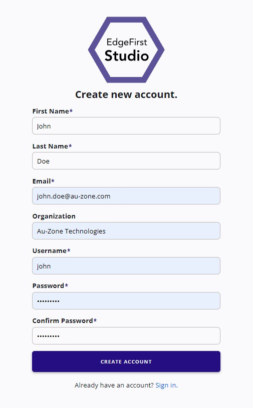{ align=center }
    <figcaption>Create a New Account</figcaption>
    </figure>

3. An email will be sent to verify the email you provided.  Go ahead and click on the link provided to verify your email.

    <figure markdown="span">
    { align=center }
    <figcaption>Email Verification</figcaption>
    </figure>

4. Once the email is verified, you can now [login][login] to EdgeFirst Studio.

## Log In

1. When logging in, enter your username and password you specified.  Next click the "Sign In" button to sign in.

    <figure markdown="span">
    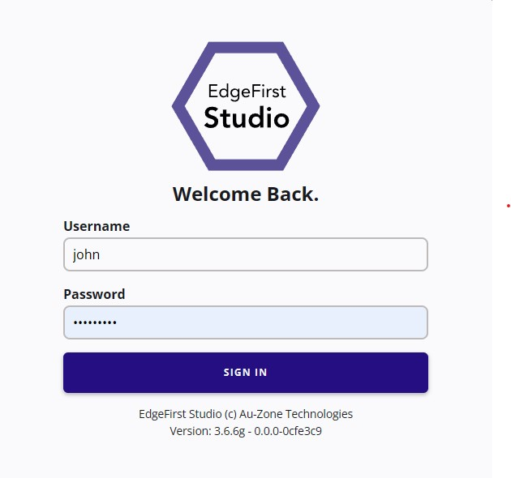{ align=center }
    <figcaption>Login Page</figcaption>
    </figure>

2. Once logged in to EdgeFirst Studio, you will be greeted with the following [Projects](./studio/projects.md) page.

    <figure markdown="span">
    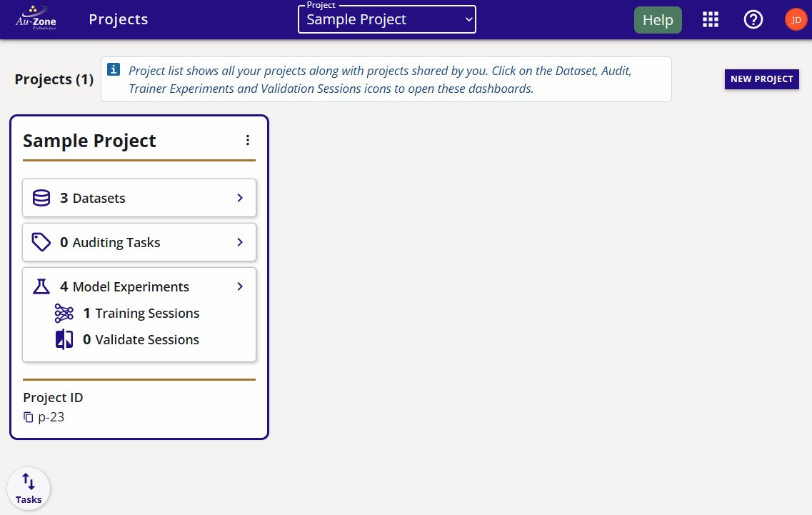{ align=center }
    <figcaption>Projects Splash Page</figcaption>
    </figure>

## Create Project

1. Now that you are in the *Projects* or Main page, create your first project by clicking on the "New Project" button on the top-right corner of the page.

    <figure markdown="span">
    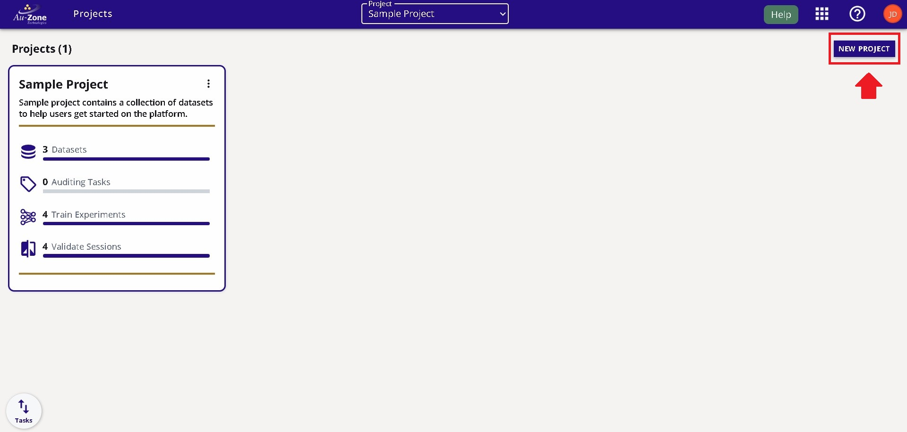{ align=center }
    <figcaption>The location of the "New Project" button</figcaption>
    </figure>

2. Provide a name and a description of the project as shown in the example below.  Click the "Create" button to create your new project.

    <figure markdown="span">
    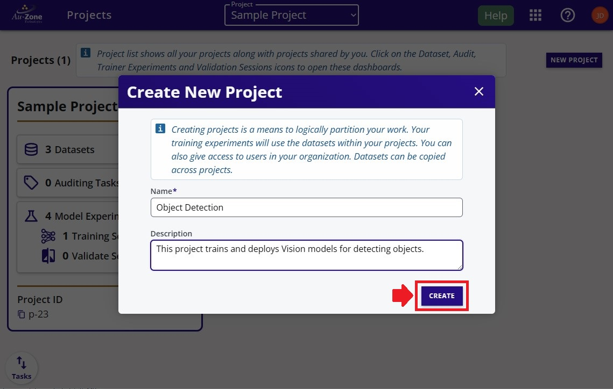{ align=center }
    <figcaption>Project Details</figcaption>
    </figure>

3. Your created project will be shown like the example below.  

    <figure markdown="span">
    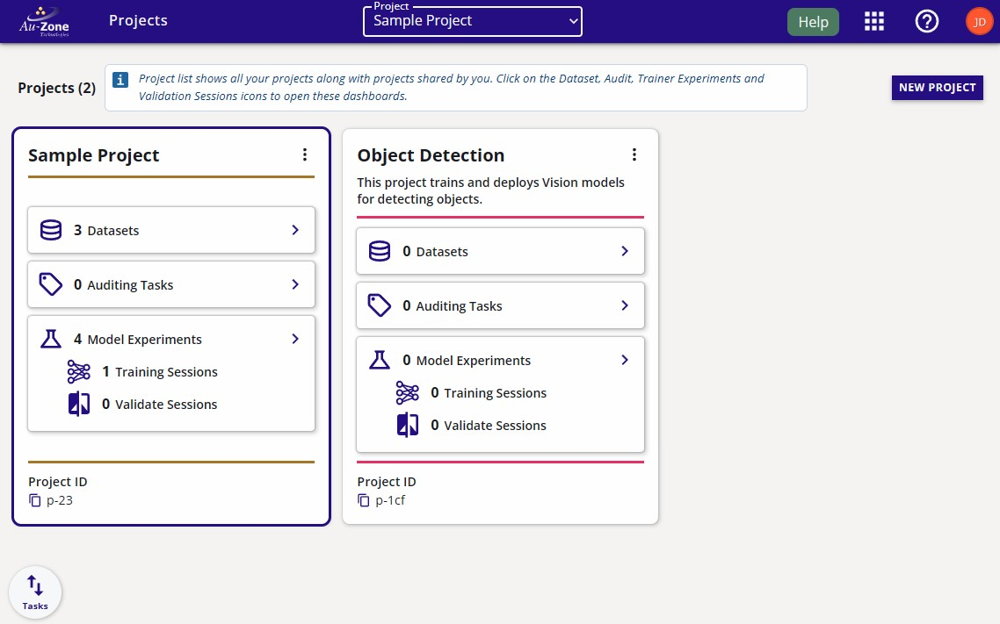{ align=center }
    <figcaption>Both Projects</figcaption>
    </figure>

## End-to-End Workflow

In this workflow, we will explore recording a video or capturing images using a mobile device and then upload the captured data into EdgeFirst Studio for annotation and then model training, validation, and deployment using the PC. 

!!! warning
    It is recommended to use a mobile device connected to a Wifi network. A device connected to mobile data might be subject to intense usage when uploading files as video files or image files can be large in size. In the examples below, the video file used was ~15MB and the image files were ~2MB.

### 1. Capture Data Using a Mobile Device

In this workflow, we will be exploring capturing data with samples of coffee cups for training a detection model that detects coffee cups. However, you can choose any type of objects in your dataset.

In this workflow, we will be recording a 5 second video on coffee cups as shown below. 

<figure markdown="span">
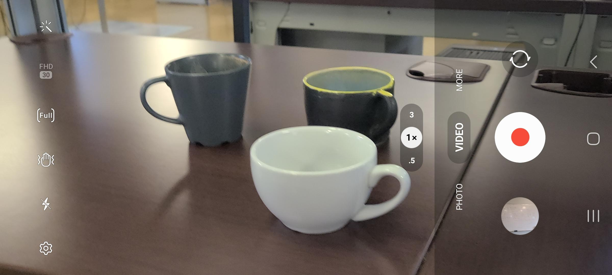{ align=center }
<figcaption>Android Mobile Video Capture</figcaption>
</figure>

Furthermore, we will also capture images of coffee cups as shown below. 

<figure markdown="span">
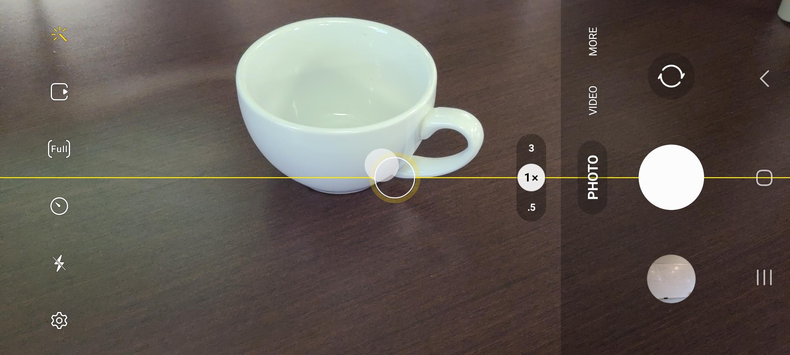{ align=center }
<figcaption>Android Mobile Image Capture</figcaption>
</figure>

!!! tip

    We recommend using videos rather than individual images. This is because Automatic Ground Truth Generation (AGTG) leverages SAM-2 with tracking information which only needs a single annotation to annotate all frames. However, individual images requires the annotation of each image separately.

### 2. Create Dataset

Once you have captured your video and some sample images for your dataset, navigate to a web browser on your mobile device and [login][login] to EdgeFirst Studio. Once logged in to EdgeFirst Studio, navigate to the "Object Detection" project that was created and click on the datasets button that is indicated in red.

<figure markdown="span">
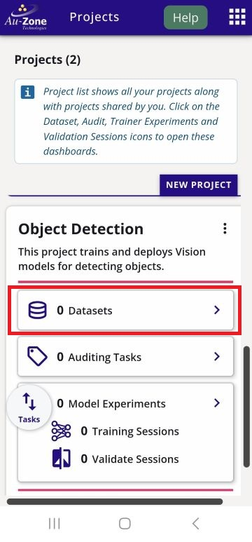{ align=center }
<figcaption>Object Detection Project</figcaption>
</figure>

This will bring you to the Datasets page of the selected project. Create a new dataset container by clicking the "New Dataset" button indicated in red.

<figure markdown="span">
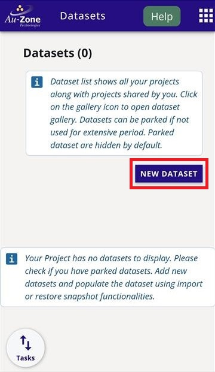{ align=center }
<figcaption>New Dataset</figcaption>
</figure>

Add the dataset and annotation container name, labels, and dataset description as indicated by the fields below.  The information in the fields can be specified by the user and does not have to strictly follow the example shown below. Click the "Create" button once the fields have been filled.

<figure markdown="span">
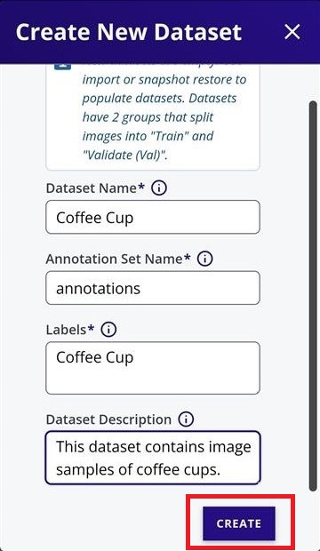{ align=center }
<figcaption>Dataset Fields</figcaption>
</figure>

Your created dataset will look as follows.

<figure markdown="span">
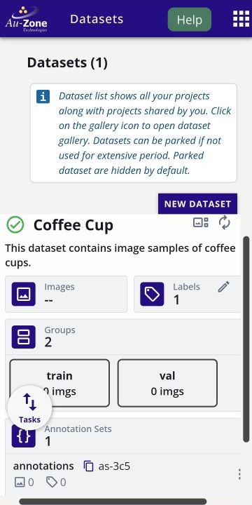{ align=center }
<figcaption>Created Dataset</figcaption>
</figure>

### 3. Upload Data 

Once the dataset container has been created, click on the dataset extended menu (three dots) and select import.

<figure markdown="span">
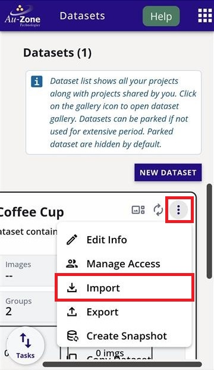{ align=center }
<figcaption>Dataset Import Option</figcaption>
</figure>

This will bring you to the "Import Dataset" page.

<figure markdown="span">
{ align=center }
<figcaption>Dataset Import</figcaption>
</figure>

First we will be importing the video recording from [step 1](#1-capture-data-using-a-mobile-device). Click on the dropdown that says "Select an Import Type" and then specify "Video" and then click "Done" as shown below. 

<figure markdown="span">
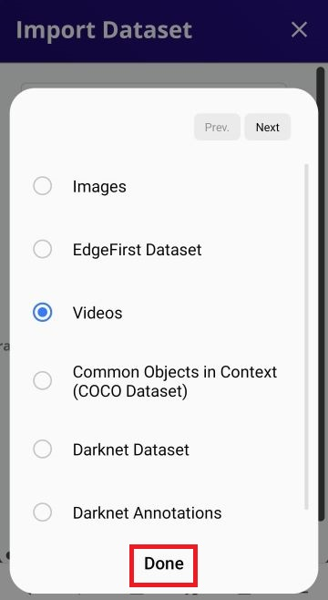{ align=center }
<figcaption>Dataset Video Import</figcaption>
</figure>

Now that the import type is specified to a video file, click on "Select File" as indicated. 

<figure markdown="span">
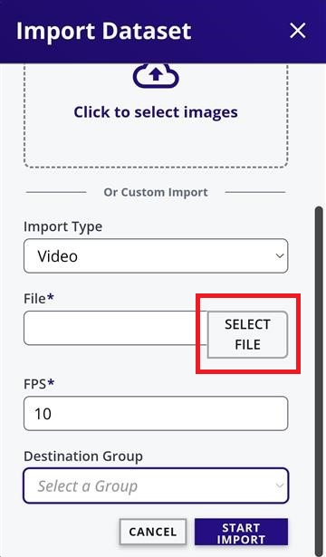{ align=center }
<figcaption>Select Video File</figcaption>
</figure>

On an android device, this will bring up the option to specify the location of the files.

<figure markdown="span">
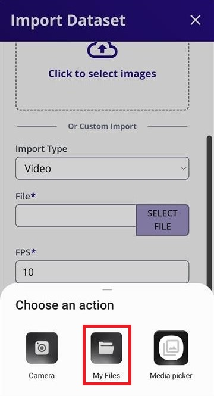{ align=center }
<figcaption>Android Select File Options</figcaption>
</figure>

In my current setup, I have selected "My Files" from the options above and then "Videos" which will allow me to pinpoint the location of the video I have recorded. 

<figure markdown="span">
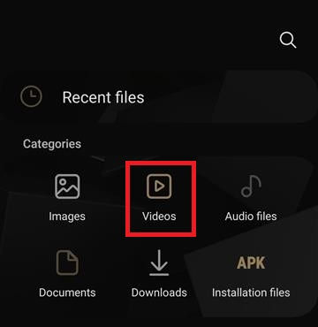{ align=center }
<figcaption>Android File Manager</figcaption>
</figure>

!!! warning
    
    Only one video can be imported at a time.

Once the video file has been selected, set the desired FPS (frames per second) ratio, and then go ahead and click the "Start Import" button to start importing the video file. 

<figure markdown="span">
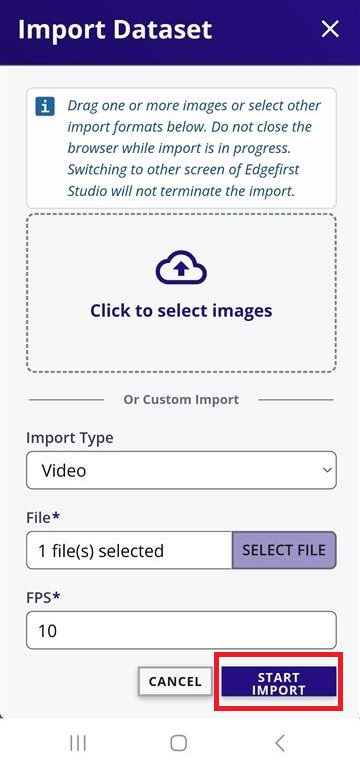{ align=center }
<figcaption>Import Fields</figcaption>
</figure>

This will start the import process and once it is completed, you should see the number of images in the dataset increased. If you do not see any changes, refresh the browser. 

<figure markdown="span">
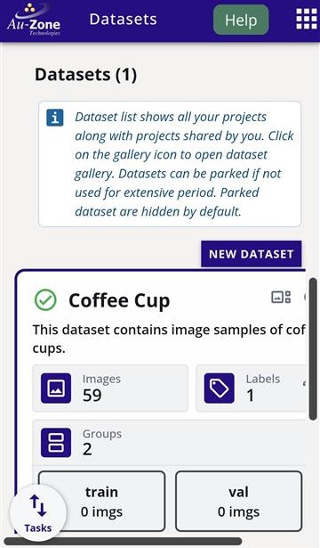{ align=center }
<figcaption>Imported Video</figcaption>
</figure>

Next we will import the captured images from [step 1](#1-capture-data-using-a-mobile-device). 
Navigate back to the "Import Dataset" page (refer to the [top](#3-upload-data)).

<figure markdown="span">
{ align=center }
<figcaption>Dataset Import</figcaption>
</figure>

Click on "Click to select images". This will bring up the option to specify the location of the files.

<figure markdown="span">
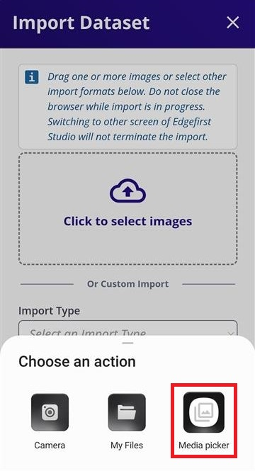{ align=center }
<figcaption>Android Mobile Media Picker</figcaption>
</figure>

In my current setup, I have selected "Media Picker" from the options above and then I have multi-selected the images I want to import by press and hold on a single image to enable multi-select. To import, I pressed "Select".

<figure markdown="span">
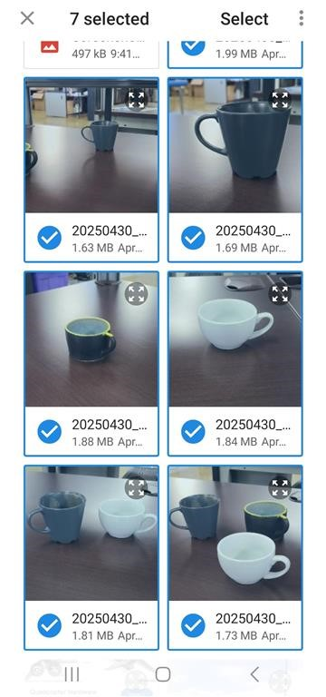{ align=center }
<figcaption>Android Multiselect Images</figcaption>
</figure>

Once the image files have been selected, the progress for the image import will be shown. 

<figure markdown="span">
{ align=center }
<figcaption>Image Import Progress</figcaption>
</figure>

Once it completes, you should see the number of images in the dataset increase by the amount of selected images. If you do not see any changes, refresh your browser.

<figure markdown="span">
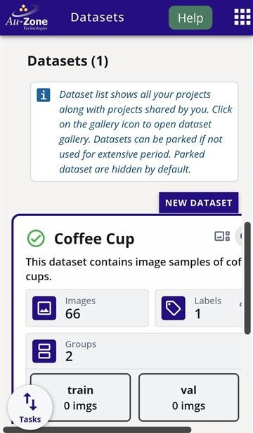{ align=center }
<figcaption>Imported Images</figcaption>
</figure>

Next [view the gallery of the dataset](datasets/tutorials.md#viewing-datasets) to confirm all the captured data has been uploaded. You should see the imported video file and images in the gallery. Note that videos appear as sequences with a play button overlay on the preview thumbnail.

<figure markdown="span">
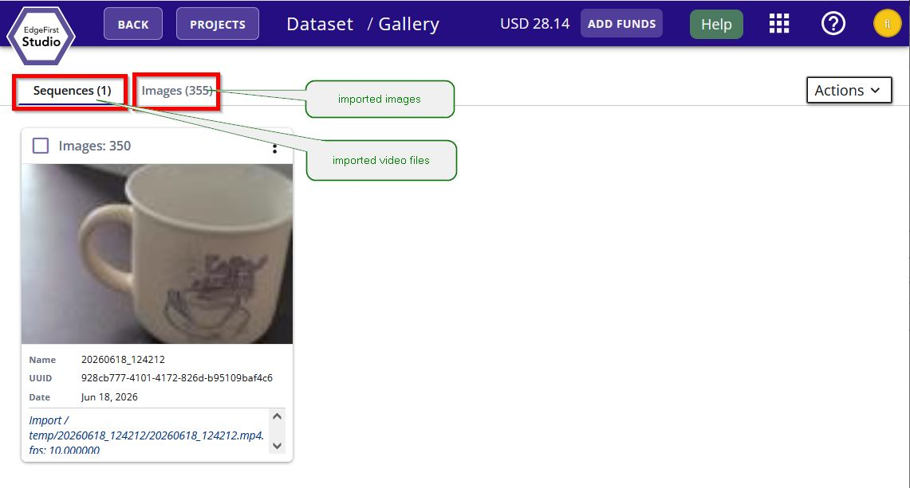{ align=center }
<figcaption>Coffee Cup Gallery</figcaption>
</figure>

Once all the captured data has been uploaded to the dataset container, we will now assign groups to the data to split the data into training and validation sets. Follow the [tutorial for creating groups](datasets/tutorials.md#splitting-datasets) with an 80% partition to training and 20% partition to validation. The final outcome for the groups should look as follows.

<figure markdown="span">
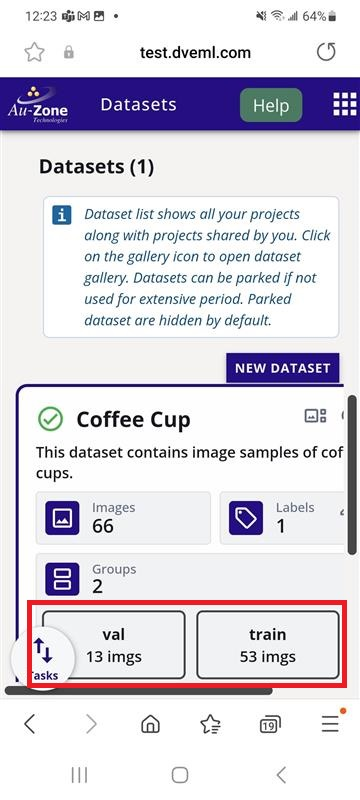{ align=center }
<figcaption>Dataset Groups</figcaption>
</figure>

Now that we have imported some data into EdgeFirst Studio and have split the captured data into training and validation partitions, we can now start annotating our data as shown in the next section below.

### 4. Annotate Data 

In this step, we will be using a personal computer with access to Wifi to [log in][login] to EdgeFirst Studio for annotating the captured data. When annotating the dataset, we will be using AI assistance to annotate the ground truth to perform auto segmentation and bounding boxes on the objects in the frame. Once logged in to EdgeFirst Studio, follow the [Auto Annotations](datasets/tutorials.md#auto-annotations-via-gallery) instructions to auto-annotate the video sequence that was imported. Otherwise, follow the [Audit 2D Annotations](datasets/tutorials.md#audit-2d-annotations) instructions for annotating the images captured.

A complete annotation will have a segmentation mask and a bounding box for each object in the frame. Shown below is an example. 

<figure markdown="span">
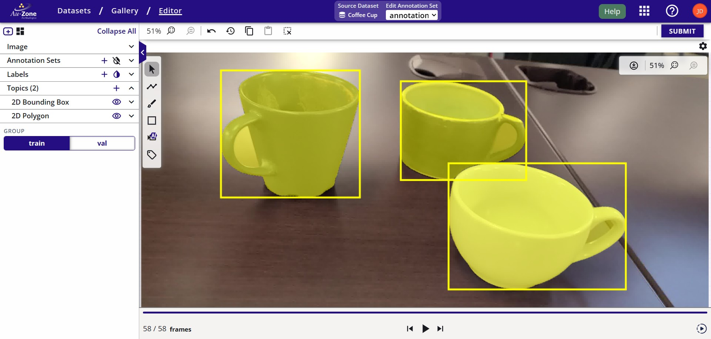{ align=center }
<figcaption>Sample Annotation</figcaption>
</figure>

### 5. Train a Model 

Once you have a proper dataset that is fully annotated and split into training and validation groups, you can now start training your Vision model. For instructions to train a Vision model, please refer to the [Training ModelPack Tutorial](models/modelpack/training.md).

A completed training session will look like the following figure.

<figure markdown="span">
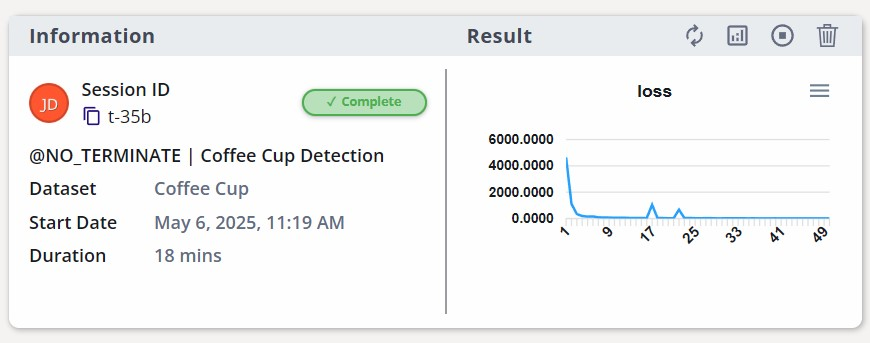{ align=center }
<figcaption>Training Session</figcaption>
</figure>

### 6. Validate the Model

Once the model is trained, you can now start validating the performance of the model to verify if the model is ready for deployment. 

For instructions to validate a Vision model, please refere to the [Validating ModelPack Tutorial](models/modelpack/validation.md).

Once the validation session completes, the metrics will be displayed like the following figure.

<figure markdown="span">
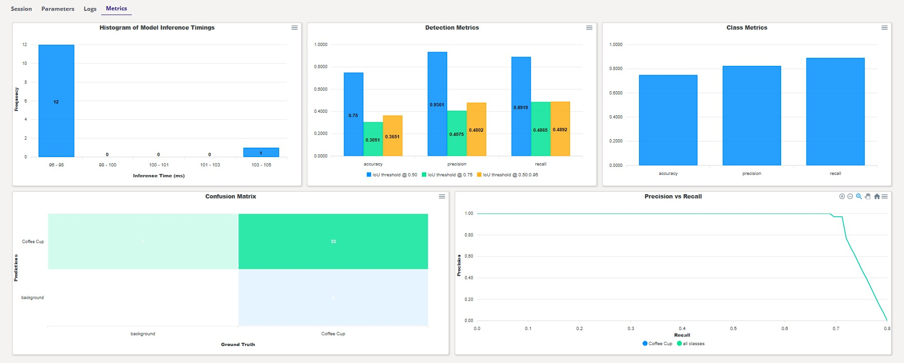{ align=center }
<figcaption>Validation Metrics</figcaption>
</figure>

### 7. Deploy the Model

Once you have validated your trained model, let's take a look at an example of how this model can be deployed in your PC by following the tutorial [Deploying Vision Models](models/modelpack/deployment/pc.md). 

In this Quickstart guide, you have created your EdgeFirst Studio Account, logged in to EdgeFirst Studio, and created your very first project and ran your first experiment by capturing data, annotating data, training a detection model, validating the trained model, and deployed the model back into the PC for inference. 

## Next Steps

For these next steps, it is recommended for new users to be familiar with the concepts and UI elements in EdgeFirst Studio as described in the [EdgeFirst Studio: Overview](getting_started/studio.md).  Next, users are invited to follow along other various [User Workflows](getting_started/workflows/index.md) that are tailored towards various hardware requirements and resources available to the user.

!!! tip "Need Help?"
    📬 Have questions or ran into an issue?  
    Feel free to [email our support team](mailto:support@edgefirst.ai) — we’re here to help!

[signup]: https://stage.edgefirst.studio/#/signup
[login]: https://stage.edgefirst.studio/#/login
