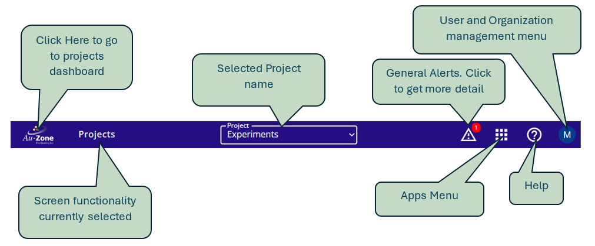
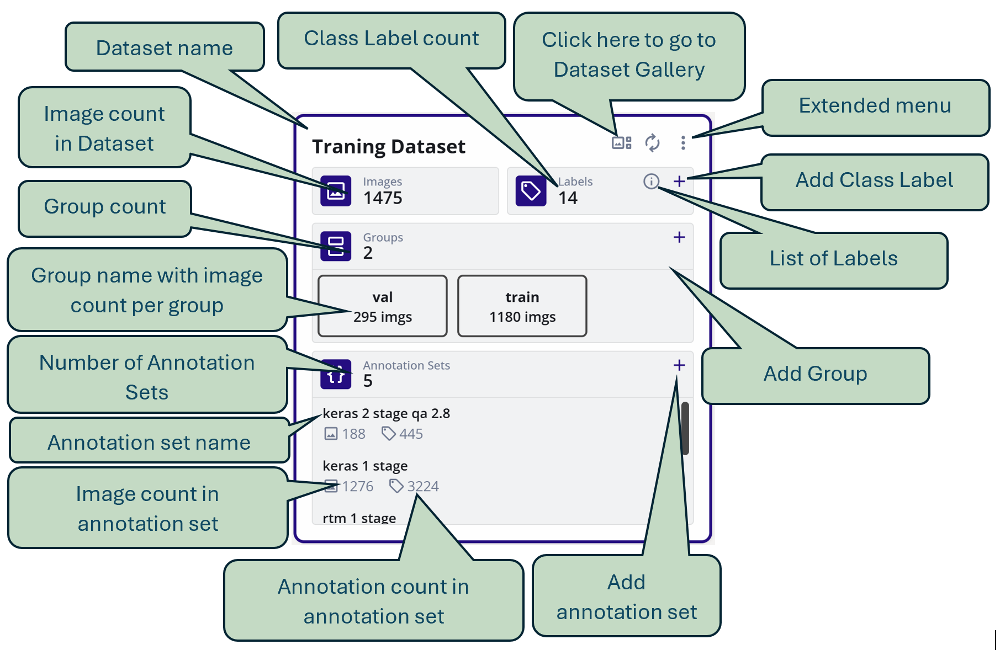
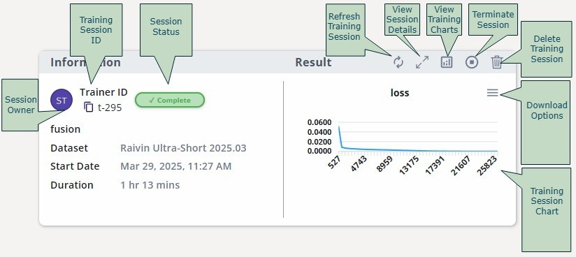
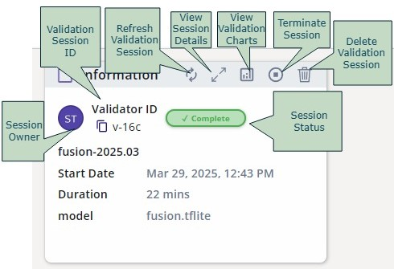

# Getting Started

Welcome to EdgeFirst Studio, this tutorial will walk you through the full end-to-end workflow.
Though not required, we urge you to follow along with an appropriate edge device to test the
models on the actual hardware.

    <iframe width="560" height="315" src="https://www.youtube.com/embed/HaiYg6Dk57Y?si=PgReAjTKj9Tn14fn" title="YouTube video player" frameborder="0" allow="accelerometer; autoplay; clipboard-write; encrypted-media; gyroscope; picture-in-picture; web-share" referrerpolicy="strict-origin-when-cross-origin" allowfullscreen></iframe>

## EdgeFirst Platforms Quickstart

If you have recently received one of these EdgeFirst Modules you may want to first start with
the [EdgeFirst Platforms Quickstart](platforms/quickstart.md) then come back once you're ready to get started with the
cloud tools.

**[Maivin 1](platforms/index.md)** | **[Maivin 2](platforms/index.md)** | **[Raivin](platforms/index.md)**
:------------------:|:------------------:|:------------------:
 |  | 

## EdgeFirst Studio Quickstart

This guide will walk a user through a high-level overview of getting started with 
EdgeFirst Studio (formerly Deep View Enterprise) by exploring individual processes from collecting
and curating datasets to training, validating, and deploying EdgeFirst models.

This guide will showcase two workflows. The first workflow will provide a guided user experience by
providing completed experiments for users to follow along merely acting as an observer to get a 
general idea of the workspace. The second workflow will be much more user involved by providing
instructions for the user to be familiar with using the tools available in EdgeFirst Studio *(coming soon)*. 

### Guided Workflow

#### Sign Up

Start by creating your [EdgeFirst Studio Account](https://edgefirst.studio/#/login?initialMode=new-user).

Enter the required fields denoted by the asterisk (*) and then create your account once completed.

<figure markdown="span">
{ align=center }
<figcaption>Create a New Account</figcaption>
</figure>

Next an email will be sent to verify the email you provided. Go ahead and click on the link provided to verify your email.

<figure markdown="span">
{ align=center }
<figcaption>Email Verification</figcaption>
</figure>

#### EdgeFirst Studio Workspace

Next become familiar with the EdgeFirst Studio workspace. 

The following figure provides a general overview of the workspace layout. 

<figure markdown="span">
{ align=center }
<figcaption>Navigation</figcaption>
</figure>

Please see the overview of [Navigating the Workspace](studio/navigation/index.md) for more details.

#### Create a Project

Using the account you just created, sign in to EdgeFirst Studio. 
Once you're logged in, create your first project. Provide a name and description of the project 
that reflects your goals. 

<figure markdown="span">
{ align=center }
<figcaption>Create a New Project</figcaption>
</figure>

#### Explore Dataset

Try our sample Raivin dataset for training a Fusion Model.

<figure markdown="span">
{ align=center }
<figcaption>Raivin Dataset</figcaption>
</figure>

<figure markdown="span">
{ align=center }
<figcaption>Dataset Fields</figcaption>
</figure>

Please see the overview of the [Datasets Dashboard](datasets/index.md) for more details regarding the 
dataset attributes in EdgeFirst Studio.

#### Train Model

The following training session is a completed session from training a Fusion model
from the dataset provided. 

<figure markdown="span">
{ align=center }
<figcaption>Sample Training Session</figcaption>
</figure>

<figure markdown="span">
{ align=center }
<figcaption>Training Session Fields</figcaption>
</figure>

For more details regarding deploying training sessions, please see 
[Training Modelpack](models/modelpack/training.md) for training Vision models and 
[Training Fusion](models/fusion/training.md) for training Fusion models.

#### Validate Model

The following validation session is a completed session from validating a Fusion model
from the dataset provided.

<figure markdown="span">
{ align=center }
<figcaption>Sample Validation Session</figcaption>
</figure>

<figure markdown="span">
{ align=center }
<figcaption>Validation Session Fields</figcaption>
</figure>

For more details regarding deploying validation sessions, please see 
[Validating Modelpack](models/modelpack/validation.md) for validating Vision models and 
[Validating Fusion](models/fusion/validation.md) for validating Fusion models.