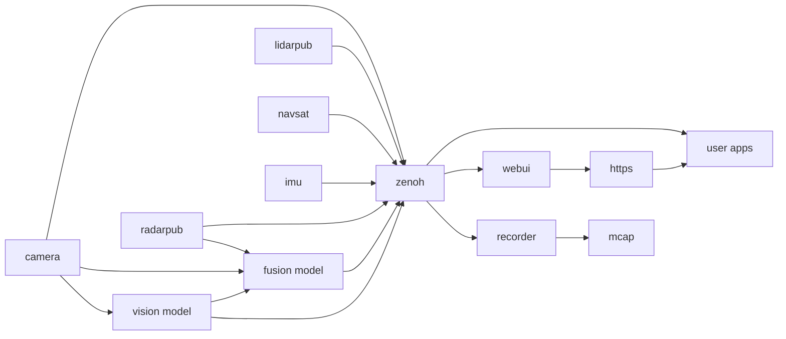

# EdgeFirst Perception Middleware

The EdgeFirst Perception Middleware is a modular software stack designed as a collection of services
communicating over a ROS2-like communication middleware called Zenoh. The various application services 
are each focused on a general task.  For example a camera service is charged with interfacing with the 
camera and ISP (Image Signal Processor) to efficiently deliver camera frames to other services which
require access to the camera.  The camera service is also responsible for encoding camera frames using 
a video codec into H.265 video for efficient recording or remote streaming, this feature of the camera
service can be configured or disabled if recording or streaming are not required.

The middleware services communicate with each other using the Zenoh networking middleware which provides 
a highly efficient publisher/subscriber communications stack.  While we do not directly depend on ROS2
the services do encode their messages using the ROS2 CDR (Common Data Representation). The middleware
uses the ROS2 standard schemas where applicable and augment them with custom schemas where required.
The Recorder and Foxglove chapters go into more detail on how this allows efficient streaming and 
recording of messages and interoperability with industry standard tools.

