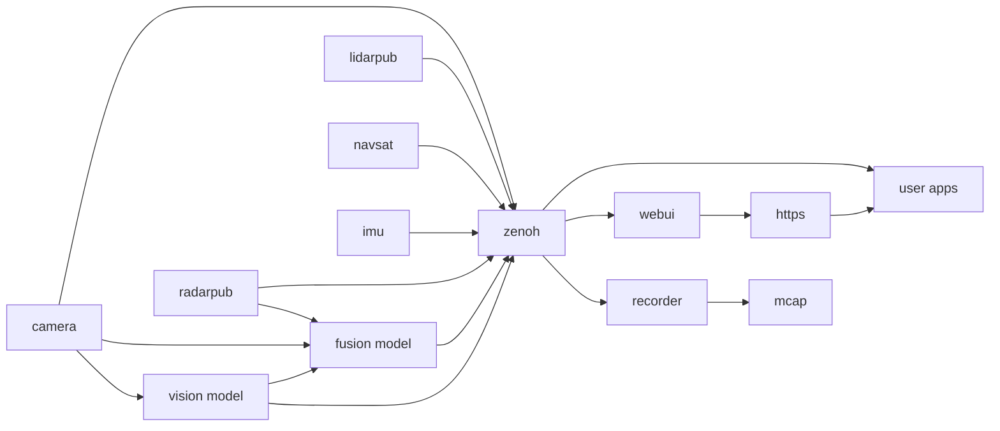

# Middleware Topics

The EdgeFirst Perception Middleware is built on a principle of having modular services handling their specialized tasks.
For example the camera service is tasked with configuring the camera source and publishing camera frames, the model service
subscribes to the camera service to receive camera frames which are then processed by the model and, in turn, publish the
model results.  There are numerous such services, some can be run in multiple instances to support multiple camera inputs
or multiple parallel models.

These middleware applications publish messages and subscribe to messages from other publishers on what is referred to as a topic.
Services will often publish to multiple topics within a namespace, for example the camera service uses the `/camera` namespace
to publish a few topics such as `/camera/info` which publishes information about the camera such as resolution and intrinsic
calibration parameters.  The camera service also publishes `/camera/dma` which handles zero-copy of camera frames between
consumers, it can also publish the `/camera/h264` or `/camera/jpeg` topics for cases where compressed frames are required, such
as when recording or streaming the camera over the network.

Topics are identified by these path-like names and the underlying discovery and network connections to publish and subscribe
over topics is handled by the Zenoh library.  Zenoh topics are by default available only on the local device, a service named
`zenohd` can be run to allow remote connections to the device's topics through a router interface defined as part of the Zenohd
protocol.  Messages published over Zenoh support various encodings defined through MIME types.  The EdgeFirst Middleware uses
the Common Data Representation (CDR) encoding for messages, this is an open standard encoding and the same used by ROS2.  The
CDR encoding uses schemas to represent each type of message, the EdgeFirst Middleware uses the ROS2 common interfaces whenever
possible and provides custom schemas when required.  The schemas are published on Github and we provide pre-made bindings for
Python and Rust.  The schemas can be installed into a ROS2 system, we cover EdgeFirst Middleware with ROS2 integration in the
Zenoh ROS2 Bridge chapter.

User applications interface with the EdgeFirst Middleware by subscribing to the appropriate topics.  For example, if we need
an application to display the camera feed with bounding boxes drawn from the detection model we would write an application
which subscribes to the camera and model topics.  This application would be responsible for drawing the camera pixels and
then drawing the bounding box pixels over the camera and finally displaying the results for the user.  We provide a few
examples of such applications, the first you're likely to see is the Web User Interface (REFER TO WEBUI CHAPTER).  Our sample
code includes many examples which use the Rerun framework for drawing and demonstrate how to subscribe to topics and how
to interpret the results, such as reading bounding boxes and drawing them over the camera feed.  You'll see these examples
using Rerun for display througout our examples, but there is no direct connection to rerun and user applications could use
any UI of their choosing.

## Camera Topic

The camera topic is published under the `/camera` namespace and offers the following sub-topics.  Some topics are optional and might not be available on the current system, refer to the camera service configuration documentation for details.

### /camera/info

### /camera/dma

### /camera/h264

### /camera/jpeg

## Radar Topic

## LiDAR Topic

