# Vision Augmentations

This page is dedicated to describing all available vision augmentations during training and model validation. For training purposes, vision augmentations are techniques used to increase the number of training samples in the dataset by providing more variations for each sample thus exposing the model with samples that have a diverse set of characteristics and conditions. For validation purposes, the model performance is evaluated for cases where there is a level of synthetic degradation imposed on the camera to mimic environmental conditions such as heavy rain, fog, snow, etc. where camera-based models could fail at detecting objects in the scene, whereas models with radar-based aspects could be more robust in such conditions. 

> *Note:*
> *For Fusion models, the camera is an optional sensor, but for ModelPack the camera is a requirement since ModelPack is a single-sensor (single-input) architecture and Fusion is a multi-sensor (multi-input) architecture.*

The camera augmentations are distinguished into two categories: *Geometric* and *Non-Geometric*.

## Geometric

These augmentations are based on transformations of the spatial orientation of the image. For these type of augmentations, the ground truth annotations needs to adhere to the changes in the orientation of the objects in the image aswell. The augmentations below provide visualizations for demonstrating the image and ground truth transformation.

### Shift

This type of augmentation translates the image in either x, y, or both axis causing certain portions of the image to disappear, but allowing grayed out areas in order to compensate for the translation maintaining the original image resolution. In these examples, the ground truth mask and bounding box annotation is maintained around the person after the augmentations. 

| Without Shift               | Negative XY Shift           | Positive XY shift             |
|-----------------------------|-----------------------------|-------------------------------|
| 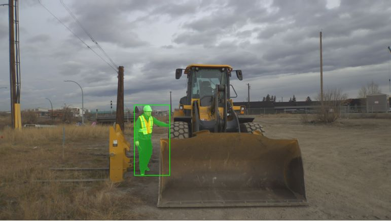 | 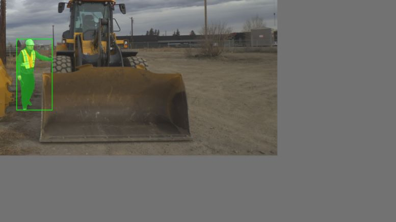 | 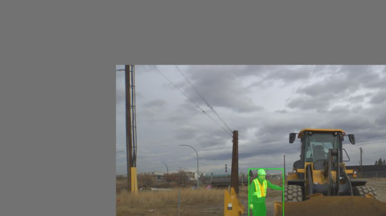 |

### Scale

This type of augmentation resizes the actual image either smaller or larger, but maintaining the original image resolution. For the example of image downscaling in the middle, the actual image is positioned on the top left corner, but grayed out areas are added to maintain the original image resolution. For the example of image upscaling on the right, the image has the effect of being zoomed in, thus leaving out certain portions of the image. However, for both types of augmentations, the ground truth annotation around the person is maintained.

| Original Scaling            | 0.50 Scaling                | 1.50 Scaling                  |
|-----------------------------|-----------------------------|-------------------------------|
|  | 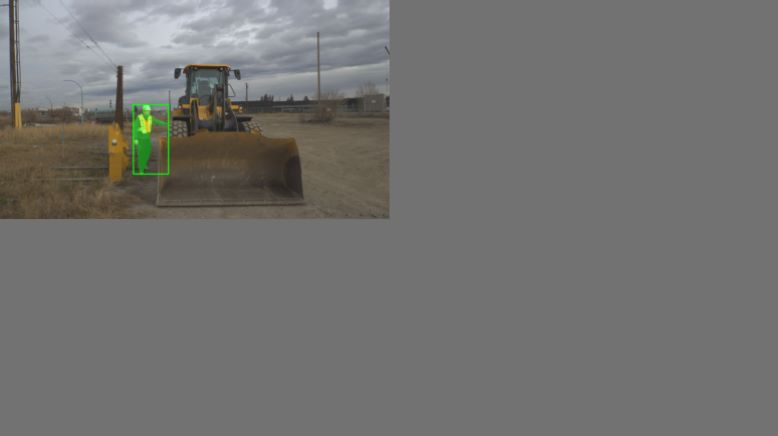 | 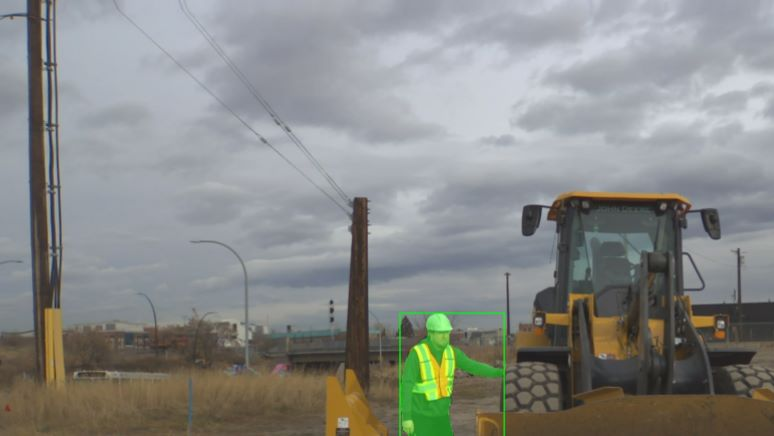 |

### HFlip

This type of augmentation flips the image in the x-axis. Once the image is flipped, the ground truth annotations are also flipped to ensure the annotations properly represent the objects in the scene. In this example, the mask and the bounding box around the person are also flipped.

| Original                        | Horizontal Flip             |
|---------------------------------|-----------------------------|
|  | 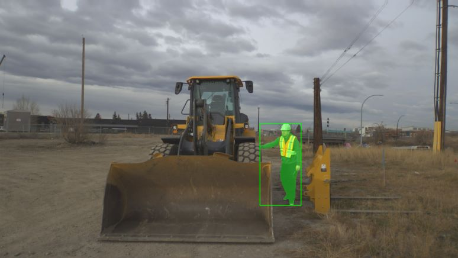 |

> *Note:*
> *The augmentation for a vertical flip is omitted because these cases are arguably rare for samples being upside-down.*

## Non-Geometric

These augmentations are based on transformations of the color properties or applying various filters on the image to modify visual characteristics of the image. The main intention behind these augmentations is to provide practical visual alterations just enough to maintain a level of realistic representations of the scene. Heavier alterations are primarily due to blur and solarizations which are still reproducible in real-world environments such as heavy fog or extreme sun glare.

### Blur

This augmentation reduces the clarity of the image with levels from 0-100% where 0% indicates no blur applied to the image and 100% indicates maximum blur rendering the image visually opaque. The effects of blur in levels of 0%, 20%, 50%, 80%, 100% are shown below.

| 0% Blur                         | 20% Blur                    |
|---------------------------------|-----------------------------|
| 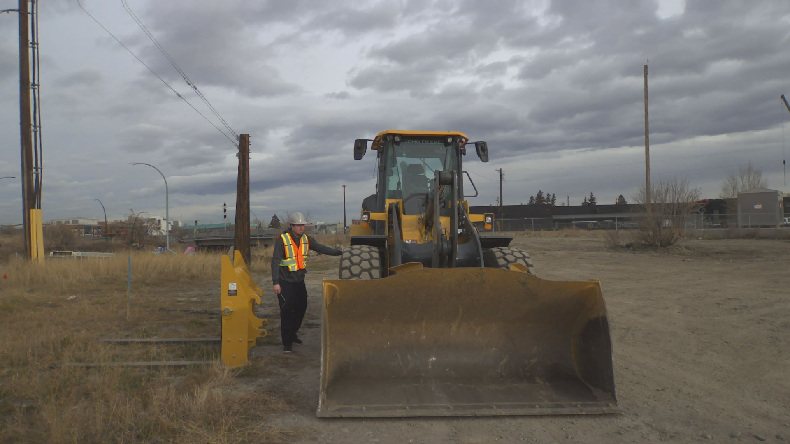 |  |

| 50% Blur                    | 80% Blur                    | 100% Blur                     |
|-----------------------------|-----------------------------|-------------------------------|
| 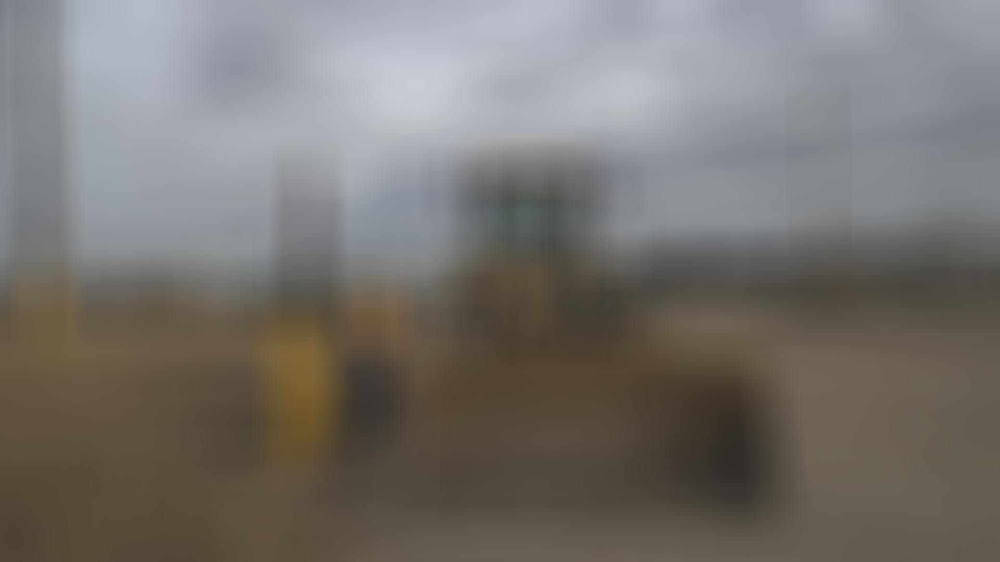 |  |  |

### Grayscale

This augmentation converts a color image to a grayscale image. A grayscale image is a single channel image where each pixel represents light intensity. 

> *Note:*
> *This augmentation is not exposed as an option in DVE because its transformation has no other variations, but model training utilizes this augmentation as part of the random selection of augmentations.*

| Color Image                    | Grayscale Image               |
|--------------------------------|-------------------------------|
|  | 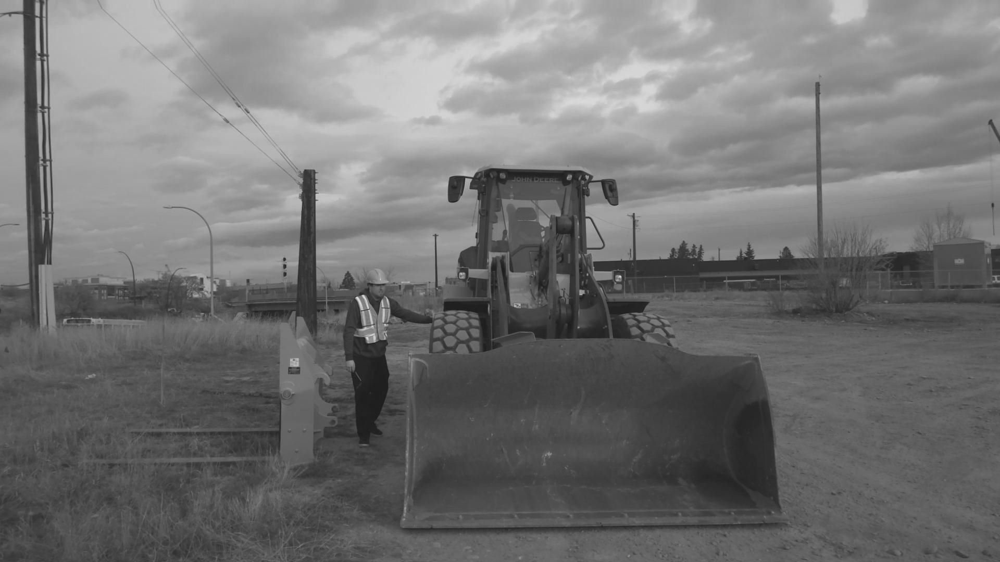 |

### Solarize

This augmentation manipulates the distribution of light and dark pixels based on a given threshold. The darker pixels (below the threshold) to remain the same. The brighter pixels (above the threshold) to be inverted, creating a high-contrast effect. The following side-by-side figures shows the original image on the left and the transformed image with solarization on the right given a threshold of 128 for maximum effect.

| Without Solarization           | With Solarization             |
|--------------------------------|-------------------------------|
|  | 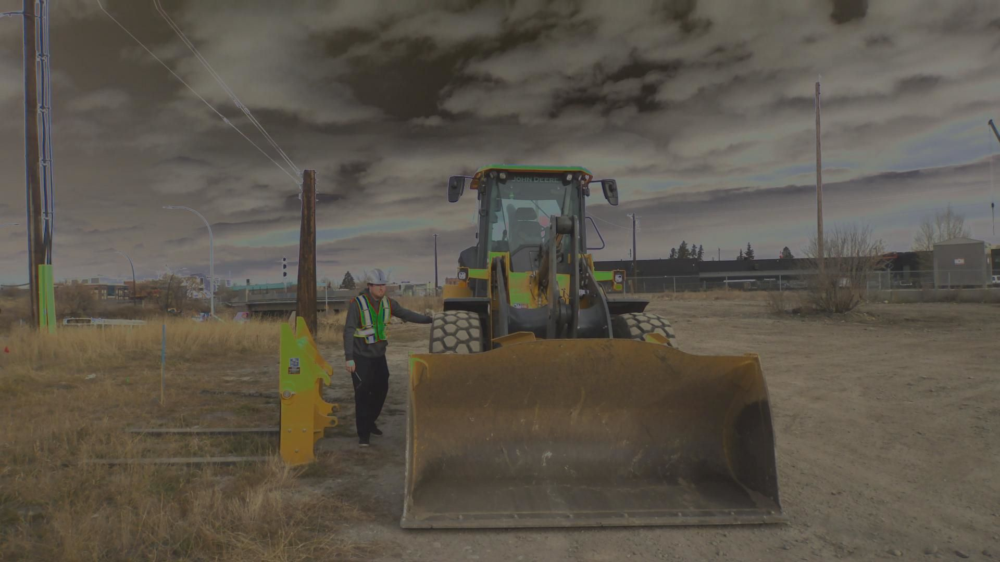 |

### Contrast

This augmentation enhances the contrast in the image by enhancing the difference between color in different parts of the image. It computes the contrast by shifting each pixel relative to the mean pixel value of the image and then scaling it by the contrast factor. The following side-by-side figures shows the original image on the left and the transformed image on the right with a contrast value of 150 for maximum effect.

| Without Contrast               | With Contrast                  |
|--------------------------------|--------------------------------|
|  | 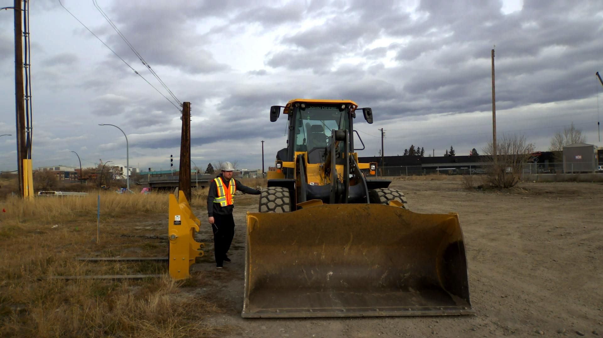 |

### Brightness

This augmentation either dims or brightens the image by scaling the values in all channels of the image by a fixed factor. The following side-by-side figures shows the original image on the left and the transformed image with a brightness of 50 in the center and a brightness of 200 on the right for maximum effect.

| Original Brightness            | Brightness of 50                        | Brightness of 200                         |
|--------------------------------|-----------------------------------------|-------------------------------------------|
|  | 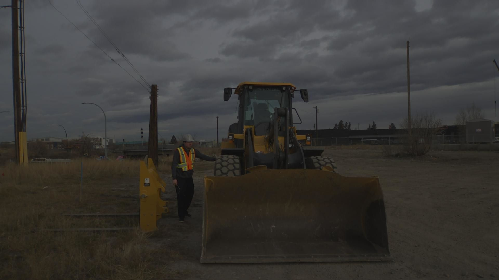 | 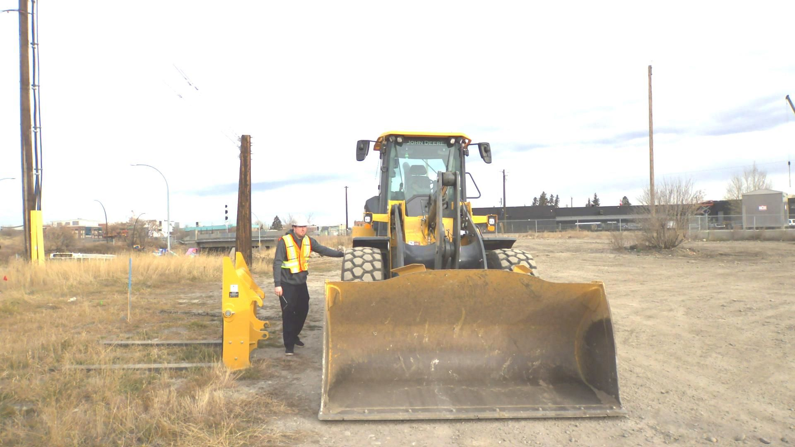 |

### Hue

This augmentation shifts the color of the image along the HSV color space. A parameter is provided to determine the extent of the hue adjustment. As an example, a red color might become blue or green depending on the hue adjustment. The following side-by-side figures shows the original image on the left and the transformed image on the right with hue set to 100 for maximum effect.

| Original                       | With Hue Adjustments             |
|--------------------------------|----------------------------------|
|  | 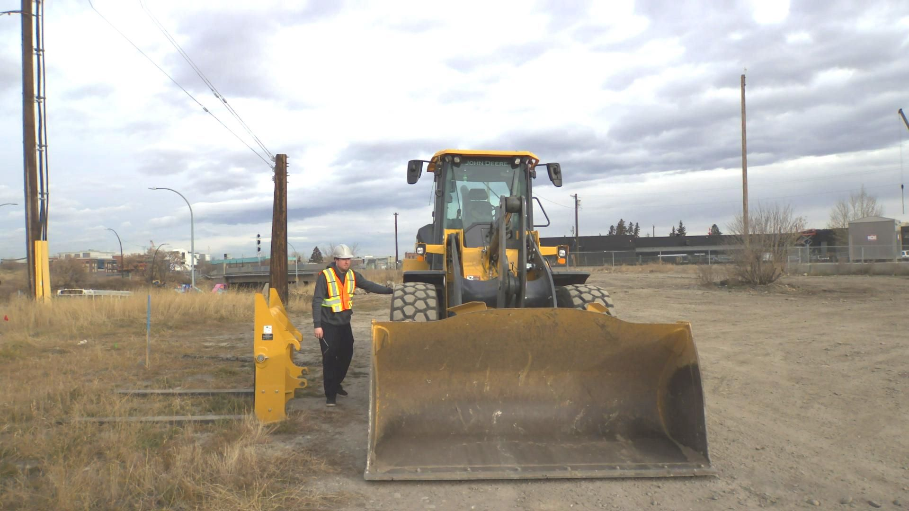      |

### Saturation

This augmentation applies saturation in the HSV (Hue, Saturation, Value) color space. This augmentation either increases the intensity of the colors in the image for increased vibrancy or a decrease in intensity to become much more grayscale or monotone. The following side-by-side figures shows the original image on the left and the transformed image on the right with saturation set to 150 for maximum effect.

| Original                       | With Saturation Adjustments              |
|--------------------------------|------------------------------------------|
|  | 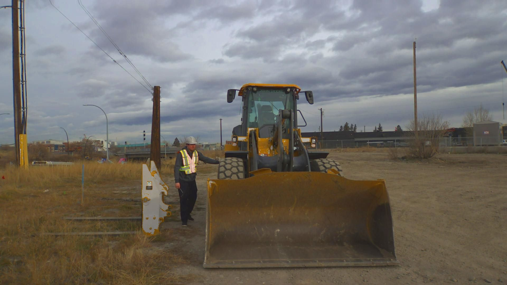 |

### Plasma

This augmentation applies a random plasma texture on the image using a Gaussian-filtered noise to enhance the contrast. The effect will result in an image with random variations (perturbations) to the pixel values in both bright and dark areas. The following side-by-side figures shows the original image on the left and the transformed image on the right with a plasma texture applied. 

| Original                       | With Plasma Adjustments        |
|--------------------------------|-------------------------------|
|  | 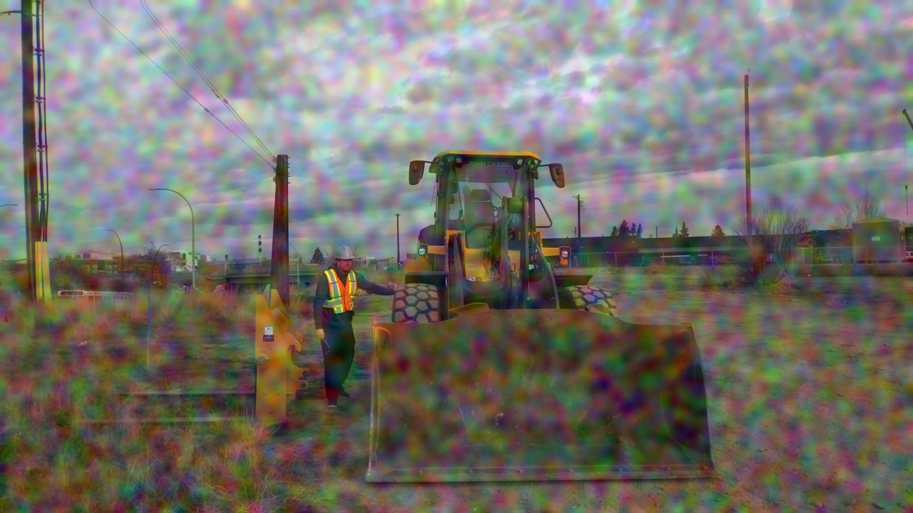 |

### Random Patch

This augmentation generates a random patch within the image space. Then runs a random augmentation from the augmentations described above on that patch. The following side-by-side figures shows the original image on the left and the transformed image on the right with a random patch augmentation. 

| Original                       | With Patch Adjustments        |
|--------------------------------|-------------------------------|
|  | 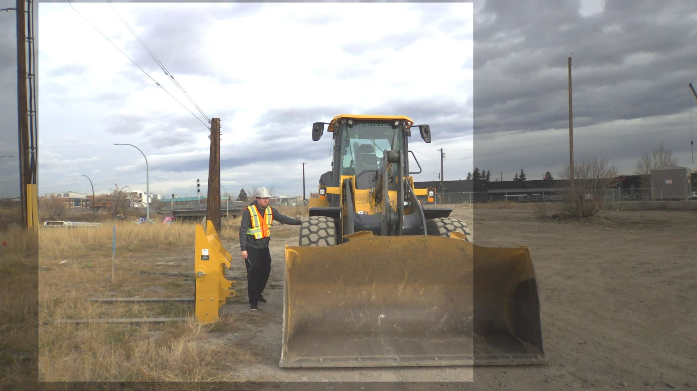 |