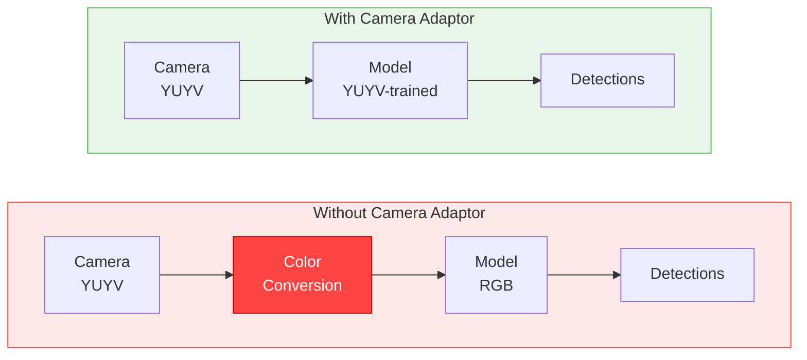

# Camera Adaptor

Camera Adaptor enables deep learning models to consume camera formats natively supported by edge platforms, eliminating costly runtime color space conversions. Instead of converting camera output (e.g., YUV, BGR, RGBA) to RGB before inference, Camera Adaptor teaches the model to accept the native camera format directly.

The open source library is available at [github.com/EdgeFirstAI/cameraadaptor](https://github.com/EdgeFirstAI/cameraadaptor).

## Why Camera Adaptor?

Most deep learning models are trained on RGB images, but edge cameras rarely output RGB natively. Common camera output formats include BGR, RGBA, YUYV, and Bayer patterns. Without Camera Adaptor, the inference pipeline must convert every frame from the camera's native format to RGB before feeding it to the model --- a conversion that adds latency and consumes system resources.



By training the model to accept the camera's native format, Camera Adaptor removes the conversion step entirely, reducing latency and freeing system resources for other tasks.

## How It Works

Camera Adaptor operates in two phases:

### Training Phase

During training, the `CameraAdaptorTransform` converts RGB training images to the target camera format as part of the data loading pipeline. The model learns to extract features from the target format directly. This is handled automatically by [EdgeFirst Studio](../studio/index.md) when a Camera Adaptor format is selected.

### Inference Phase

At inference time, the camera provides data directly in its native format. Since the model was trained on that format, no conversion is needed --- the raw camera output is fed directly to the model.

!!! note
    The Camera Adaptor layer performs layout permutation and alpha channel dropping but does **not** perform color space conversion. The model itself learns to handle the different color representation during training.

## EdgeFirst Studio Integration

Both [ModelPack](modelpack/index.md) and [Ultralytics](ultralytics/index.md) training frameworks in EdgeFirst Studio provide a **Camera Adaptor** dropdown when configuring a training session. Select the target camera format to match your deployment platform.

{{ figure("assets/cameraadaptor/studio-cameraadaptor-dropdown.png", "Camera Adaptor Dropdown") }}

The dropdown offers the same set of supported formats for both training frameworks.

## Supported Formats

| Format | Channels | Description |
|--------|----------|-------------|
| `rgb` | 3 | Standard RGB --- no adaptor layer needed |
| `bgr` | 3 | Blue-Green-Red channel order (OpenCV default) |
| `rgba` | 4 → 3 | RGB with alpha channel (alpha is dropped by the adaptor layer) |
| `bgra` | 4 → 3 | BGR with alpha channel (alpha is dropped by the adaptor layer) |
| `grey` | 1 | Greyscale single-channel input |
| `yuyv` | 2 | YUV 4:2:2 packed format for direct camera sensor input |

## Platform Guidance

The choice of Camera Adaptor format depends on your target platform's camera pipeline:

| Platform | Recommended Format | Reason |
|----------|--------------------|--------|
| i.MX 93 | `bgr` | PXP hardware outputs BGR |
| i.MX 8M Plus | `rgba` | G2D hardware outputs RGBA; adaptor auto-strips alpha |
| i.MX 95 | Varies | Depends on ISI/ISP pipeline configuration |

Refer to the [Camera Adaptor repository](https://github.com/EdgeFirstAI/cameraadaptor) for detailed platform-specific guidance and additional format support on the roadmap (NV12, NV21, Bayer patterns).

## Configuration

The Camera Adaptor format is stored in the `cameraadaptor` field within the `input` section of [model metadata](metadata.md):

```yaml
input:
  shape: [1, 640, 640, 3]
  cameraadaptor: rgb       # Camera format: rgb, bgr, rgba, bgra, grey, yuyv
```

This metadata field is set automatically by EdgeFirst Studio during training. For third-party integrations, include this field to specify the expected input format. See [Model Metadata](metadata.md) for the complete schema.

## Open Source

Camera Adaptor is an open source library released under the **Apache 2.0** license.

- **Repository**: [github.com/EdgeFirstAI/cameraadaptor](https://github.com/EdgeFirstAI/cameraadaptor)
- **Installation**: `pip install edgefirst-cameraadaptor`
- **Optional extras**: `[transform]` (OpenCV), `[torch]` (PyTorch), `[tensorflow]`, `[lightning]`, `[all]`

The core library requires only NumPy. Additional extras are available for framework-specific integrations.

---

## Related Articles

1. [Model Metadata](metadata.md) - Complete metadata schema including `cameraadaptor` field
2. [Vision Augmentations](augmentations.md) - Training-time data augmentation configuration
3. [ModelPack Overview](modelpack/index.md) - ModelPack architecture and training
4. [Ultralytics Integration](ultralytics/index.md) - Ultralytics YOLO training and deployment
5. [Training Vision Models](training/vision.md) - Step-by-step training workflow
