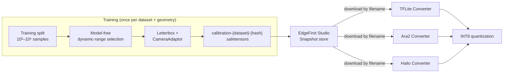

# Calibration Snapshot

Every quantizing Converter App needs the same thing before it can turn a
float32 graph into an INT8 binary: a small, representative batch of model
inputs to measure activation ranges against. EdgeFirst Studio produces that
batch **once, at training time**, as a portable `.safetensors` **calibration
snapshot** — a pre-filtered, pre-processed subset of the training data with
full provenance back to the source samples. Every converter downloads the same
snapshot, so calibration is consistent across targets and never has to be
regenerated per conversion.

## The Problem

INT8 quantization needs a representative sample of the input distribution to
measure the per-tensor activation ranges that set each quantization scale (see
[Smart Quantization](index.md#smart-quantization) for why those ranges matter
so much). Producing that sample naively is wasteful and fragile:

- **The pool is enormous.** A calibration set is typically ~500 samples, but
  the training dataset it is drawn from can be tens of thousands, hundreds of
  thousands, or millions of samples. Re-selecting 500 from that pool inside
  every converter, for every target, on every conversion, repeats expensive
  work that only depends on the *dataset*, not the model or the target.
- **Preprocessing is the model's secret.** Calibration inputs must be
  preprocessed exactly as the model expects — the same letterbox geometry, the
  same channel layout, the same [CameraAdaptor](../cameraadaptor.md) color
  conversion used in training. A model-agnostic converter does not — and should
  not — know those details.
- **Divergent assumptions drift.** When each producer and consumer bakes its
  own conventions (tensor names, value ranges, resize policy) into an
  undocumented file, they quietly disagree, and the failure shows up as lost
  accuracy on hardware rather than a clear error.

## The Solution

The calibration snapshot moves all of that work to the one place that already
has the answers — the trainer — and captures the result in a self-describing,
content-addressed file:

- **Generated once at training time.** The trainer already decodes and
  letterboxes the dataset; it selects the calibration subset and writes the
  snapshot as a by-product of export. No separate calibration job exists.
- **Pre-filtered.** A model-free selection picks the ~500 samples that best
  span the dataset's pixel dynamic range, so a small set calibrates as well as
  — or better than — the full pool.
- **Pre-processed through letterbox, but not normalization.** The geometric
  preprocessing that *is* the model's secret (letterbox resize, channel layout,
  CameraAdaptor) is baked into the stored pixels. The numeric normalization
  that converters legitimately differ on is **recorded as metadata, not
  applied** (see [Letterbox, Not Normalization](#letterbox-not-normalization)).
- **Reusable across models by hash.** The filename encodes a hash of the
  generation parameters. Two models trained on the same dataset with the same
  input geometry and data-preparation pattern resolve to the **same snapshot**
  — it is generated once and reused, across model architectures and across
  every converter, automatically.
- **Traceable.** The snapshot records which EdgeFirst Studio instance, dataset,
  and individual samples it was built from, so any calibration set — and any
  model calibrated from it — can be traced back to its exact source data (see
  [Provenance and Traceability](#provenance-and-traceability)).



!!! note
    A calibration snapshot is fully determined by **dataset-source
    parameters** — the dataset, split, input geometry, color convention, and
    selection policy. **No model and no model inference is involved in
    producing it.** This is what lets one snapshot serve every model and every
    target that share a data-preparation pattern.

## Anatomy of a Snapshot

A snapshot is a standard [safetensors](https://huggingface.co/docs/safetensors/)
file containing one named tensor per model input plus a populated
`__metadata__` map:

| Property | Value | Notes |
|----------|-------|-------|
| Tensor dtype | `uint8` | Raw `[0, 255]` pixels — **not** pre-normalized float. |
| Layout | `NCHW` | `[num_samples, channels, height, width]`. Consumers needing NHWC transpose on load. |
| Tensor name | model input name (e.g. `images`) | Recorded in metadata; multi-input models carry one tensor per input. |
| Value range | `[0, 255]` | Recorded in metadata. |
| `__metadata__` | string → string map | Parameter set, normalization recipe, provenance, integrity digest (see [Embedded Metadata Schema](#embedded-metadata-schema)). |

Storing **uint8** rather than normalized float32 makes the file ~4× smaller
(~150 MB vs ~600 MB for 500×3×640×640), preserves the exact source pixels for
audit, and lets each converter apply its own normalization without lossy
round-trips.

## Selection: Maximizing Dynamic Range

Selection is **model-free** and operates on **source pixel statistics only** —
the decoded source images at native resolution, before any resize. For each
candidate image the producer computes a per-channel minimum, maximum, and a
64-bin intensity histogram; the selector then chooses the subset that best
covers the pool's per-channel intensity distribution and reaches its true
extremes.

The reference algorithm, tagged `max_dynamic_range_v1`:

1. Decode every pool image at native resolution; compute its per-channel
   min/max and a normalized 64-bin histogram.
2. **Seed** the set with the images holding the global per-channel extrema —
   these define the achievable range and are mandatory members.
3. **Greedily** add the image whose inclusion most reduces the L1 distance
   between the selected-set mean histogram and the pool mean histogram, until
   the requested count is reached. Ties resolve to the lowest pool index.
4. If coverage saturates before the count is met, fill the remainder by
   seeded-random sampling for diversity.
5. Emit the selected indices in ascending pool order — this fixes the sample
   order in the file and in the provenance record.

Because the statistics come from source pixels, selection is **independent of
input geometry and CameraAdaptor**: the same dataset selects the same images
for every model, and only the preprocessing of those images varies per target.
The selection is deterministic — identical parameters over an identical pool
produce the identical sample set.

!!! note "Why model-free selection matters"
    An earlier design selected calibration samples by pre-scanning model
    *output* activations. Measured on Ara240 hardware (yolov8n-seg, COCO
    val5k), that approach excluded the range-defining samples a MinMax-
    calibrated integer pipeline most needs; replacing it with the
    dynamic-range-maximizing selection above moved box mAP **0.2731 → 0.3220**
    with no model change. Snapshots always include the genuine distribution
    extremes; a converter that needs a tighter range for INT8 applies its own
    percentile or KL clipping internally.

## Letterbox, Not Normalization

The distinction between what is *baked into the pixels* and what is *recorded
as metadata* is deliberate, and it is the crux of why one snapshot can serve
many converters.

**Baked in — the geometric preprocessing that is the model's secret:**

- **Letterbox resize.** The source image is scaled so its long side matches the
  model input (preserving aspect ratio, upscaling small images), then
  center-padded to the square input with a constant gray value (114). This is a
  required, model-defining step that is already performed identically during
  training, so the snapshot captures its exact result.
- **Channel layout and CameraAdaptor.** The color conversion (RGB, BGR, YUYV,
  gray, …) and channel layout the model was trained with are applied, so the
  stored tensor is byte-identical to what the model sees at inference.

**Recorded, not applied — the numeric normalization converters differ on:**

- The scale, mean, and standard deviation the model expects (e.g. scale
  `1/255` to map `[0, 255] → [0, 1]`) are stored in metadata. Each converter
  applies them on load in the form its quantizer expects — a signed-INT8 target
  centers the range, a DFC-based target keeps `[0, 255]`, a TFLite per-input
  pipeline applies its own — without the lossy `[0,1] → [0,255]` round-trips
  that plagued ad-hoc snapshots.

Generating the snapshot at training time is what makes this clean: the
letterbox recipe is reused verbatim from the training data pipeline, and the
parameter hash makes the resulting file reusable across every model that shares
the same recipe.

## Parameter Hash and Caching

The snapshot is a pure function of a canonical parameter set. The filename
encodes a hash of that set so the snapshot is **content-addressed**:

```text
calibration-{dataset_id}-{param_hash}.safetensors
```

- `{dataset_id}` — Studio dataset label (e.g. `ds-2bcc`); the literal `local`
  for non-Studio (offline) generation.
- `{param_hash}` — first 16 hex characters of the SHA-256 of the canonical JSON
  serialization (sorted keys) of the parameter set below.

The parameter set covers every input that affects the produced bytes:

```jsonc
{
  "dataset_id": "ds-2bcc",            // null offline
  "annotation_set_id": "as-1a3f",     // or null
  "split": "train",                   // calibration pools from the TRAINING split
  "input_shape": [640, 640],          // [H, W]
  "channels": 3,                      // post color-conversion channel count
  "layout": "NCHW",
  "dtype": "uint8",
  "resize": "letterbox",
  "letterbox": {                      // the exact recipe: long-side resize
    "pad_color": [114, 114, 114],     // (ceil rounding, linear interp),
    "scale": "long_side",             // then center-pad the short side
    "round": "ceil",
    "center": true,
    "interpolation": "linear"
  },
  "color": "rgb",                     // CameraAdaptor name
  "normalization": {                  // recorded, NOT applied to stored bytes
    "scale": 0.00392156863,           // 1/255
    "mean": [0.0, 0.0, 0.0],
    "std":  [1.0, 1.0, 1.0]
  },
  "count": 500,                       // requested sample count
  "selection": "max_dynamic_range_v1",// versioned selection algorithm
  "seed": 42                          // selection seed
}
```

Two properties follow from hashing the parameters rather than the content:

- **Versioned selection.** The `selection` tag names the algorithm. Changing
  the algorithm bumps the tag, which changes the hash and the filename — the
  only safe way to roll out an improved selector, since it cannot silently
  shadow snapshots produced by the old one.
- **Cross-model reuse.** Two models with the same dataset, geometry, color
  convention, count, and seed resolve to the same filename, so the snapshot is
  generated once and reused.

The pool is drawn from the **training split**, never the validation split:
calibrating on validation data leaks the evaluation distribution, and
calibration needs input coverage, not labels. When the pool is smaller than the
requested count, the whole pool is used and both the requested and actual
counts are recorded.

### Caching against the Studio snapshot store

Calibration snapshots are stored as [EdgeFirst Studio
snapshots](../../studio/snapshots.md), keyed by filename. The trainer's
workflow is:

1. Compute the parameter hash and build the filename.
2. Look the filename up in the snapshot store.
3. If it exists → reuse it (skip selection and generation entirely; an
   export-only run can skip downloading the training images altogether).
4. If not → select, generate, and publish it under that filename.

## Embedded Metadata Schema

The `__metadata__` map is a string → string map (nested values are JSON-encoded
strings). Consumers **must** resolve these keys rather than assuming defaults,
and **must** fail loudly when a required key is absent rather than guessing.

| Key | Example | Purpose |
|-----|---------|---------|
| `params` | `{…}` | The exact parameter set above (the hash preimage). |
| `param_hash` | `"a1b2c3d4e5f60718"` | Matches the filename; self-describing. |
| `tensor_names` | `["images"]` | Ordered input tensor names. |
| `dtype` | `"uint8"` | Stored sample dtype. |
| `value_range` | `[0, 255]` | Stored sample range (not normalized). |
| `layout` | `"NCHW"` | Stored layout. |
| `normalization` | `{"scale":…,"mean":…,"std":…}` | What the model expects; the consumer applies it. |
| `count_requested` | `500` | Requested sample count. |
| `count_actual` | `500` | Samples actually written (may be smaller than requested for small pools). |
| `selection` | `"max_dynamic_range_v1"` | Selection algorithm tag. |
| `seed` | `42` | Selection seed. |
| `content_sha256` | `"…"` | Digest over the concatenated sample bytes (integrity + cache validation). |
| `producer` | `"edgefirst-studio-ultralytics/1.13.0"` | Generating component and version. |
| `studio_instance` | `"saas"` | **Provenance** — Studio instance (`test`, `stage`, `saas`, or custom hostname). |
| `pool` | `{"dataset_id":…,"annotation_set_id":…,"split":"train","size":118287}` | **Provenance** — resolved pool identity. |
| `image_ids` | `["…","…"]` | **Provenance** — the selected Studio sample IDs, in file order. |

The provenance keys (`studio_instance`, `pool`, `image_ids`) are present only
when the pool was drawn from an EdgeFirst Studio dataset; offline/local
snapshots omit them entirely. Metadata carries **no creation timestamp** — so
that identical parameters over an identical pool produce a byte-identical file,
verifiable by comparing `content_sha256` or the whole file.

## Provenance and Traceability

The calibration snapshot is a first-class participant in EdgeFirst Studio's
[end-to-end traceability](../metadata.md#overview). Just as a compiled model
links back to its training session and dataset, a snapshot links back to the
exact samples it was built from:

- **`studio_instance` + `pool.dataset_id` + `image_ids`** form a complete trail
  from any calibration sample to its source sample in Studio. Given a snapshot,
  an engineer can re-open the precise images that defined a model's
  quantization ranges — for review, for debugging an accuracy regression, or
  for reproducing the calibration set exactly.
- **The converter records the snapshot filename** in its
  [converter-traceability section](../metadata.md#converter-traceability) of
  `edgefirst.json` (e.g. `tflite_quantizer.calibration`). The compiled model
  therefore names the snapshot, the snapshot names its parameter hash and
  sample IDs, and the sample IDs name the dataset — an unbroken audit chain from
  a deployed binary back to individual training images.
- **`content_sha256`** lets any consumer verify it calibrated against the exact
  bytes it expected, independent of the filename.

## Implementing a Producer

A training framework that emits EdgeFirst calibration snapshots must:

1. **Pool from the training split.** Draw candidates from the training split by
   default; record the resolved pool identity (dataset, annotation set, split,
   size) in metadata.
2. **Select model-free.** Compute source-pixel descriptors and select with a
   versioned, deterministic algorithm. Under `max_dynamic_range_v1` the selected
   set's per-channel min/max must equal the pool's — the extrema-bearing images
   are mandatory.
3. **Preprocess through letterbox only.** Apply the model's exact letterbox and
   CameraAdaptor recipe; store **uint8 [0, 255] NCHW**. Record the normalization
   the model expects in metadata — do **not** apply it to the stored bytes.
4. **Name and hash deterministically.** Serialize the canonical parameter set
   with sorted keys and a fixed float representation; hash to 16 hex characters;
   build the filename. Identical parameters over an identical pool must produce
   byte-identical files.
5. **Populate `__metadata__`.** Write every required key, the `content_sha256`
   digest, and — for Studio pools — the provenance keys.
6. **Cache against the snapshot store.** Look up by filename before generating;
   publish under that filename after generating.

## Implementing a Consumer

A Converter App that calibrates from a snapshot must:

1. **Resolve from metadata, never assume.** Read `tensor_names`, `dtype`,
   `value_range`, `layout`, and `normalization` from `__metadata__`. Fail loudly
   if a required key is missing.
2. **Apply the recorded normalization** to the uint8 samples in the form your
   quantizer expects (signed/centered, `[0, 255]`, or per-input float), and
   transpose `NCHW → NHWC` if your runtime needs it.
3. **Verify integrity.** Check `content_sha256` over the sample bytes on load.
4. **Record traceability.** Write the snapshot filename into your converter
   section of `edgefirst.json`.

```python
from safetensors import safe_open
import json, numpy as np

with safe_open(calibration_path, framework="numpy") as f:
    meta = f.metadata()                       # __metadata__ map
    names = json.loads(meta["tensor_names"])
    norm = json.loads(meta["normalization"])  # {scale, mean, std}
    scale = np.float32(norm["scale"])
    mean = np.asarray(norm["mean"], np.float32)
    std = np.asarray(norm["std"], np.float32)

    num_samples = f.get_slice(names[0]).get_shape()[0]
    for i in range(num_samples):
        feed = {}
        for name in names:
            sample = f.get_slice(name)[i]                 # CHW uint8
            sample = np.transpose(sample, (1, 2, 0))      # -> HWC
            sample = (sample.astype(np.float32) * scale - mean) / std
            feed[name] = sample[np.newaxis]               # NHWC, batch 1
        yield feed                                        # representative_dataset
```

## What's Next

- [Smart Quantization](index.md#smart-quantization) — why activation ranges
  dominate INT8 accuracy and what the converters do about it.
- [Model Metadata](../metadata.md) — the `edgefirst.json` schema, the
  `calibration` field, and the converter-traceability sections that reference
  the snapshot.
- The per-converter pages ([TFLite](tflite.md), [Ara2](ara2.md),
  [Hailo](hailo.md), [Neutron](neutron.md)) for how each target consumes the
  snapshot and derives its quantization ranges.
