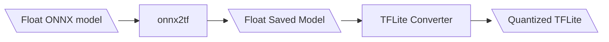

# Model Quantization

In this section, you will find instructions for exporting and quantizing float models.

## ONNX to TFLite

You can follow these steps to export a float ONNX model to a quantized TFLite.

**Alternatively**, you can follow [instructions provided by Ultralytics](https://docs.ultralytics.com/modes/export/) for exporting PyTorch models to ONNX, and then to TFLite using the commands below.

```shell
wget https://github.com/ultralytics/assets/releases/download/v8.3.0/yolo11s-seg.pt
yolo export model=yolo11s-seg.pt format=tflite int8=True
```

Those commands will generate *yolo11s-seg.onnx* and *yolo11s-seg_saved_model/yolo11s-seg_full_integer_quant.tflite*. In the tutorial below, we can take the float [yolo11s-seg.onnx](assets/yolo11s-seg.onnx){: download="yolo11s-seg.onnx"} and convert it to a quantized TFLite.  We can then [deploy](npu.md#deploying-quantized-tflite) the TFLite converted from following the steps below. 



1. Install the following dependencies.

```shell
$ pip install onnx2tf
$ pip install tf_keras 
$ pip install onnx
$ pip install onnx_graphsurgeon
$ pip install psutil
$ pip install ai-edge-litert
$ pip install sng4onnx
$ pip install tensorflow
$ pip install opencv-python
$ pip install numpy
```

These versions of the libraries were tested

```shell
onnx2tf                      1.28.2
tf_keras                     2.19.0
onnx                         1.18.0 
onnx_graphsurgeon            0.5.8
psutil                       7.0.0
ai-edge-litert               1.4.0 
sng4onnx                     1.0.4
tensorflow                   2.19.1
opencv-python                4.12.0.88
numpy                        2.1.3
```

2. Export the ONNX model to TensorFlow saved model.

`onnx2tf -i mymodel.onnx -o model_tf --non_verbose`

3. Run the TFLite converter script below using TensorFlow.

This script quantizes the model to a uint8 datatype.  However, you can choose to specify other types. 

`python3 converter.py`

=== "converter.py"

    ```python 
    import tensorflow as tf
    import numpy as np
    import glob
    import cv2

    model_path = "model_tf" # Path to the TensorFlow saved mdoel
    images_path = "COCO/images/*.jpg" # Conversion requires image samples for quantization.
    input_shape = (640, 640) # Model (height, width) input shape.
    output_path = "mymodel.tflite" # Path to save the TFLite model. 

    def representative_data_gen():
        images = glob.glob(images_path)
        images = images[:100] # Only take the first 100 images. 

        for image in images:
            image = cv2.imread(image)
            image = cv2.resize(image, input_shape)
            image = cv2.cvtColor(image, cv2.COLOR_BGR2RGB)
            image = image.astype(np.float32)
            image = image / 255.0
            image = np.expand_dims(image, axis=0)
            yield [image]

    converter = tf.lite.TFLiteConverter.from_saved_model(model_path)
    converter.optimizations = [tf.lite.Optimize.DEFAULT]
    converter.representative_dataset = representative_data_gen
    converter.target_spec.supported_ops = [tf.lite.OpsSet.TFLITE_BUILTINS_INT8]
    converter.inference_input_type = tf.uint8
    converter.inference_output_type = tf.int8

    tflite_model = converter.convert()
    with open(output_path, "wb") as f:
        f.write(tflite_model)
    ```

## Next Steps

Once you have converted your model to a quantized TFLite, you can verify the performance of the model by [deploying the model](npu.md#deploying-quantized-tflite) in the i.MX 8M Plus EVK's NPU. 
