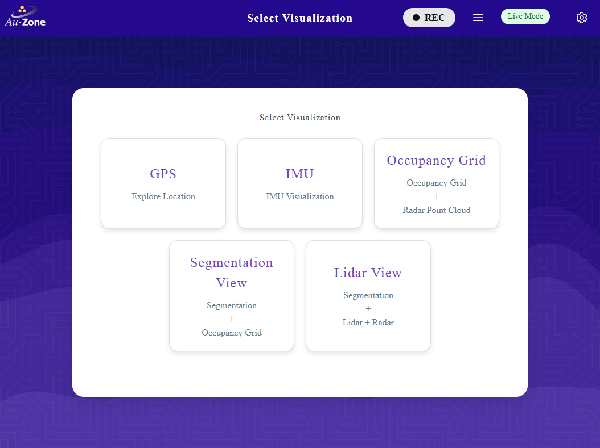
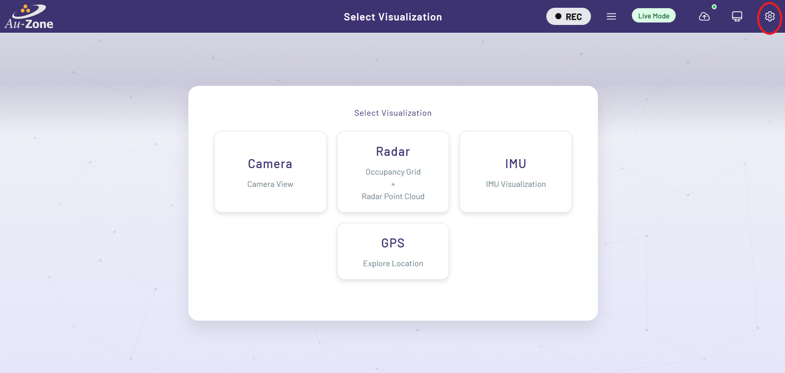
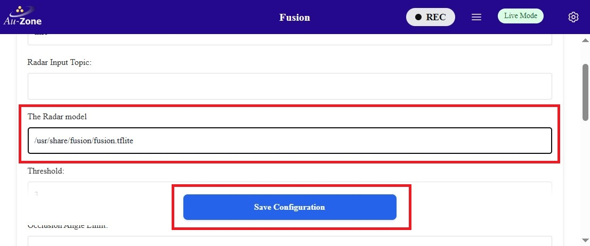
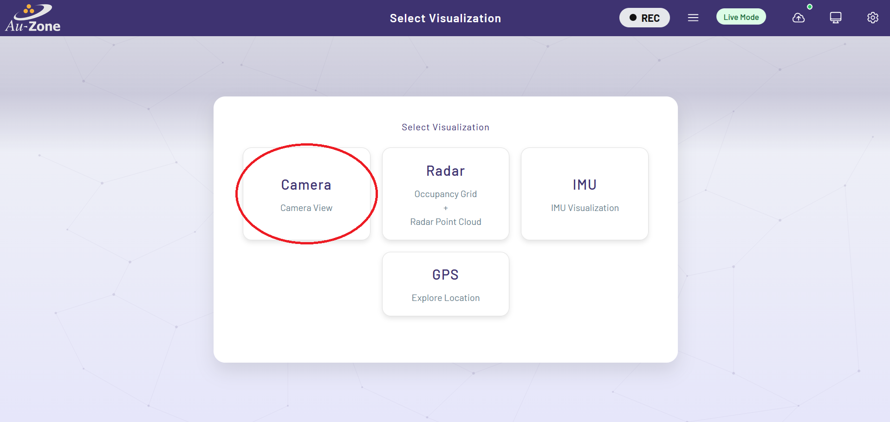

# Deploying to the Raivin

Now that you have [validated your Fusion model](../validation/fusion/managed.md), this guide will walk you through deploying Fusion models in a [Raivin Platform](../../platforms/index.md).  

<figure markdown="span">
{ align=center }
</figure>

This guide will showcase two methods of deploying the model.

1. [Live View (Segmentation App)](#live-view-segmentation-app): Displays the live camera feed using the default model provided.
2. [MCAP Recording](../../platforms/recording.md#record-mcap): Allows control of the recording options and provides download file options to replay the recording.



## Visit the Web UI Service

Use your browser to connect to the Web UI of the remote device, enter the following URL `https://<hostname>/`.

!!! note
    Replace `<hostname>` with the hostname of your device.

You will be greeted with the Raivin [WebUI Main Page](../../platforms/walkthrough.md) page.

<figure markdown="span">
{ align=center }
<figcaption>WebUI Main Page</figcaption>
</figure>

For more information, please see the [Web UI Walkthrough](../../platforms/walkthrough.md).

## Update the Model Path

Next you will need to specify the path to the model in the device.  You can either update the model path in the Web UI or via the command line.

!!! note "Configure Model Settings"
    Whenever a new model has been updated, ensure that the [model settings](../../platforms/configuration.md#model-configuration) such as the score and the IoU thresholds are ideally set for this model. 

=== "via Web UI"

    Once you are in the Web UI main page, you can specify the path to the model by following the steps below.

    Click the settings icon on the top right corner of the page.

    <figure markdown="span">
    { align=center }
    <figcaption>Settings</figcaption>
    </figure>

    Select "Model Settings".

    <figure markdown="span">
    { align=center }
    <figcaption>Model Settings</figcaption>
    </figure>

    Configure the path to the model in your device as specified under "MODEL:".  Once configured, click "Save Configuration" to save your changes.

    <figure markdown="span">
    { align=center }
    <figcaption>Model Path</figcaption>
    </figure>

=== "via Command Line"

    To update the model path using the command line in the device, edit the following file using `sudo vi /etc/default/model`.

    Next, you will see the file with the following contents.

    ```vi
    # This is the configuration file for the model systemd service file.  When
    # running systemctl start detect the service will use these configurations.
    # If running model directly, you must continue to use the command-line options.

    # A model is required for the model application. This can be a segmentation model
    # and/or a detection model.
    MODEL = "path/to/mymodel.tflite"
    ```

    Edit the following line `MODEL = "path/to/mymodel.tflite"` to point to the specific path to your model.  To edit, press `i` to enter into "Insert Mode".  You should now be able to edit the lines.  To exit "Insert Mode", press the ESC key on your keyboard.  Next save and exit the file by typing `:wq` on your keyboard.  More examples for using `vi` can be found [here](https://coderwall.com/p/adv71w/basic-vim-commands-for-getting-started).

    Once the path to the model has been updated, restart the model service using `sudo systemctl restart model`.

## Enable and Start the Camera and Model Services

Once the model path in the device is specified, ensure that all services are enabled.  To verify, go back to the settings and click on the "Service Status" button.

<figure markdown="span">
{ align=center }
<figcaption>Service Status</figcaption>
</figure>

You will be greeted with the "Service Overview" page.  Ensure that all services are enabled and running by toggling the "Enable" and "Start" buttons as shown.  Only "Enable" the "recorder" service as shown.  You will be using the recorder service in [MCAP Recording](../../platforms/recording.md#record-mcap).

<figure markdown="span">
{ align=center }
<figcaption>Service Overview</figcaption>
</figure>

## Live View (Segmentation App)

Now you will see a live inference of the model in the device.  Once all services are enabled, go back to the main page and then select the "Segmentation View" application as shown.

<figure markdown="span">
{ align=center }
<figcaption>Segmentation App</figcaption>
</figure>

This will run inference on the model specified to generate segmentation masks of identified objects on the camera feed and highlights the radar point clouds on the occupancy grid marking the positions of the objects in world coordinates.  Examples are shown below.

<figure markdown="span">
{ align=center }
<figcaption>Sample 1</figcaption>
</figure>

<figure markdown="span">
{ align=center }
<figcaption>Sample 2</figcaption>
</figure>

Now that the model has been updated, you can [make new recordings](../../platforms/recording.md#record-mcap) using the model's inference and then [visualize the recording using Foxglove Studio](../../platforms/foxglove.md).

## Inference Visualization in Foxglove

Once the MCAP recording has been downloaded, you can use Foxglove Studio to see the playback of MCAP recordings and the model inference.  The following preview shows the segmentation mask from the model identifying the person in the frame (right) and the occupancy grid highlighting the radar clusters that correspond to the person's position in world coordinates.

<figure markdown="span">
{ align=center }
<figcaption>Foxglove Sample 1</figcaption>
</figure>

More information on the MCAP playback is provided in [Foxglove Studio](../../platforms/foxglove.md).  Modifying panels and customizing various settings are also shown in [Advanced Foxglove](../../platforms/advanced_foxglove.md).

## Next Steps

In this tutorial, you have fetched the trained and validated model from EdgeFirst Studio, copied the model in the Raivin, configured the Raivin model services, and ran inference on the model in the device.  You have seen the model running live using the Raivin's camera and Radar module, and ran a Raivin MCAP recording to capture the model inferences in the frame that can be visualized using Foxglove Studio. 

See our [developer guide](../../perception/dev/examples/model.md) for examples to query the model outputs using Rust or Python.

For more examples on deploying ModelPack in other platforms, see other [User Workflows](../../getting_started/workflows/index.md).
