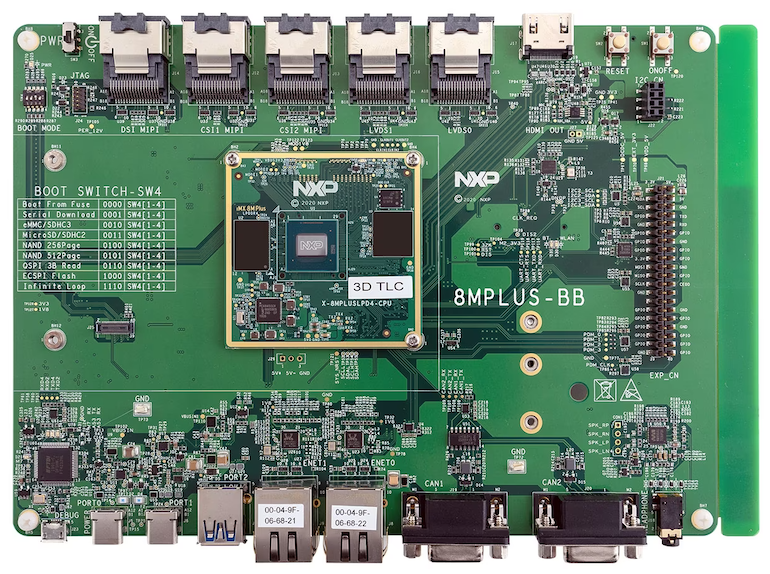

# Deploying to Embedded Targets

This guide will walk you through installing the EdgeFirst Middleware in "user-mode" on a target device.  If you're using a Maivin or Raivin refer to the [Deploying to the Maivin](maivin.md) guide instead.



## Installation

!!! warning

    This workflow is currently only supported on NXP i.MX 8M Plus EVK platforms running the [NXP Yocto BSP](https://www.nxp.com/design/design-center/software/embedded-software/i-mx-software/embedded-linux-for-i-mx-applications-processors:IMXLINUX).

The EdgeFirst Middleware can be easily installed on embedded targets using the Python package manager to install the middleware binaries and sample models.  Simply run the following command to install the middleware.

```bash
pip3 install edgefirst
```

This can also be done through a Python virtual environment to keep all the packages in a user-defined location.

```bash
pip3 install virtualenv
python3 -m virtualenv venv
source venv/bin/activate
pip3 install edgefirst
```



## Usage

Once installed, the applications can be launched using the `edgefirst` launcher which handles running the various [services](../../perception/launcher.md#services).  The applications can also be run directly, for example `edgefirst-camera` to run the camera service.  The launcher is an optional but convenient way to run all the applications in "user-mode" in contrast to having the middleware integrated into the system as "system-mode" where the applications will be managed by systemd.

### Live Camera Mode

The live camera mode is launched using the following command.  By default it will run a person detection and segmentation model, if you wish to run your own model simply use the `--model mymodel.tflite` parameter and provide the path to your TFLite model.  Currently only ModelPack for Detection & Segmentation is supported by the launcher.

```bash
edgefirst live
```

!!! note

    The live camera mode uses the camera found at `/dev/video3` by default.  If your camera is on another device entry you can use the `--camera /dev/videoX` parameter to select the correct camera, replace `X` with the correct camera index.

Once launched, you can access the live camera view and model overlays by pointing your browser to your device's IP address using `https://MY_DEVICE_IP`.  You'll see something like the following.


If testing a model trained using a few images collected on a phone you'll notice the performance is probably poor.  With small datasets it is especially important to include samples captured with the target device's camera which is luckily easy to do from the web interface.  There is a toggle button in the top-right of the screen which will start an MCAP recording.


You can also access the MCAP recordings from the working directory where the `edgefirst live` command was run.

Once you have your MCAP download to your PC you may upload it to EdgeFirst Studio to annotate and further train your model.  Uploading MCAP recordings is done through the [Snapshot Dashboard](../../studio/snapshots.md#upload-from-mcap-file).

## Next Steps

In this tutorial, you have fetched the trained and validated model from EdgeFirst Studio, copied the model to the EVK and ran the model live using the EdgeFirst Live application and the EVK's camera.

See our [developer guide](../../perception/dev/examples/model.md) for examples to query the model outputs using Rust or Python.

For more examples on deploying ModelPack in other platforms, see the [User Workflows](../../getting_started/workflows/index.md).
