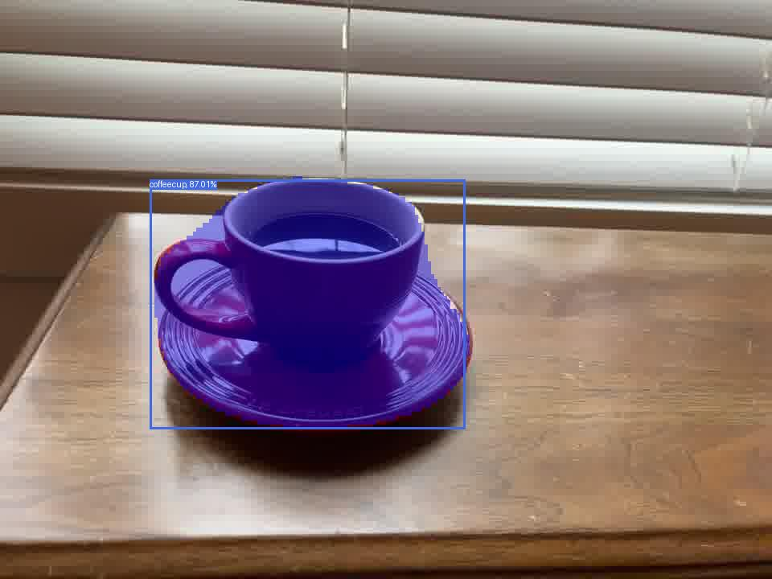
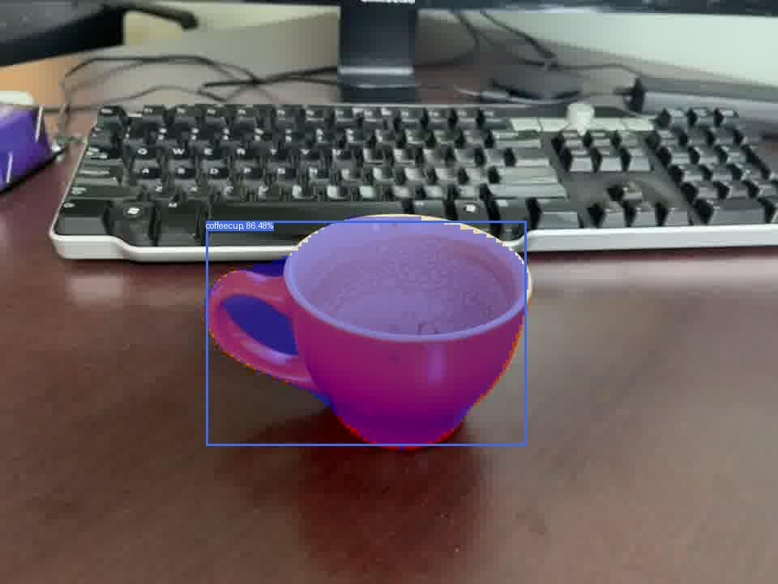
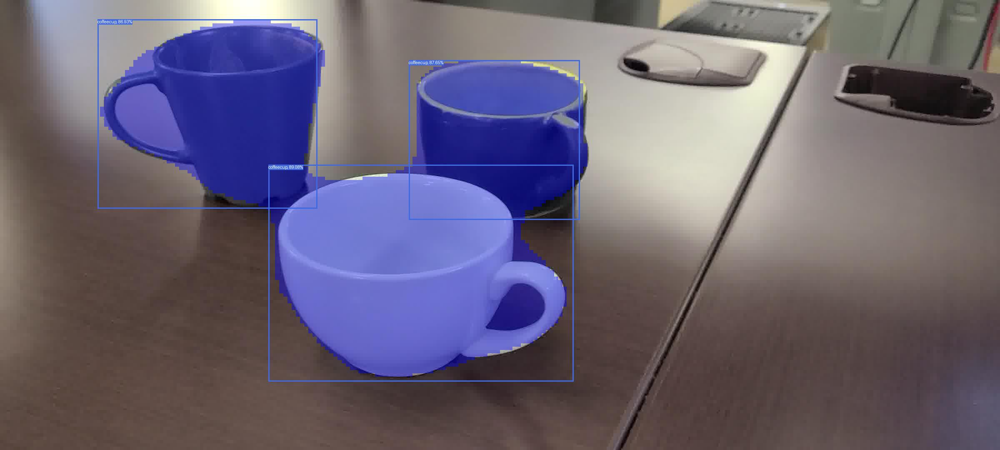
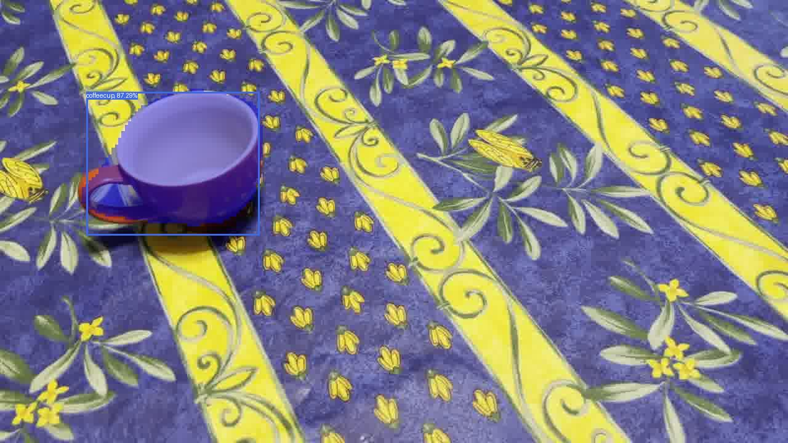
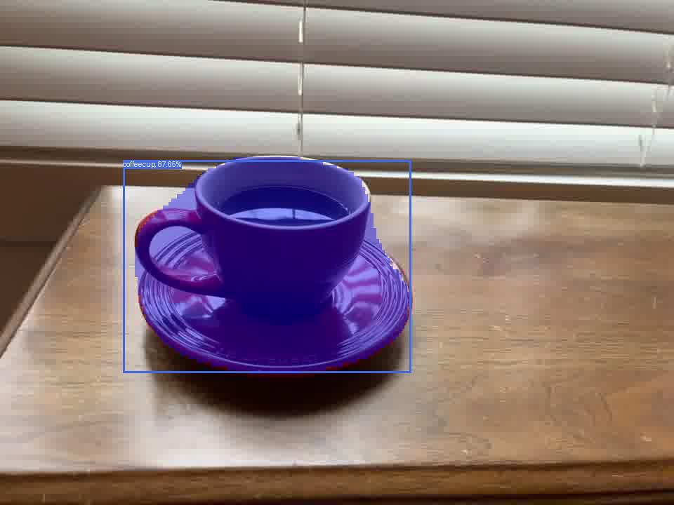

# Deploying ModelPack in the PC
 
If you have an ONNX or a TFLite ModelPack model file, you can follow these instructions for running the model on your PC.  You will need [Python 3.10](https://www.python.org/downloads/) to run this example. 

If you have an ONNX model, download the [run-onnx.py Python script](../assets/run-onnx.py){: download="run-onnx.py"}.  Otherwise, if you have a TFLite model, download the [run-tflite.py Python script](../assets/run-tflite.py){: download="run-tflite.py"}.  These scripts will load the model for inference across multiple images and saves the images with visualizations in your PC.  Run the scripts with the steps shown below. 

As mentioned under [Quickstart -> Train a Vision Model](../../../getting_started/train_vision.md), you can find the trained model artifacts (.onnx or .tflite) in the training session details which you can then download into your PC.

| Session Details                                                        | Artifacts                                                                  |
|------------------------------------------------------------------------|----------------------------------------------------------------------------|
|  |  | 

For this Python script you will need a set of images and a model file.  You can click on the following link and download these [set of images with coffee cup samples](../assets/coffeecup.zip){: download="coffeecup.zip"}.  Once downloaded, unzip the file into a directory.  Next download a sample [ONNX](../assets/coffeecup-modelpack-multitask-t-1f54.onnx){: download="coffeecup-modelpack-multitask-t-1f54.onnx"} or [TFLite](../assets/coffeecup-modelpack-multitask-t-1f54.tflite){: download="coffeecup-modelpack-multitask-t-1f54.tflite"} model to run the following examples.

1. Install required dependencies.

    === "ONNX"

        ```shell
        pip install onnxruntime-gpu pillow numpy
        ```

        !!! note "Tested Versions"
            
            The following versions of these dependencies were tested.

            ```
            $ pip list
            Package         Version
            --------------- -------
            numpy           2.2.6
            onnxruntime-gpu 1.23.2
            pillow          12.0.0
            ```

    === "TFLite"

        ```shell
        pip install tensorflow pillow numpy
        ```

        !!! note "Tested Versions"
            
            The following versions of these dependencies were tested.

            ```
            $ pip list
            Package         Version
            --------------- -------
            numpy           2.2.6
            tensorflow      2.20.0
            pillow          12.0.0
            ```

2. Run the script

    === "ONNX"

        If you have downloaded the sample images and the ONNX model above, run this command to use the script.  Otherwise modify the path to the model and the images specific to your system.  If you have multiple labels in your dataset specify them as `--labels bench coco` for example.

        ```shell
        $ python run-onnx.py coffeecup-modelpack-multitask-t-1f54.onnx coffeecup/*.jpg --labels coffeecup
        2025-11-18 13:39:07.683129404 [W:onnxruntime:Default, device_discovery.cc:164 DiscoverDevicesForPlatform] GPU device discovery failed: device_discovery.cc:89 ReadFileContents Failed to open file: "/sys/class/drm/card0/device/vendor"
        Using Execution Providers: ['CUDAExecutionProvider', 'CPUExecutionProvider']
        Objects found in image:  20250430_172430_17.jpg
        1 label 0.87926835 [0.26601335 0.36210924 0.5735067  0.8584561 ]
        1 label 0.86259437 [0.0948802  0.04210137 0.3184373  0.46704173]
        1 label 0.86069584 [0.40953434 0.12491359 0.5871578  0.5056495 ]
        Objects found in image:  IMG_9007_13.jpg
        1 label 0.8577206 [0.10292357 0.19846882 0.33462578 0.5329166 ]
        Objects found in image:  IMG_9015_35.jpg
        1 label 0.8701283 [0.1946017  0.3104946  0.60248053 0.7411861 ]
        Objects found in image:  IMG_9028_86.jpg
        1 label 0.8647619 [0.265095   0.37879103 0.67696035 0.76366836]
        Average Inference Time: 45.25 ms
        ```

    === "TFLite"

        If you have downloaded the sample images and the TFLite model above, run this command to use the script.  Otherwise modify the path to the model and the images specific to your system.  If you have multiple labels in your dataset specify them as `--labels bench coco` for example.

        ```shell
        $ python run-tflite.py coffeecup-modelpack-multitask-t-1f54.tflite coffeecup/*.jpg --labels coffeecup
        2025-11-18 14:01:30.182493: I tensorflow/core/platform/cpu_feature_guard.cc:210] This TensorFlow binary is optimized to use available CPU instructions in performance-critical operations.
        To enable the following instructions: AVX2 FMA, in other operations, rebuild TensorFlow with the appropriate compiler flags.
        /home/johns/Repositories/validator/delenv/lib/python3.10/site-packages/tensorflow/lite/python/interpreter.py:457: UserWarning:     Warning: tf.lite.Interpreter is deprecated and is scheduled for deletion in
            TF 2.20. Please use the LiteRT interpreter from the ai_edge_litert package.
            See the [migration guide](https://ai.google.dev/edge/litert/migration)
            for details.
            
        warnings.warn(_INTERPRETER_DELETION_WARNING)
        INFO: Created TensorFlow Lite XNNPACK delegate for CPU.
        Objects found in image:  20250430_172430_17.jpg
        1 label 0.89077294 [0.26847103 0.36609685 0.5735518  0.8481244 ]
        1 label 0.87646335 [0.40880817 0.13423552 0.5796534  0.48812914]
        1 label 0.86930853 [0.09762583 0.0427113  0.31728396 0.46372268]
        Objects found in image:  IMG_9007_13.jpg
        1 label 0.87288594 [0.10982906 0.20745489 0.32948717 0.53084046]
        Objects found in image:  IMG_9015_35.jpg
        1 label 0.87646335 [0.18304843 0.31728396 0.6101614  0.7382953 ]
        Objects found in image:  IMG_9028_86.jpg
        1 label 0.8836181 [0.27457264 0.37219846 0.67117757 0.7627018 ]
        Average Inference Time: 60.25 ms
        ```

3. See the model output visualizations.

    A directory called "results" should be created which contains the same input images with annotations to visualize the output of the trained model. 

    === "ONNX"
    
        | 20250430_172430_17.jpg                              | IMG_9007_13.jpg                              |
        |-----------------------------------------------------|----------------------------------------------|
        |  |  |

        | IMG_9015_35.jpg                              | IMG_9028_86                                  |
        |----------------------------------------------|----------------------------------------------|
        |  |  |

    === "TFLite"

        | 20250430_172430_17.jpg                                | IMG_9007_13.jpg                                |
        |-------------------------------------------------------|------------------------------------------------|
        |  |  |

        | IMG_9015_35.jpg                                | IMG_9028_86                                    |
        |------------------------------------------------|------------------------------------------------|
        |  |  |
