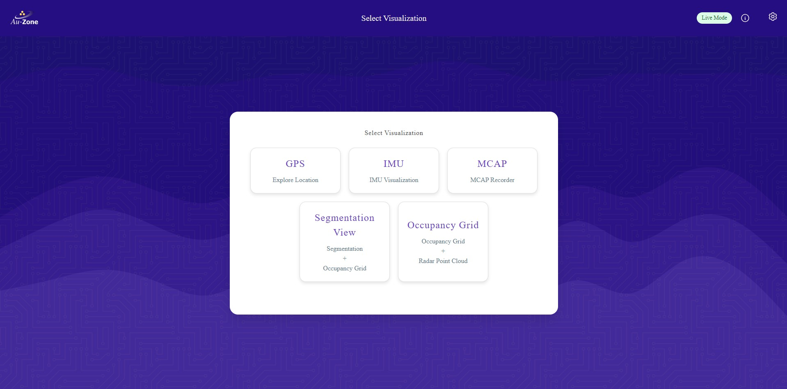
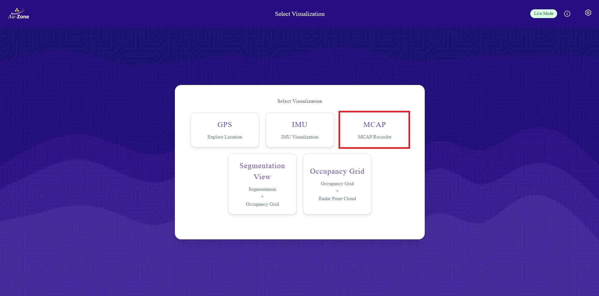
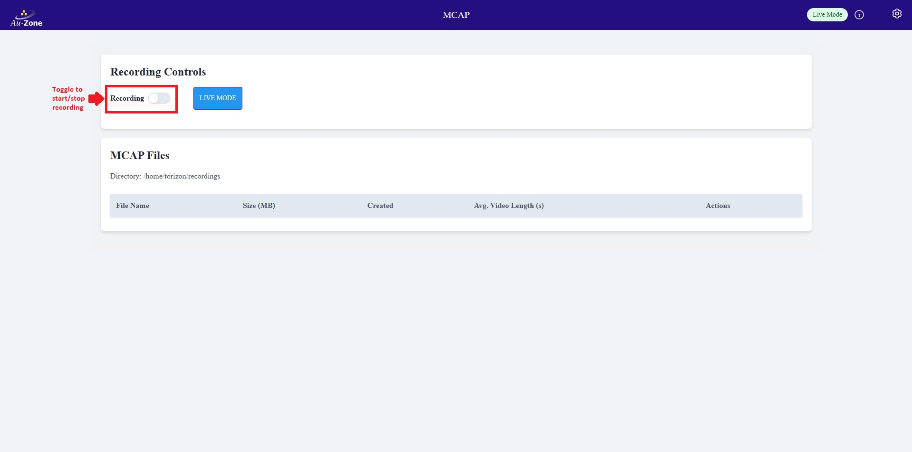
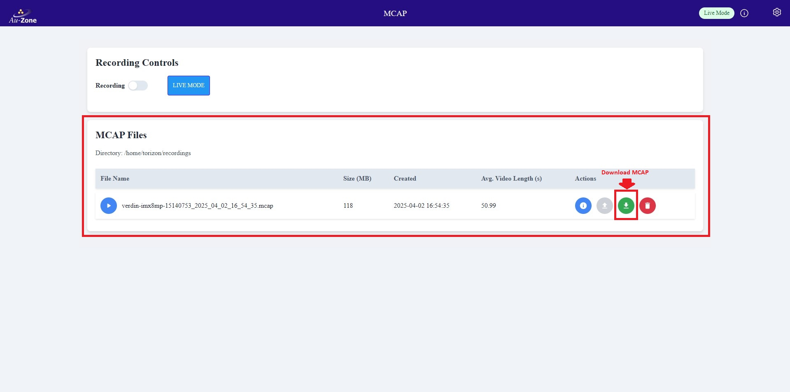

# Deploying Fusion

Now that you have [validated your Fusion model](validation.md), this page will provide a walk-through for deploying Fusion models in an [EdgeFirst Platform](../../platforms/index.md).  This page will showcase two types of deployments.

1. [Live View (Segmentation App)](#live-view-segmentation-app)
2. [MCAP Recording](#mcap-recording)

## Download the Model

Download the model from EdgeFirst Studio into the EdgeFirst Platform.  There are two methods for downloading the model.  The first method is to download the model from EdgeFirst Studio and then SCP the model file to the EdgeFirst Platform.  The second method is to use the EdgeFirst Client to download the modle directly in the device. 

### Download and SCP

As mentioned under the [Trained Models](training.md#trained-models) section, the trained models can be downloaded by clicking the "View Session Details" button.

<figure markdown="span">
{ align=center }
<figcaption>Training Session Attributes</figcaption>
</figure>

This will open the session details and the models are listed on the right with downward arrow buttons that downloads the models to your PC. In this example, we will be deploying the TFLite model on device. 

<figure markdown="span">
{ align=center }
<figcaption>Session Details</figcaption>
</figure>

Once the model is downloaded in your PC, you can SCP the model to the EdgeFirst Platform by using this command template.

```shell
scp <path to the downloaded TFLite model> <destination path>
```

An example command is shown below.

```shell
scp fusion.tflite torizon@verdin-imx8mp-07130049:~
```

For more information, please visit [Secure Copy](../../platforms/ssh.md#secure-copy).

### Download using the Client

This method expects you to have connected to the EdgeFirst Platform via [SSH](../../platforms/ssh.md).  The [EdgeFirst Client](../../perception/studio.md) will already come pre installed in the device.  You can verify the installation with the client version command.

```shell
$ edgefirst-client version
Deep View Enterprise 3.7.0e
```

Next login to the client with the command.

```shell
$ edgefirst-client login
Username: user
Password: ****
```

You will now be able to download the model on the device by the download-artifact command.

```shell
edgefirst-client download-artifact <session ID> <model name>
```

The `download-artifact` expects three arguments.

* session ID: Pass the trainer or validation session ID associated with the models.
* model name: Pass the specific model that will be downloaded to the device.
* download path (optional): Specify the path to the download the model.  If not provided, it will download to the current working directory.

Please see [EdgeFirst Client](../../perception/studio.md) For more information on using the client via command line.

## Visit the WebUI Service

Visit the WebUI service by entering the URL `https://<hostname>/` in your browser.

!!! note
    Replace `<hostname>` with the hostname of your device.

You should be greeted with the following page.

<figure markdown="span">
{ align=center }
<figcaption>WebUI</figcaption>
</figure>

For more information, please see the [Web UI Walkthrough](../../platforms/walkthrough.md).

## Update the Model Path

Once you are in the WebUI main page, specify the path to the model in the device.

Click the settings icon on the top right corner of the page.

<figure markdown="span">
{ align=center }
<figcaption>Settings</figcaption>
</figure>

Select "Model Settings".

<figure markdown="span">
{ align=center }
<figcaption>Model Settings</figcaption>
</figure>

Configure the path to the model in your device as specified under "MODEL:".  Once configured, click "Save Configuration" to save your changes.

<figure markdown="span">
{ align=center }
<figcaption>Model Path</figcaption>
</figure>

## Enable and Start the Camera and Model Services

Ensure that all services are enabled.  To verify, go back to the settings and click on the "Service Status" button.

<figure markdown="span">
{ align=center }
<figcaption>Service Status</figcaption>
</figure>

You will be greeted with the "Service Overview" page.  Ensure that all services are enabled and running by toggling the "Enable" and "Start" button as shown. Only "Enable" the "recorder" service as shown.  We will start the recorder service in [MCAP Recording](#mcap-recording).

<figure markdown="span">
{ align=center }
<figcaption>Service Overview</figcaption>
</figure>

## Live View (Segmentation App)

Once all services are enabled, go back to the main page and then select the "Segmentation View" application as shown.

<figure markdown="span">
{ align=center }
<figcaption>Segmentation App</figcaption>
</figure>

This will run inference on the model specified to generate segmentation masks of identified objects on the camera feed and highlights the radar point clouds on the occupancy grid marking the positions of the objects in world coordinates.  Examples are shown below.

<figure markdown="span">
{ align=center }
<figcaption>Sample 1</figcaption>
</figure>

<figure markdown="span">
{ align=center }
<figcaption>Sample 2</figcaption>
</figure>

## MCAP Recording

Once all services are enabled, go back to the main page and then select the "MCAP" application as shown.

<figure markdown="span">
{ align=center }
<figcaption>MCAP Recorder</figcaption>
</figure>

You will be greeted with the MCAP recording page.

<figure markdown="span">
{ align=center }
<figcaption>MCAP Recording Page</figcaption>
</figure>

Toggle the "Recording" button as shown to start recording the video feed.  To stop the recording, toggle the same button and then the recording will be stored as an MCAP file.

For more information on MCAP recordings, please see the [MCAP Recording Service](../../platforms/recording.md).

### Inference Visualization in Foxglove

The MCAP recordings are listed under the list of "MCAP Files" which can then be downloaded to your PC.

<figure markdown="span">
{ align=center }
<figcaption>MCAP Files</figcaption>
</figure>

Once the MCAP recording has been downloaded, we can use Foxglove Studio to see the playback of MCAP recordings and the model inference.  The following preview shows the segmentation mask from the model identifying the person in the frame (right) and the occupancy grid highlighting the radar clusters that correspond to the person's position in world coordinates.

<figure markdown="span">
{ align=center }
<figcaption>Foxglove Sample 1</figcaption>
</figure>

For more information on the MCAP playback in [Foxglove Studio](../../platforms/foxglove.md) and modifying panels shown in [Advanced Foxglove](../../platforms/advanced_foxglove.md), please see the links attached.

