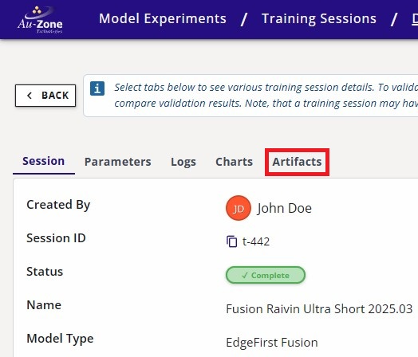
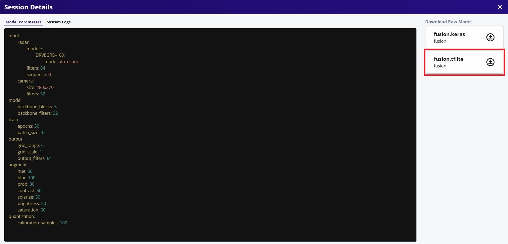
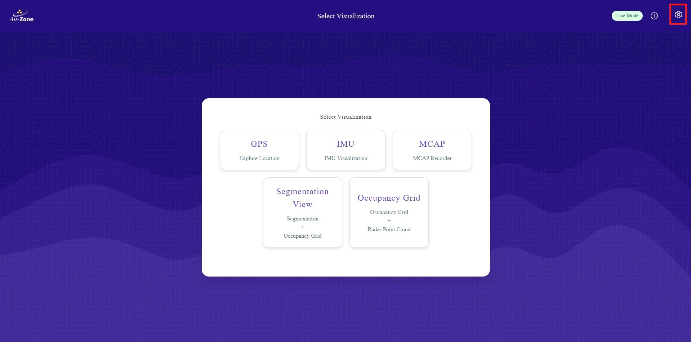
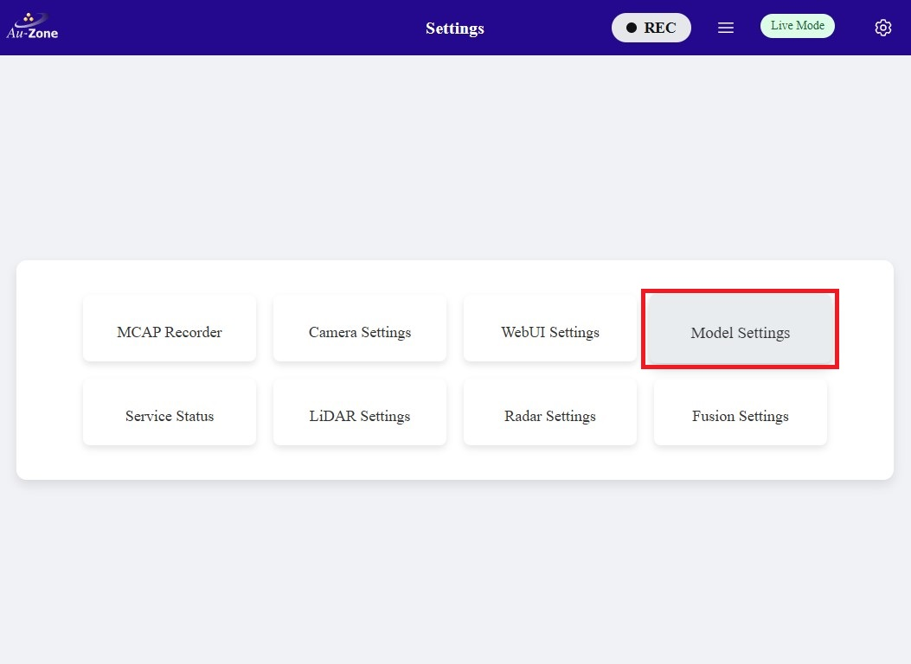
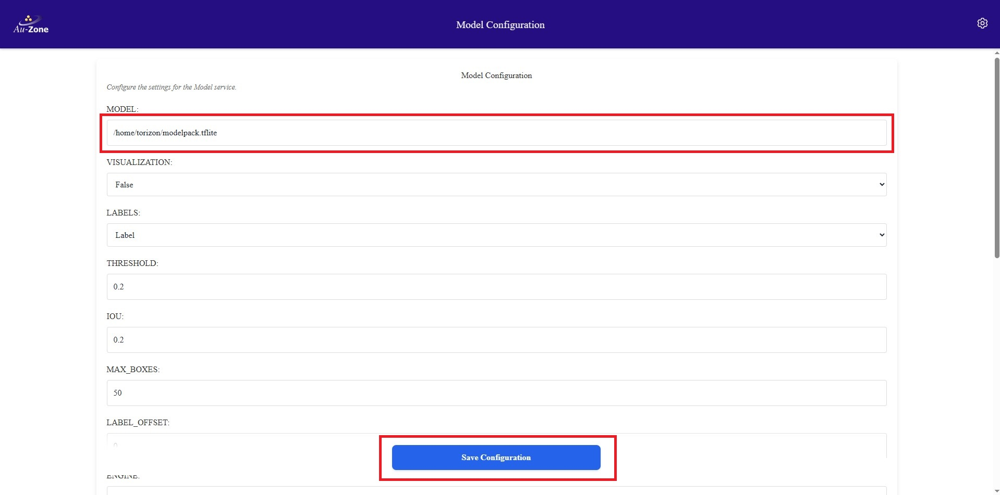
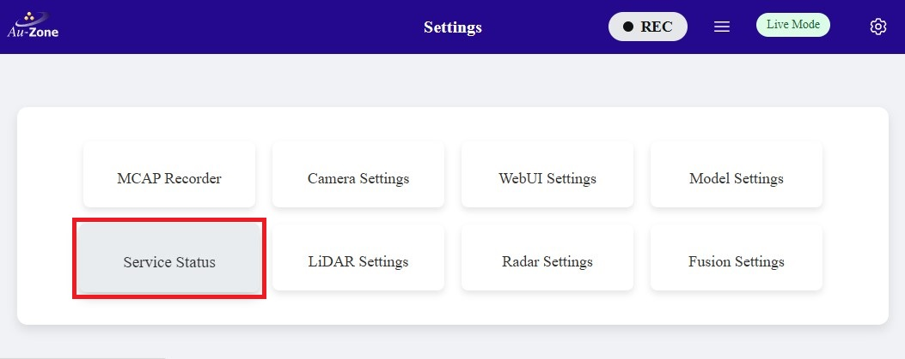
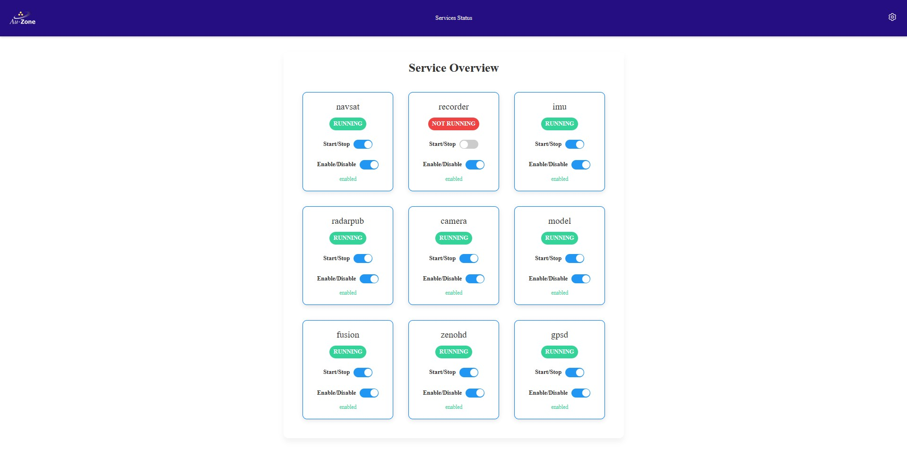
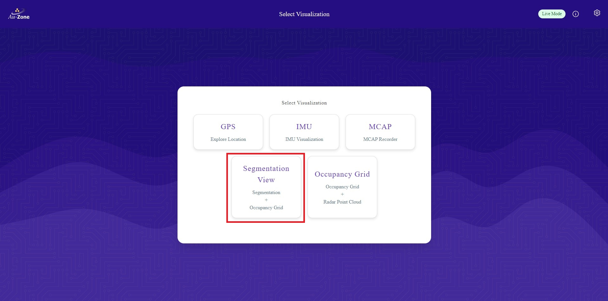
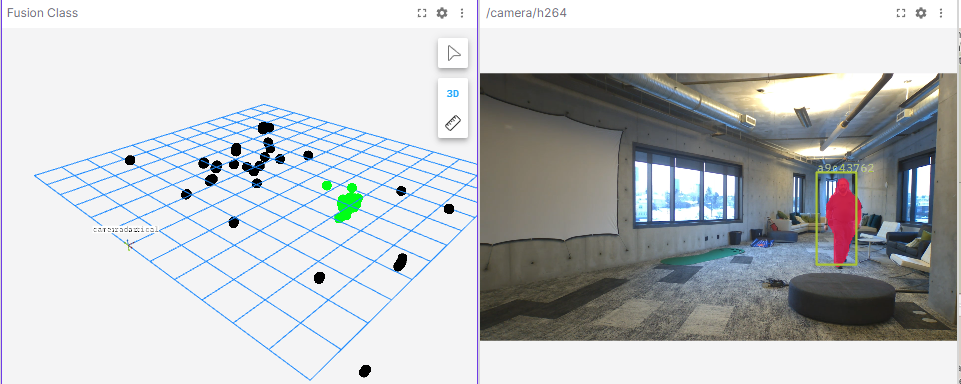

# Deploying to the Raivin

Now that you have [validated your Fusion model](../validation.md), this guide will walk you through deploying Fusion models in a [Raivin Platform](../../../platforms/index.md).  

<figure markdown="span">
{ align=center }
</figure>

This guide will showcase two methods of deploying the model.

1. [Live View (Segmentation App)](#live-view-segmentation-app)
2. [MCAP Recording](#recording-an-mcap)

## Download the Model

First download the model from EdgeFirst Studio into the Raivin Platform.  There are two methods for downloading the model.  The first method is to download the model from EdgeFirst Studio and then SCP the model file to the Raivin Platform.  The second method is to use the EdgeFirst Client to download the model directly in the device. 

### Download and SCP

As mentioned under the [Trained Models](../training.md#trained-models) section, the trained models can be downloaded by clicking the "View Additional Details" button on the training session card in EdgeFirst Studio.

<figure markdown="span">
{ align=center }
<figcaption>Training Session Attributes</figcaption>
</figure>

This will open the session details and the models are listed under the "Artifacts" tab as shown below.  Click on the downward arrow indicated in red to download the models to your PC.  In this example, we will be deploying the TFLite model in the Raivin.

| Session Details                                                | Artifacts                                                                     |
|----------------------------------------------------------------|-------------------------------------------------------------------------------|
|  |  | 

Once the model is downloaded in your PC, you can `SCP` the model to the Raivin by using this command template.

```shell
scp <path to the downloaded TFLite model> <destination path>
```

An example command is shown below.

```shell
scp fusion.tflite torizon@verdin-imx8mp-07130049:~
```

For more information, please visit [Secure Copy](../../../platforms/ssh.md#secure-copy).

### Download using the Client

This method expects you to have already connected to the Raivin via [SSH](../../../platforms/ssh.md).  The [EdgeFirst Client](../../../perception/studio.md) will already come preinstalled in the device.  You can verify the installation with the client version command.

```shell
$ edgefirst-client version
EdgeFirst Studio Server: 3.7.5-def7735 Client: 1.3.4
```

Next login to the client with the command.

```shell
$ edgefirst-client login
Username: user
Password: ****
```

You will now be able to download the model on the device by the `download-artifact` command.

```shell
edgefirst-client download-artifact <session ID> <model name>
```

The `download-artifact` expects three arguments.

* session ID: Pass the integer trainer or validation session ID associated with the models.
* model name: Pass the specific model that will be downloaded to the device. Usually this is `fusion.tflite`.
* download path (optional): Specify the path to download the model.  If not provided, it will download to the current working directory.

Please see [EdgeFirst Client](../../../perception/studio.md) For more information on using the client via command line.

## Visit the Web UI Service

Visit the Web UI service by entering the URL `https://<hostname>/` in your browser.

!!! note
    Replace `<hostname>` with the hostname of your device.

You will be greeted with the Maivin [WebUI Main Page](../../../platforms/walkthrough.md) page.

<figure markdown="span">
{ align=center }
<figcaption>WebUI Main Page</figcaption>
</figure>

For more information, please see the [Web UI Walkthrough](../../../platforms/walkthrough.md).

## Update the Model Path

Once you are in the Web UI main page, specify the path to the model in the device.

Click the settings icon on the top right corner of the page.

<figure markdown="span">
{ align=center }
<figcaption>Settings</figcaption>
</figure>

Select "Model Settings".

<figure markdown="span">
{ align=center }
<figcaption>Model Settings</figcaption>
</figure>

Configure the path to the model in your device as specified under "MODEL:".  Once configured, click "Save Configuration" to save your changes.

<figure markdown="span">
{ align=center }
<figcaption>Model Path</figcaption>
</figure>

## Enable and Start the Camera and Model Services

Once the model path in the device is specified, ensure that all services are enabled.  To verify, go back to the settings and click on the "Service Status" button.

<figure markdown="span">
{ align=center }
<figcaption>Service Status</figcaption>
</figure>

You will be greeted with the "Service Overview" page.  Ensure that all services are enabled and running by toggling the "Enable" and "Start" buttons as shown.  Only "Enable" the "recorder" service as shown.  You will be using the recorder service in [MCAP Recording](#recording-an-mcap).

<figure markdown="span">
{ align=center }
<figcaption>Service Overview</figcaption>
</figure>

## Live View (Segmentation App)

Now we will demonstrate a live inference of the model in the device.  Once all services are enabled, go back to the main page and then select the "Segmentation View" application as shown.

<figure markdown="span">
{ align=center }
<figcaption>Segmentation App</figcaption>
</figure>

This will run inference on the model specified to generate segmentation masks of identified objects on the camera feed and highlights the radar point clouds on the occupancy grid marking the positions of the objects in world coordinates.  Examples are shown below.

<figure markdown="span">
{ align=center }
<figcaption>Sample 1</figcaption>
</figure>

<figure markdown="span">
{ align=center }
<figcaption>Sample 2</figcaption>
</figure>

Now that the model has been updated, you can make new recordings using the model's inference and then visualizing the recording using Foxglove Studio.




## Inference Visualization in Foxglove
Once the MCAP recording has been downloaded, you can use Foxglove Studio to see the playback of MCAP recordings and the model inference.  The following preview shows the segmentation mask from the model identifying the person in the frame (right) and the occupancy grid highlighting the radar clusters that correspond to the person's position in world coordinates.

<figure markdown="span">
{ align=center }
<figcaption>Foxglove Sample 1</figcaption>
</figure>

More information on the MCAP playback is provided in [Foxglove Studio](../../../platforms/foxglove.md). Modifying panels and customizing various settings are also shown in [Advanced Foxglove](../../../platforms/advanced_foxglove.md).

In this tutorial, you have fetched the trained and validated model from EdgeFirst Studio, copied the model in the Raivin, configured the Raivin model services, and ran inference on the model in the device.  You have seen the model running live using the Raivin's camera and Radar module, and ran a Raivin MCAP recording to capture the model inferences in the frame that can be visualized using Foxglove Studio. 
