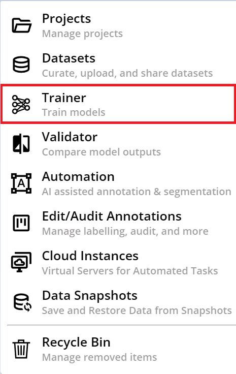
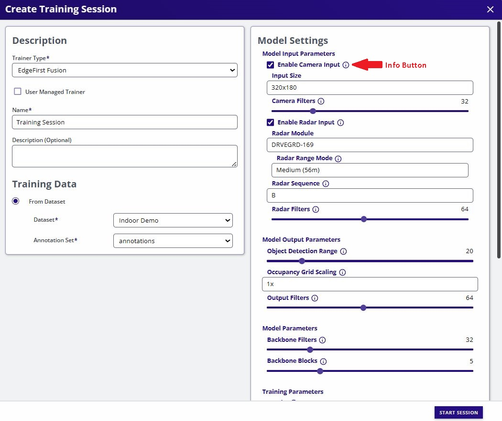
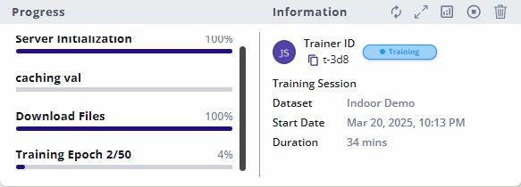
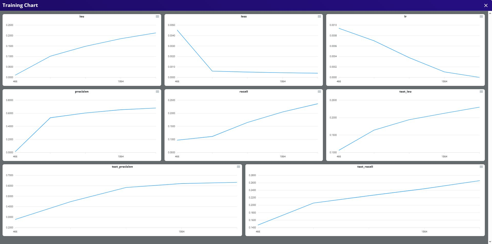
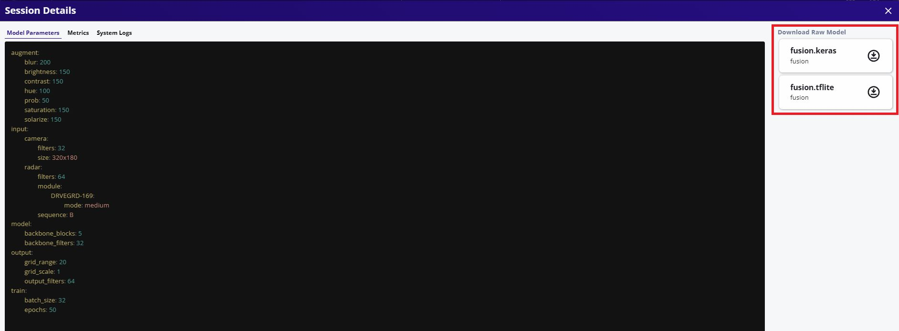

# Training Fusion Models

This page will provide a walk-through on using DVE for training Fusion models.

1. Select *Trainer* from the tool options. 

    <figure markdown="span">
    { align=center }
    <figcaption>Tool Options</figcaption>
    </figure>

2. Specify the project to run training at the center of the top menu bar.

    <figure markdown="span">
    { align=center }
    <figcaption>Project Selection</figcaption>
    </figure>

3. Create a new training session by clicking the *create* button on the top right.

    <figure markdown="span">
    { align=center }
    <figcaption>Create New Session</figcaption>
    </figure>

4. Configure the settings on the left panel by specifying *Trainer Type* to *EdgeFirst Fusion* and provide additional configurations for the name of the session and the dataset to deploy. Next configure the settings on the right panel by specifying training parameters. By default the Fusion model is configured with both camera and radar inputs, however, a Camera-Only or Radar-Only model are possible variations. 

    !!! note
        Additional information on these parameters are provided by hovering over the info button.
        For more information on available vision augmentations please see [Vision Augmentations](../augmentations.md).

    <figure markdown="span">
    { align=center }
    <figcaption>Training Options</figcaption>
    </figure>

5. Start the session by clicking the *START SESSION* button on the bottom right.

    <figure markdown="span">
    { align=center }
    <figcaption>Start the Session</figcaption>
    </figure>

6. The training session has now started while the progress is tracked on the left panel and additional information and status is shown on the right panel.

    <figure markdown="span">
    { align=center }
    <figcaption>Training Session</figcaption>
    </figure>

7. Once completed, the status will be shown as complete.

    <figure markdown="span">
    { align=center }
    <figcaption>Completed Session</figcaption>
    </figure>

8. The training metrics are shown by clicking the plots button on the top left of the session card. 

    <figure markdown="span">
    { align=center }
    <figcaption>Training Metrics</figcaption>
    </figure>

9. The trained Keras and TFLite models can be found and downloaded by clicking on the maximize button next to the plots button on the top right of the session card. This will open a new dialog with the session details and the models are placed on the top right which can then be downloaded.

    <figure markdown="span">
    { align=center }
    <figcaption>Session Details</figcaption>
    </figure>

10. Now you have generated your Fusion model, follow these [next steps](validation.md) for validating your Fusion model.