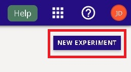
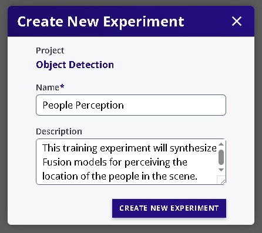
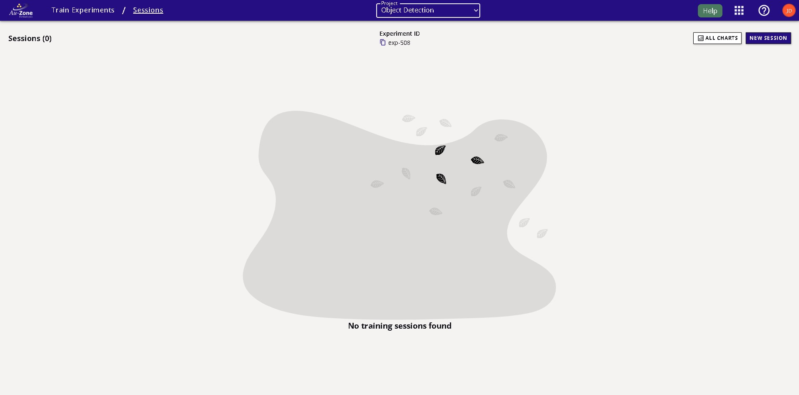

# Training Fusion Models

This page will provide a walk-through for training **Fusion** models in EdgeFirst Studio.  For a walk-through on training Vision models, please see [Training ModelPack](../modelpack/training.md).

    <iframe width="560" height="315" src="https://www.youtube.com/embed/Q8uiYJb1HJ4" title="Fusion Training Workflow" frameborder="0" allow="accelerometer; autoplay; clipboard-write; encrypted-media; gyroscope; picture-in-picture; web-share" referrerpolicy="strict-origin-when-cross-origin" allowfullscreen></iframe>

Checkout our full video tutorial above as part of the [EdgeFirst Studio Series](https://youtube.com/playlist?list=PLtgoOooyxY45Kl6pztdm4una-tHUjuIXz&si=DAmpo-gTvaSNktjw) to showcase the steps for running Fusion training in EdgeFirst Studio.  Otherwise, follow along the steps shown below with section specific timestamps of the video.

## Verify Dataset

Before running a training session, ensure the dataset is ready to be used for training.  
This means that the dataset is properly annotated and the dataset is properly split 
with training and validation samples.  The tutorial [Verifying Datasets](../../datasets/tutorials.md#verifying-datasets) will show what to look for in a dataset before deploying it for training.

## Select the Trainer Tool

    <iframe width="560" height="315" src="https://www.youtube.com/embed/Q8uiYJb1HJ4?start=117&end=217" title="EdgeFirst Fusion Trainer" frameborder="0" allow="accelerometer; autoplay; clipboard-write; encrypted-media; gyroscope; picture-in-picture; web-share" referrerpolicy="strict-origin-when-cross-origin" allowfullscreen></iframe>

Once the training dataset is ready, select "Train Experiments" from the tool options.  

<figure markdown="span">
{ align=center }
<figcaption>Tool Options</figcaption>
</figure>

## Specify the Project

Specify the project to run training at the center of the top menu bar.

<figure markdown="span">
{ align=center }
<figcaption>Project Selection</figcaption>
</figure>

## Create Training Experiment

If you haven't already done so, create a training experiment.  Create a new 
training experiment by clicking the "NEW EXPERIMENT" button on the top right.

<figure markdown="span">
{ align=center }
<figcaption>Create New Experiment</figcaption>
</figure>

This will provide pop-up for the user to specify the name and description of 
the experiment.  Give a name and a description that reflects your goals in this experiment.

<figure markdown="span">
{ align=center }
<figcaption>Create New Experiment</figcaption>
</figure>

Click on the "CREATE NEW EXPERIMENT" button to create your new training experiment.  This will show
the created experiment.

<figure markdown="span">
{ align=center }
<figcaption>Created Experiment</figcaption>
</figure>

Open the created experiment by clicking on the experiment.  Inside the experiment, we can create multiple training sessions.  Each training session will train Fusion models which we will explore next.

<figure markdown="span">
{ align=center }
<figcaption>Inside the Experiment</figcaption>
</figure>

## Create Training Session

    <iframe width="560" height="315" src="https://www.youtube.com/embed/Q8uiYJb1HJ4?start=217&end=863" title="Training Session" frameborder="0" allow="accelerometer; autoplay; clipboard-write; encrypted-media; gyroscope; picture-in-picture; web-share" referrerpolicy="strict-origin-when-cross-origin" allowfullscreen></iframe>

Create a new training session within this experiment by clicking the "NEW SESSION" button as shown below.

<figure markdown="span">
{ align=center }
<figcaption>Training Session</figcaption>
</figure>

Configure the settings on the left panel by specifying "Trainer Type" to "EdgeFirst Fusion" and provide additional configurations for the name of the session and the dataset to deploy.  Next configure the settings on the right panel by specifying training parameters.  By default the Fusion model is configured with both camera and radar inputs, however, a Camera-Only or Radar-Only model are possible variations.  

Additional information on these parameters are provided by hovering over the info button.
For more information on available vision augmentations please see [Vision Augmentations](../augmentations.md).

<figure markdown="span">
{ align=center }
<figcaption>Training Options</figcaption>
</figure>

!!! note
    For an indoor setting, the "Radar Range Mode" is typically set to "Ultra Short (9m)" and the "Object Detection Range" is set to 9 meters.  This is the maximum range of detection, further distances are ignored. 

## Start the Session

Start the session by clicking the "START SESSION" button on the bottom right.

<figure markdown="span">
{ align=center }
<figcaption>Start the Session</figcaption>
</figure>

## Session Progress

    <iframe width="560" height="315" src="https://www.youtube.com/embed/Q8uiYJb1HJ4?start=863&end=1050" title="Training Started" frameborder="0" allow="accelerometer; autoplay; clipboard-write; encrypted-media; gyroscope; picture-in-picture; web-share" referrerpolicy="strict-origin-when-cross-origin" allowfullscreen></iframe>

The training session has now started while the progress is tracked on the left 
panel and additional information and status is shown on the right panel.

<figure markdown="span">
{ align=center }
<figcaption>Training Session</figcaption>
</figure>

The completed session will look as follows.

<figure markdown="span">
{ align=center }
<figcaption>Completed Session</figcaption>
</figure>

<figure markdown="span">
{ align=center }
<figcaption>Training Session Attributes</figcaption>
</figure>

## Training Outcomes

### Training Metrics

    <iframe width="560" height="315" src="https://www.youtube.com/embed/Q8uiYJb1HJ4?start=1050&end=1355" title="Training Summary Metrics" frameborder="0" allow="accelerometer; autoplay; clipboard-write; encrypted-media; gyroscope; picture-in-picture; web-share" referrerpolicy="strict-origin-when-cross-origin" allowfullscreen></iframe>

The training metrics are shown by clicking the button that views the training charts on the top right of the session card.  

<figure markdown="span">
{ align=center }
<figcaption>Training Metrics</figcaption>
</figure>

### Completed Session

    <iframe width="560" height="315" src="https://www.youtube.com/embed/Q8uiYJb1HJ4?start=1358&end=1529" title="Training Completed" frameborder="0" allow="accelerometer; autoplay; clipboard-write; encrypted-media; gyroscope; picture-in-picture; web-share" referrerpolicy="strict-origin-when-cross-origin" allowfullscreen></iframe>

Once completed, the status will be shown as complete.

<figure markdown="span">
{ align=center }
<figcaption>Completed Session</figcaption>
</figure>

### Trained Models

    <iframe width="560" height="315" src="https://www.youtube.com/embed/Q8uiYJb1HJ4?start=1530&end=1830" title="Downloading Model" frameborder="0" allow="accelerometer; autoplay; clipboard-write; encrypted-media; gyroscope; picture-in-picture; web-share" referrerpolicy="strict-origin-when-cross-origin" allowfullscreen></iframe>

The trained Keras, TFLite, and ONNX models are listed on the right.  These models can be downloaded by clicking on the downward arrows on the right.

<figure markdown="span">
{ align=center }
<figcaption>Session Details</figcaption>
</figure>

!!! info
    You can visualize the architecture of these models using [https://netron.app/](https://netron.app/).

## Next Steps

Now that you have generated your Fusion model, follow these next steps
for [validating your Fusion model](validation.md).