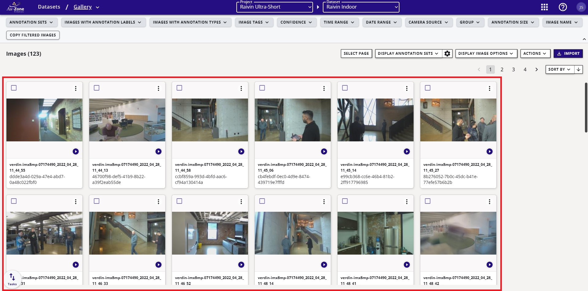
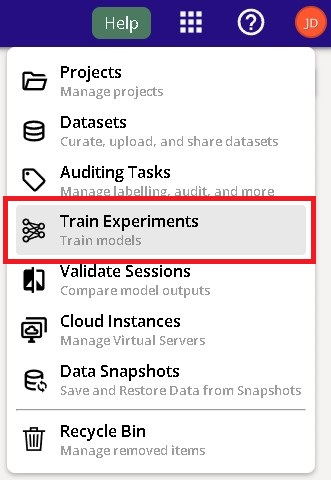
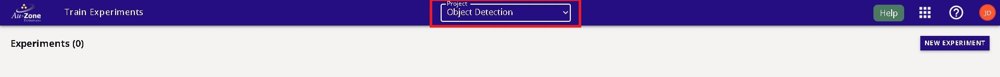
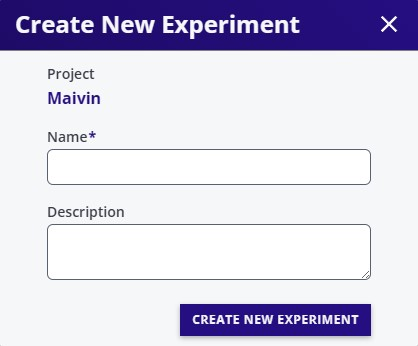
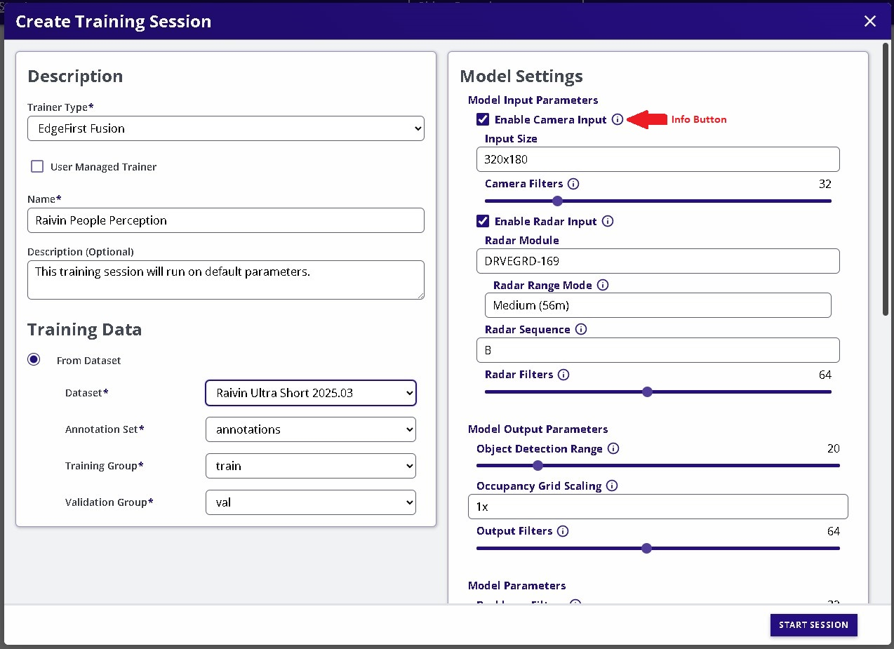
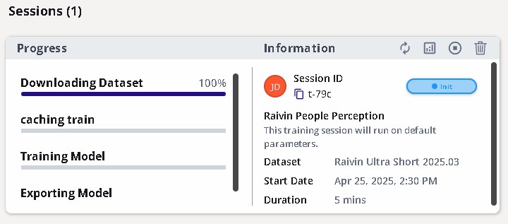
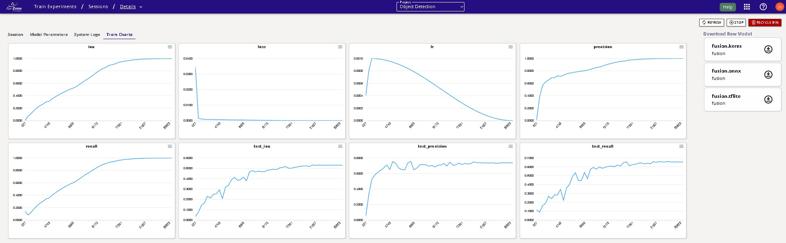

# Training Fusion Models

This page will provide a walk-through on using DVE for training Fusion models.

    <iframe width="560" height="315" src="https://www.youtube.com/embed/Q8uiYJb1HJ4?si=B5Q7_3uxUSG6BWa_" title="YouTube video player" frameborder="0" allow="accelerometer; autoplay; clipboard-write; encrypted-media; gyroscope; picture-in-picture; web-share" referrerpolicy="strict-origin-when-cross-origin" allowfullscreen></iframe>

!!! note 
    Checkout our video tutorial above as part of the [EdgeFirst Studio Series](https://youtube.com/playlist?list=PLtgoOooyxY45Kl6pztdm4una-tHUjuIXz&si=DAmpo-gTvaSNktjw) to showcase the steps for running Fusion training in DVE. Otherwise, follow the steps below.

## Verify Dataset

Before running a training session, ensure the dataset is ready to be used for training. This means that the dataset is properly annotated and the dataset is properly split with training and validation samples. The sample dataset shown below has a dedicated split for training (20066 samples) and validation (2229 samples).

<figure markdown="span">
{ align=center }
<figcaption>Dataset Groups</figcaption>
</figure>

To verify the annotations, click the button that navigates to the gallery. This will show the contents of the dataset. The dataset may be comprised of multiple sequences as shown below. 

<figure markdown="span">
{ align=center }
<figcaption>Dataset Sequences</figcaption>
</figure>

Clicking on any of these sequences will open individual images in the sequence with the visualizations of the annotations. 

!!! info
    Datasets that train Fusion models provide world annotations of the object's 3D bounding box. For more information on the dataset annotations, please see [EdgeFirst Dataset Format](../../datasets/format.md#dataset-annotation-format).

<figure markdown="span">
{ align=center }
<figcaption>Fusion Annotations</figcaption>
</figure>

For cases where the annotations need corrections, please see [Dataset Tutorials](../../datasets/tutorials.md#manual-annotations) for more details.

## Select the Trainer Tool

Select *Trainer* from the tool options. 

<figure markdown="span">
{ align=center }
<figcaption>Tool Options</figcaption>
</figure>

## Specify the Project

Specify the project to run training at the center of the top menu bar.

<figure markdown="span">
{ align=center }
<figcaption>Project Selection</figcaption>
</figure>

## Create Training Experiment

If you haven't already done so, create a training experiment. Create a new 
training experiment by clicking the *create* button on the top right.

<figure markdown="span">
{ align=center }
<figcaption>Create New Experiment</figcaption>
</figure>

This will provide pop-up for the user to specify the name and description of 
the experiment. Give a name and a description that reflects your goals in this experiment.

<figure markdown="span">
{ align=center }
<figcaption>Create New Experiment</figcaption>
</figure>

## Create Training Session

Create a new training session within this experiment by clicking the *NEW SESSION* button as shown below.

<figure markdown="span">
{ align=center }
<figcaption>Training Session</figcaption>
</figure>

Configure the settings on the left panel by specifying *Trainer Type* to *EdgeFirst Fusion* and provide additional configurations for the name of the session and the dataset to deploy. Next configure the settings on the right panel by specifying training parameters. By default the Fusion model is configured with both camera and radar inputs, however, a Camera-Only or Radar-Only model are possible variations. 

!!! note
    Additional information on these parameters are provided by hovering over the info button.
    For more information on available vision augmentations please see [Vision Augmentations](../augmentations.md).

<figure markdown="span">
{ align=center }
<figcaption>Training Options</figcaption>
</figure>

## Start the Session

Start the session by clicking the *START SESSION* button on the bottom right.

<figure markdown="span">
{ align=center }
<figcaption>Start the Session</figcaption>
</figure>

## Session Progress

The training session has now started while the progress is tracked on the left 
panel and additional information and status is shown on the right panel.

<figure markdown="span">
{ align=center }
<figcaption>Training Session</figcaption>
</figure>

## Completed Session

Once completed, the status will be shown as complete.

<figure markdown="span">
{ align=center }
<figcaption>Completed Session</figcaption>
</figure>

## Training Metrics

The training metrics are shown by clicking the plots button on the top left of the session card. 

<figure markdown="span">
{ align=center }
<figcaption>Training Metrics</figcaption>
</figure>

## Trained Models

The trained Keras and TFLite models can be found and downloaded by clicking on the 
maximize button next to the plots button on the top right of the session card. 
This will open a new dialog with the session details and the models are placed on 
the top right which can then be downloaded.

<figure markdown="span">
{ align=center }
<figcaption>Session Details</figcaption>
</figure>

## Next Steps

Now you have generated your Fusion model, follow these [next steps](validation.md) 
for validating your Fusion model.