# Training Fusion Models

This tutorial describes the steps to train **Fusion** models in EdgeFirst Studio.  For a tutorial to train ModelPack Vision models, see [Training ModelPack](../modelpack/training.md).  It is highly recommended for users to be familiar with the concepts and UI elements in EdgeFirst Studio as described in the [EdgeFirst Studio: Overview](../../getting_started/studio.md).

    <iframe width="560" height="315" src="https://www.youtube.com/embed/Q8uiYJb1HJ4" title="Fusion Training Workflow" frameborder="0" allow="accelerometer; autoplay; clipboard-write; encrypted-media; gyroscope; picture-in-picture; web-share" referrerpolicy="strict-origin-when-cross-origin" allowfullscreen></iframe>

Checkout our full video tutorial above as part of the [EdgeFirst Studio Series](https://youtube.com/playlist?list=PLtgoOooyxY45Kl6pztdm4una-tHUjuIXz&si=DAmpo-gTvaSNktjw) to showcase the steps for running Fusion training in EdgeFirst Studio.  Otherwise, follow along the steps shown below with section specific timestamps of the video.

## Verify Dataset

First ensure the dataset is ready to be used for training.  This means that the dataset is properly annotated and the dataset is properly split with training and validation samples.  The tutorial [Verifying Datasets](../../datasets/tutorials/management.md#verifying-datasets) will show what to look for in a dataset before deploying it for training.

## Specify Project Experiments

From the projects page, choose the project that contains the dataset you plan to use.  In this example, the project chosen is called "Spatial Perception" project.  Next click the "Model Experiments" button as indicated in red. 

<figure markdown="span">
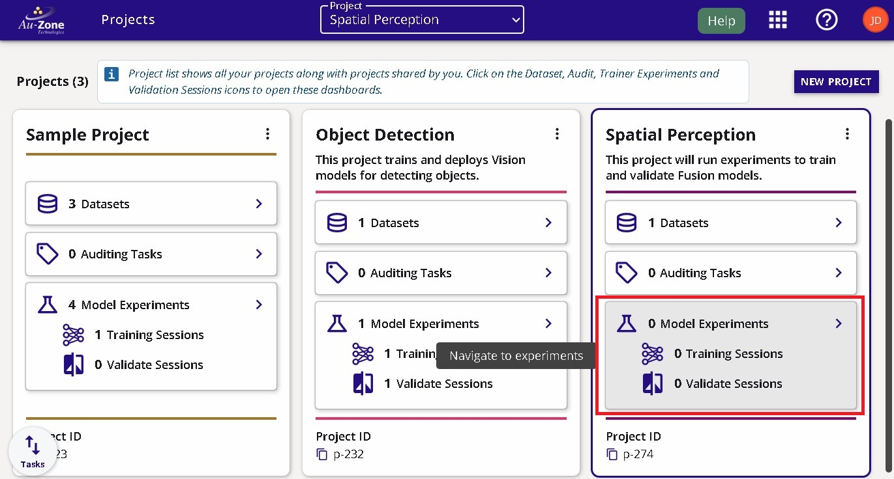{ align=center }
<figcaption>Model Experiments</figcaption>
</figure>

## Create Model Experiment

You will be greeted with the "Model Experiments" page.  A new project will not have any experiments as shown below.  You will need to first create a model experiment.  As mentioned in the [EdgeFirst Studio: Overview](../../getting_started/studio.md#model-experiments), model experiments will contain both training and validation sessions. 

<figure markdown="span">
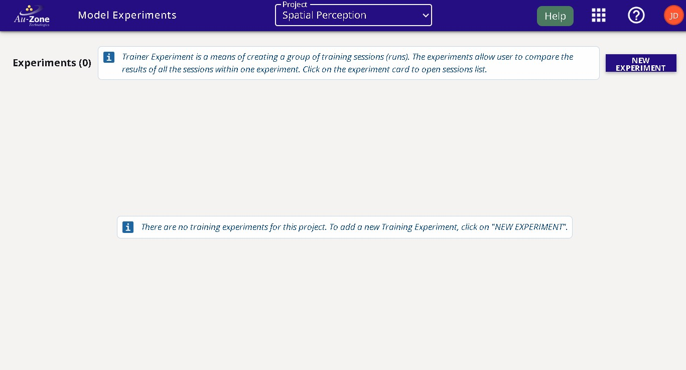{ align=center }
<figcaption>Model Experiments Page</figcaption>
</figure>

Click on the "New Experiment" button as shown on the top right corner of the page.

<figure markdown="span">
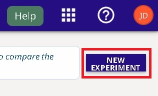{ align=center }
<figcaption>New Experiment Button</figcaption>
</figure>

Enter the name and the description of the experiment marked by the fields shown below.  Click on the "Create New Experiment" button to create your experiment.

<figure markdown="span">
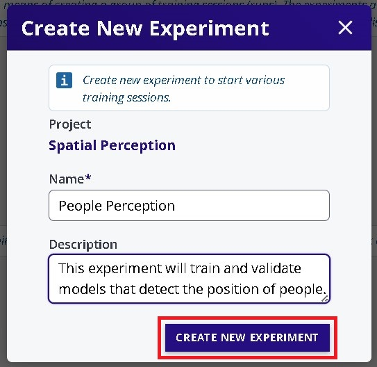{ align=center }
<figcaption>Experiment Fields</figcaption>
</figure>

Your created experiment will appear like the following below.  At the start, this experiment will contain zero training and validation sessions.  The next step will show how to start your first training session on this experiment using the dataset in the project. 

<figure markdown="span">
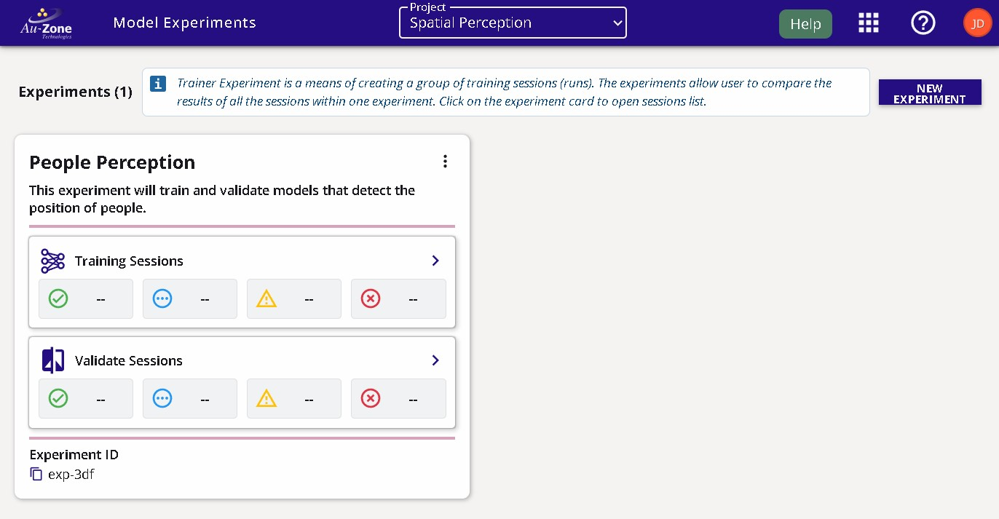{ align=center }
<figcaption>Created Experiment</figcaption>
</figure>

## Create Training Session

    <iframe width="560" height="315" src="https://www.youtube.com/embed/Q8uiYJb1HJ4?start=217&end=863" title="Training Session" frameborder="0" allow="accelerometer; autoplay; clipboard-write; encrypted-media; gyroscope; picture-in-picture; web-share" referrerpolicy="strict-origin-when-cross-origin" allowfullscreen></iframe>

In the experiment card, click the "Training Sessions" button as indicated in red below.

<figure markdown="span">
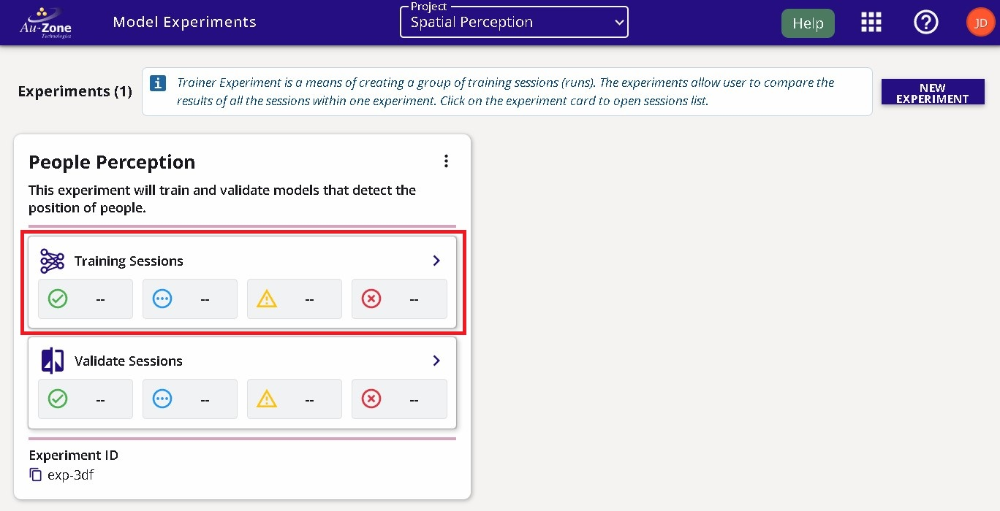{ align=center }
<figcaption>Training Sessions</figcaption>
</figure>

You will be greeted to the "Training Sessions" page as shown below.  

<figure markdown="span">
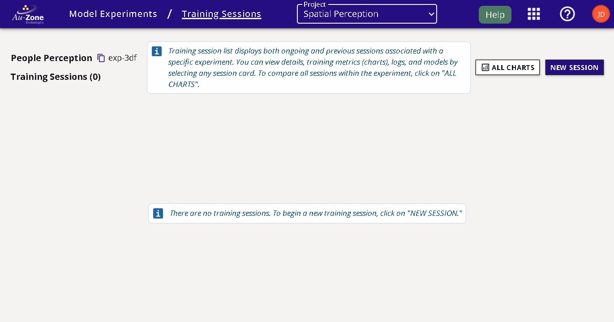{ align=center }
<figcaption>Training Sessions Page</figcaption>
</figure>

Start a training session by clicking on the "New Session" button on the top right corner of the page.

<figure markdown="span">
{ align=center }
<figcaption>New Session Button</figcaption>
</figure>

You will be greeted with the training session configuration window.  In this window, specify the "Trainer Type" to "EdgeFirst Fusion" and provide a name and description of the training session as shown below.  Next specify the dataset to be used with training and validation partitions.  In this example, the dataset specified is the "Raivin Ultra Short 25.03 (Copy)" dataset.  Next specify the training parameters.  By default, the model will be trained using both the Camera and the Radar sensors.  However, you can specify one of the sensors turned off.  This model will output an occupancy grid highlighting the positions of people in world coordinates.  Additional information on these parameters are provided by hovering over the info buttons indicated in red below.

!!! note
    For an indoor setting, the "Radar Range Mode" is typically set to "Ultra Short (9m)" and the "Object Detection Range" is set to 9 meters.  This is the maximum range of detection, further distances are ignored. 

For more information on available "Data Augmentations" please see [Vision Augmentations](../augmentations.md).

<figure markdown="span">
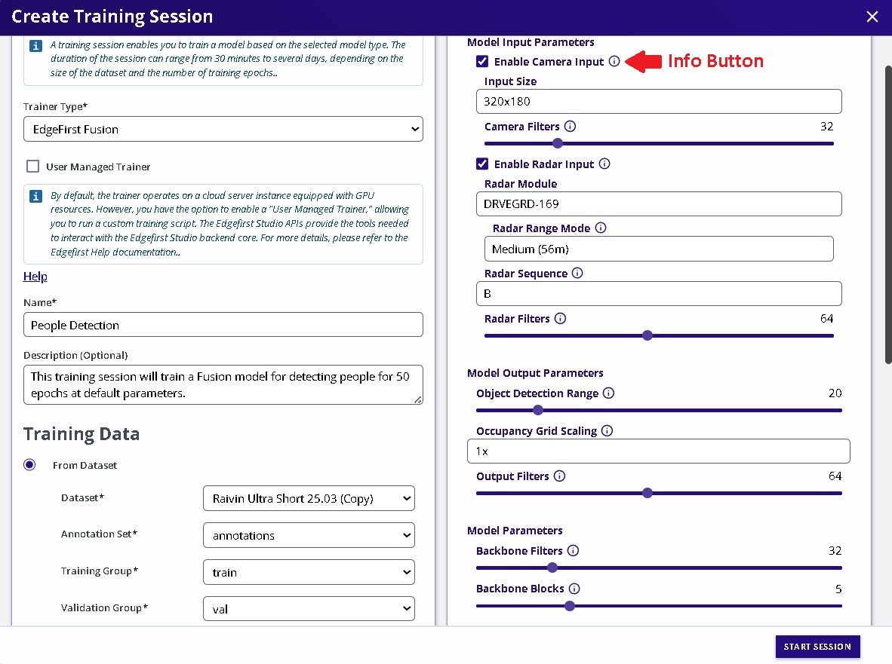{ align=center }
<figcaption>Training Session Fields</figcaption>
</figure>

Once the configuration have been made, go ahead and click on the "Start Session" button on the bottom right of the window.  This will start the training session which will train the model for the number of epochs specified. 

## Session Progress

    <iframe width="560" height="315" src="https://www.youtube.com/embed/Q8uiYJb1HJ4?start=863&end=1050" title="Training Started" frameborder="0" allow="accelerometer; autoplay; clipboard-write; encrypted-media; gyroscope; picture-in-picture; web-share" referrerpolicy="strict-origin-when-cross-origin" allowfullscreen></iframe>

Once the training session has started, the progress with the stages will be shown on the left and additional information and status is shown on the right. 

<figure markdown="span">
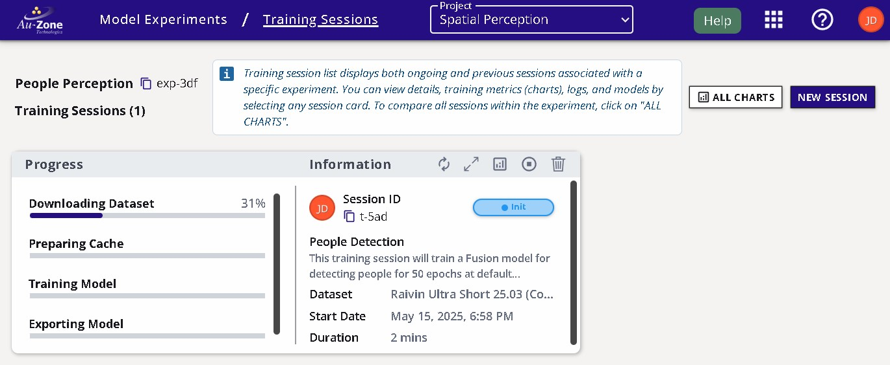{ align=center }
<figcaption>Training Session</figcaption>
</figure>

## Completed Session

The completed session will look as follows with the status set to "Complete".

<figure markdown="span">
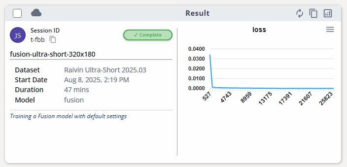{ align=center }
<figcaption>Completed Session</figcaption>
</figure>

The attributes of the training session are labeled below. 

<figure markdown="span">
{ align=center }
<figcaption>Training Session Attributes</figcaption>
</figure>

## Training Outcomes

### Training Metrics

    <iframe width="560" height="315" src="https://www.youtube.com/embed/Q8uiYJb1HJ4?start=1050&end=1355" title="Training Summary Metrics" frameborder="0" allow="accelerometer; autoplay; clipboard-write; encrypted-media; gyroscope; picture-in-picture; web-share" referrerpolicy="strict-origin-when-cross-origin" allowfullscreen></iframe>

You can view the training charts by clicking the "View Training Charts" button on the top of the session card.

<figure markdown="span">
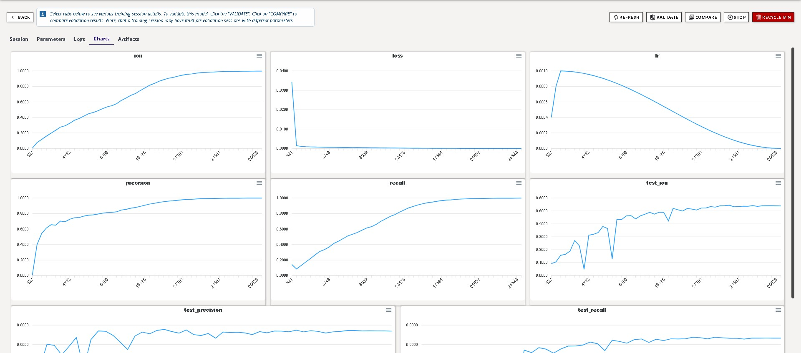{ align=center }
<figcaption>Training Charts</figcaption>
</figure>

You can go back to the training session card by pressing the "Back" button as indicated in red below on the top left corner of the page. 

<figure markdown="span">
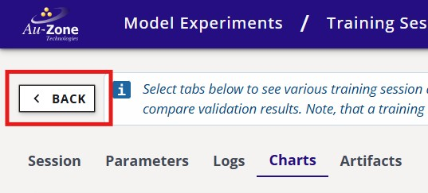{ align=center }
<figcaption>Back to the Session Card</figcaption>
</figure>

### Trained Models

    <iframe width="560" height="315" src="https://www.youtube.com/embed/Q8uiYJb1HJ4?start=1530&end=1830" title="Downloading Model" frameborder="0" allow="accelerometer; autoplay; clipboard-write; encrypted-media; gyroscope; picture-in-picture; web-share" referrerpolicy="strict-origin-when-cross-origin" allowfullscreen></iframe>

The trained model artifacts can be downloaded by clicking the "View Additional Details" button on the training session card in EdgeFirst Studio.  This will open the session details and the models are listed under the "Artifacts" tab as shown below.  Click on the downward arrow indicated in red to download the models to your PC.

| Session Details                                                | Artifacts                                                                     |
|----------------------------------------------------------------|-------------------------------------------------------------------------------|
|  |  | 

It is also possible to compare the training metrics for multiple sessions.  See [Training Sessions](../../getting_started/studio.md#training-sessions) in the EdgeFirst Studio Overview for further details. 

!!! info
    You can visualize the architecture of these models using [https://netron.app/](https://netron.app/).

## Next Steps

Now that you have generated your Fusion model, follow these next steps
for [validating your Fusion model](validation.md).