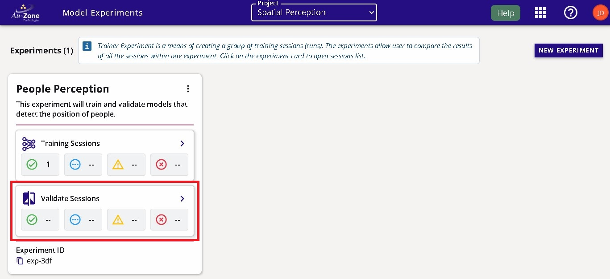
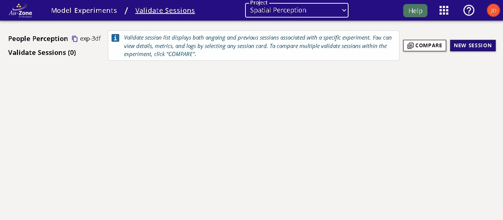

# Validating Fusion Models

This tutorial will describe the steps to validate the performance of **Fusion** models in EdgeFirst Studio that have been trained through the [end-to-end workflows](../../getting_started/workflows/index.md) or [Training Fusion](training.md).  For a tutorial to validate ModelPack Vision models, see [Validating ModelPack](../modelpack/validation.md).

    <iframe width="560" height="315" src="https://www.youtube.com/embed/oKh4k0CCLmU" title="Fusion Validation Workflow" frameborder="0" allow="accelerometer; autoplay; clipboard-write; encrypted-media; gyroscope; picture-in-picture; web-share" referrerpolicy="strict-origin-when-cross-origin" allowfullscreen></iframe>

Checkout our video tutorial above as part of the [EdgeFirst Studio Series](https://youtube.com/playlist?list=PLtgoOooyxY45Kl6pztdm4una-tHUjuIXz&si=DAmpo-gTvaSNktjw) to showcase the steps for running Fusion validation in EdgeFirst Studio.  Otherwise, follow the steps below with section specific timestamps of the video.

## Specify Project Experiments

From the projects page, choose the project that contains the training session with the models you want to validate.  In this example, the project chosen is the "Spatial Perception" project.  Next click the "Model Experiments" button as indicated in red.

<figure markdown="span">
{ align=center }
<figcaption>Model Experiments</figcaption>
</figure>

## Create Validation Session

    <iframe width="560" height="315" src="https://www.youtube.com/embed/oKh4k0CCLmU?start=117&end=278" title="Validation Session" frameborder="0" allow="accelerometer; autoplay; clipboard-write; encrypted-media; gyroscope; picture-in-picture; web-share" referrerpolicy="strict-origin-when-cross-origin" allowfullscreen></iframe>

In the experiment card, click the "Validate Sessions" button as indicated in red below.

<figure markdown="span">
{ align=center }
<figcaption>Validate Sessions</figcaption>
</figure>

You will be greeted to the "Validate Sessions" page as shown below. 

<figure markdown="span">
{ align=center }
<figcaption>Validate Sessions Page</figcaption>
</figure>

Start a validation session by clicking on the "New Session" button on the top right corner of the page. 

<figure markdown="span">
{ align=center }
<figcaption>New Session Button</figcaption>
</figure>

You will be greeted with the validation session configuration window.  In this window, specify the name of the validation session, the model to validate, and the dataset to deploy.  In this example, the TFLite model will be validated and the "Raivin Ultra Short 25.03" dataset with the validation partition will be used.  Next specify, the validation parameters such as the detection window size and the detection threshold.  Additional information on these parameters are provided by hovering over the info buttons as indicated in red below. 

The only augmentation available for this type of validation is `blur`.  See [Vision Augmentations](../augmentations.md#blur) for further details.

<figure markdown="span">
{ align=center }
<figcaption>Validation Session Fields</figcaption>
</figure>

Once the configurations have been made, go ahead and click on the "Start Session" button on the bottom right of the window.  This will start the validation session which will validate the model using the validation partition of the dataset.

## Session Progress

Once the validation session has started, the progress with the stages will be shown on the left and additional information and status is shown on the right.

<figure markdown="span">
{ align=center }
<figcaption>Validation Session</figcaption>
</figure>

## Completed Session

The completed session will look as follows with the status set to "Complete".

<figure markdown="span">
{ align=center }
<figcaption>Completed Session</figcaption>
</figure>

The attributes of the validation session are labeled below.

<figure markdown="span">
{ align=center }
<figcaption>Validation Session Attributes</figcaption>
</figure>

## Validation Metrics

    <iframe width="560" height="315" src="https://www.youtube.com/embed/oKh4k0CCLmU?start=440&end=655" title="Validation Summary Metrics" frameborder="0" allow="accelerometer; autoplay; clipboard-write; encrypted-media; gyroscope; picture-in-picture; web-share" referrerpolicy="strict-origin-when-cross-origin" allowfullscreen></iframe>

Once the validation session completes, you can view the validation metrics by clicking the "View Validation Charts" button on the top of the session card.

<figure markdown="span">
{ align=center }
<figcaption>Validation Metrics</figcaption>
</figure>

The metrics provides the precision, recall, F1, and IoU scores of the model at the specified window sizes.  Additional charts are provided for the precision vs. recall and bird’s eye view 
heatmaps describing where the model performs well and where the model makes errors.  

See [Validation Metrics](../metrics.md#modelpack) for further details.

You can go back to the validation session card by pressing the "Back" button as indicated in red below on the top left corner of the page. 

<figure markdown="span">
{ align=center }
<figcaption>Back to the Session Card</figcaption>
</figure>

## Comparing Metrics

    <iframe width="560" height="315" src="https://www.youtube.com/embed/oKh4k0CCLmU?start=713&end=975" title="Comparing Validation Metrics" frameborder="0" allow="accelerometer; autoplay; clipboard-write; encrypted-media; gyroscope; picture-in-picture; web-share" referrerpolicy="strict-origin-when-cross-origin" allowfullscreen></iframe>

It is also possible to compare validation metrics for multiple sessions.  See [Validation Sessions](../../getting_started/studio.md#validation-sessions) in the EdgeFirst Studio Overview for further details. 

## Next Steps

Now that you have validated your Fusion model, follow these next steps
for [deploying your Fusion model](deployment/raivin.md) in a Raivin Platform.