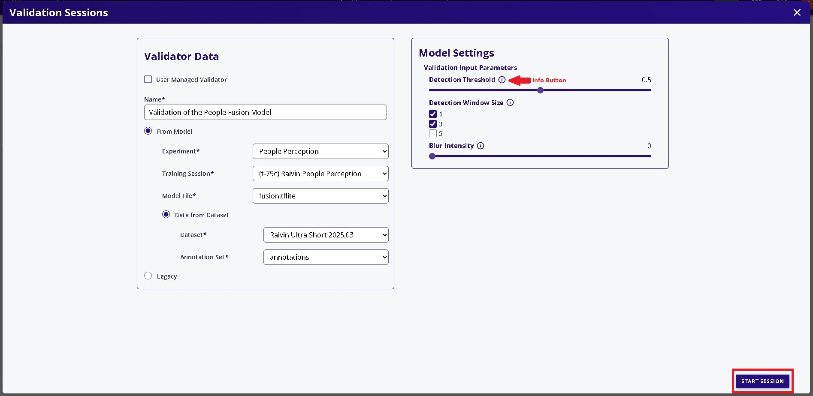
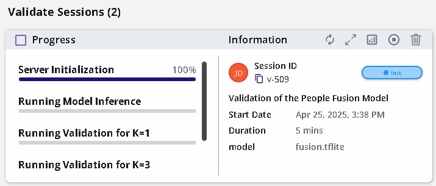
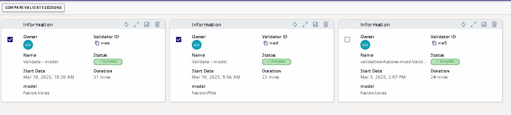
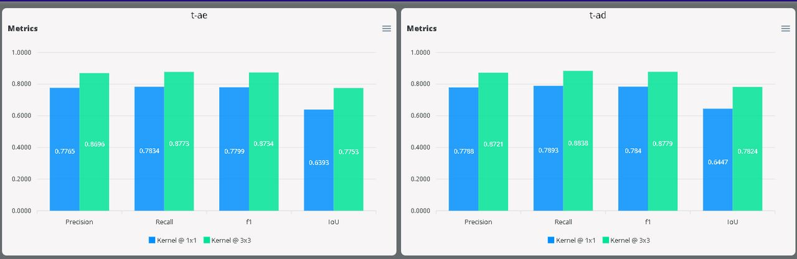

# Validating Fusion Models

This page will provide a walk-through validating the performance of 
**Fusion** models that have been trained in EdgeFirst Studio, through the [end-to-end workflows](../../getting_started/workflows.md) or [Training Fusion](training.md).  This page will focus only on the validation of Fusion models. For instructions on how to validate Vision models, please see [Validating Modelpack](../modelpack/validation.md).

    <iframe width="560" height="315" src="https://www.youtube.com/embed/oKh4k0CCLmU" title="Fusion Validation Workflow" frameborder="0" allow="accelerometer; autoplay; clipboard-write; encrypted-media; gyroscope; picture-in-picture; web-share" referrerpolicy="strict-origin-when-cross-origin" allowfullscreen></iframe>

Checkout our video tutorial above as part of the [EdgeFirst Studio Series](https://youtube.com/playlist?list=PLtgoOooyxY45Kl6pztdm4una-tHUjuIXz&si=DAmpo-gTvaSNktjw) to showcase the steps for running Fusion validation in EdgeFirst Studio.  Otherwise, follow the steps below with section specific timestamps of the video.

## Select the Validator Tool

    <iframe width="560" height="315" src="https://www.youtube.com/embed/oKh4k0CCLmU?start=106&end=117" title="EdgeFirst Fusion Validator" frameborder="0" allow="accelerometer; autoplay; clipboard-write; encrypted-media; gyroscope; picture-in-picture; web-share" referrerpolicy="strict-origin-when-cross-origin" allowfullscreen></iframe>

Select "Validate Sessions" from the tool options.

<figure markdown="span">
{ align=center }
<figcaption>Tool Options</figcaption>
</figure>

## Specify the Project

Specify the project to run validation at the center of the top menu bar.

<figure markdown="span">
{ align=center }
<figcaption>Project Selection</figcaption>
</figure>

## Create Validation Session

    <iframe width="560" height="315" src="https://www.youtube.com/embed/oKh4k0CCLmU?start=117&end=278" title="Validation Session" frameborder="0" allow="accelerometer; autoplay; clipboard-write; encrypted-media; gyroscope; picture-in-picture; web-share" referrerpolicy="strict-origin-when-cross-origin" allowfullscreen></iframe>

Create a new validation session by clicking the "NEW SESSION" button on the top right of the page.

<figure markdown="span">
{ align=center }
<figcaption>Create New Session</figcaption>
</figure>

Configure the settings on the left panel by specifying the name of the validation session, 
the model file to validate, and the dataset to deploy.  Next configure the settings on the 
right panel by specifying the validation parameters.  

Additional information on these parameters are provided by hovering over the info button.
The only augmentation available for this type of validation is `blur`.  See [Vision Augmentations](../augmentations.md#blur) for further details.

<figure markdown="span">
{ align=center }
<figcaption>Validation Options</figcaption>
</figure>

## Start the Session

Start the session by clicking the "START SESSION" button on the bottom right.

<figure markdown="span">
{ align=center }
<figcaption>Start the Session</figcaption>
</figure>

## Session Progress

The validation session has now started while the progress is tracked on the left panel 
and additional information and status is shown on the right panel.   

<figure markdown="span">
{ align=center }
<figcaption>Validation Session</figcaption>
</figure>

## Completed Session

Once completed, the status will be shown as complete.

<figure markdown="span">
{ align=center }
<figcaption>Completed Session</figcaption>
</figure>

<figure markdown="span">
{ align=center }
<figcaption>Validation Session Attributes</figcaption>
</figure>

## Validation Metrics

    <iframe width="560" height="315" src="https://www.youtube.com/embed/oKh4k0CCLmU?start=440&end=655" title="Validation Summary Metrics" frameborder="0" allow="accelerometer; autoplay; clipboard-write; encrypted-media; gyroscope; picture-in-picture; web-share" referrerpolicy="strict-origin-when-cross-origin" allowfullscreen></iframe>

The metrics are shown by clicking the button that views the validation charts on the top left of the session card.

<figure markdown="span">
{ align=center }
<figcaption>Validation Metrics</figcaption>
</figure>

The metrics provides the precision, recall, F1, and IoU scores of the model at the specified window sizes.  Additional charts are provided for the precision vs. recall and bird’s eye view 
heatmaps describing where the model performs well and where the model makes errors.  

See [Validation Metrics](../metrics.md#fusion) for further details.

## Comparing Metrics

    <iframe width="560" height="315" src="https://www.youtube.com/embed/oKh4k0CCLmU?start=713&end=975" title="Comparing Validation Metrics" frameborder="0" allow="accelerometer; autoplay; clipboard-write; encrypted-media; gyroscope; picture-in-picture; web-share" referrerpolicy="strict-origin-when-cross-origin" allowfullscreen></iframe>

It is also possible to compare validation metrics for multiple sessions.  
This is done by checking the checkboxes on the top left of the session cards.

<figure markdown="span">
{ align=center }
<figcaption>Comparing Sessions</figcaption>
</figure>

Compare the validation sessions by clicking the "COMPARE VALIDATE SESSION" button.  This will display the validation metrics side by side for the 
specified validation sessions.

<figure markdown="span">
{ align=center }
<figcaption>Metrics Side-by-Side</figcaption>
</figure>

## Next Steps

Now that you have validated your Fusion model, follow these next steps
for [deploying your Fusion model](deployment.md).