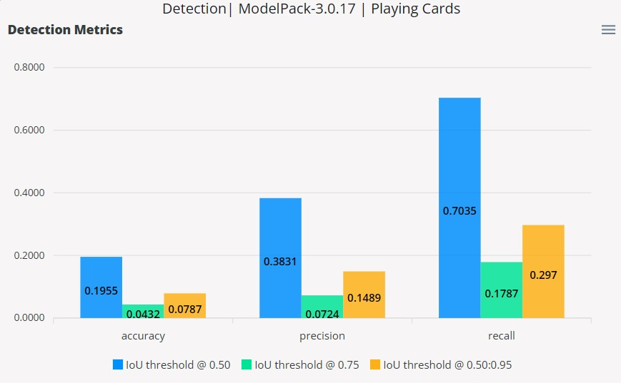
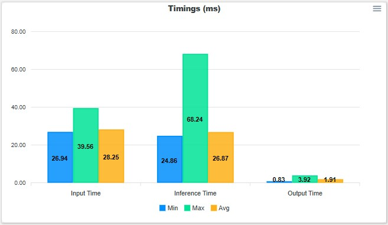
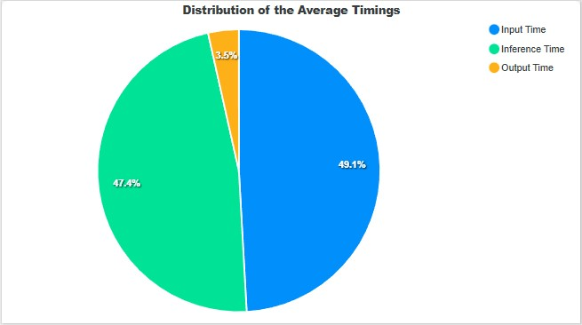
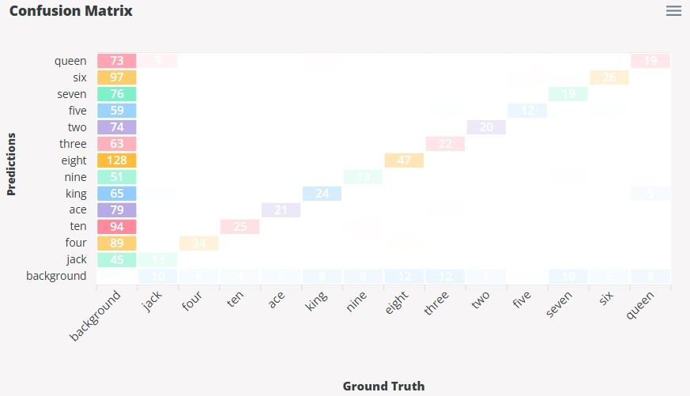
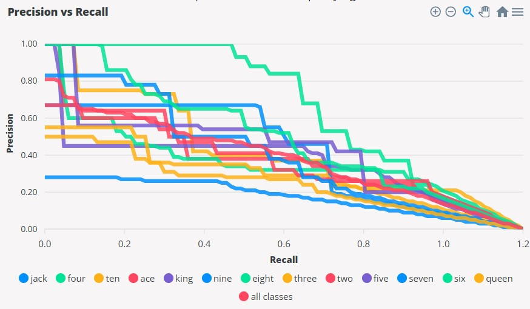

# Detection Metrics

This section will describe the validation metrics reported in [ModelPack validation sessions](../tutorials/validation.md#modelpack) for object detection.  The different types of validation methods available are Ultralytics, EdgeFirst, and YOLOv7.  These validation methods have been implemented in EdgeFirst Validator to reproduce specific metrics seen in other applications.  These metrics and their differences will be described in more detail below.

## EdgeFirst Detection Metrics

The EdgeFirst detection metrics describe the mean average precision (mAP), recall (mAR), and accuracy (mACC) at IoU thresholds 0.50, 0.75, and 0.50:0.95.  These metrics are represented as a bar chart.  Shown below is an example.

<figure markdown="span">
  { align=center }
  <figcaption>Detection Metrics</figcaption>
</figure>

### Mean Average Precision

The mAP is based on the area under the Precision versus Recall curve which plots the trade-off between precision and recall by adjusting the IoU thresholds.  The average precision is first calculated by finding the area under the Precision versus Recall curve for each class at varying IoU thresholds.  The mAP at 0.50 and 0.75 is the mean of the average precision across all classes, but only at the IoU threshold values of 0.50 and 0.75.  For the case of mAP at 0.50:0.95, the average precision at 0.50:0.95 is first calculated by taking the mean of the average precision (area under the curve) across IoU thresholds 0.50 to 0.95 in 0.05 steps.  This process is done per class and the final mAP at 0.50:0.95 is the mean of the average precision at 0.50:0.95 values across all classes.

### Mean Average Recall

This metric is calculated as the sum of the recall values of each class over the number of classes at specified IoU thresholds.  
The mean average recall at IoU thresholds 0.50 and 0.75 are calculated based on the equations below.  

$$
\text{mAR} = \frac{1}{n}\sum_{i=1}^{n}\text{recall}_{i}, n = \text{number of classes}
$$

!!! note
    The equation for recall is shown in the [Glossary](#glossary).

The metric for `mAR[0.50:0.95]` is calculated by taking the sum of mAR values at IoU thresholds 0.50, 0.55, ..., 0.95 and then dividing by the number of validation IoU thresholds (in this case 10).  

$$
\text{mAR}_{0.50-0.95} = \frac{1}{10}\sum_{i=0.50}^{n}\text{mAR}_{i}, i = \text{0.50, 0.55, 0.60, ..., 0.95}
$$

### Mean Average Accuracy

This metric is calculated as the sum of accuracy values of each class over the number of classes at specified IoU thresholds.
The mean average accuracy at IoU thresholds 0.50 and 0.75 are calculated based on the equations below.  

$$
\text{mACC} = \frac{1}{n}\sum_{i=1}^{n}\text{accuracy}_{i}, n = \text{number of classes}
$$

!!! note
    The equation for accuracy is shown in the [Glossary](#glossary).

The following equation below calculates the mean average accuracy for a range of IoU thresholds from 0.50:0.95 which is calculated similarly to mean average recall.  

$$
\text{mACC}_{0.50-0.95} = \frac{1}{10}\sum_{i=0.50}^{n}\text{mACC}_{i}, i = \text{0.50, 0.55, 0.60, ..., 0.95}
$$

## Model Timings

The model timings measures the input time, inference time, and the output time.  The input time is the time that it takes to preprocess the images which includes image normalization and image transformations such as resizing, letterbox, or padding.  The inference time is the time that it takes to run model inference on a single image.  The output time is the time that it takes to decode the model outputs into bounding boxes, masks, and scores.  These timings are represented as a bar chart showing their minimum, maximum, and average.

<figure markdown="span">
  { align=center }
  <figcaption>Model Timings</figcaption>
</figure>

Furthermore, the distribution of the average timings are also shown below as a pie chart. 

<figure markdown="span">
  { align=center }
  <figcaption>Average Timings</figcaption>
</figure>

## Confusion Matrix

The Confusion Matrix provides a summary of the prediction results by comparing the predicted labels with the ground truth (actual) labels.  This matrix will show the ground truth labels along the x-axis and the predicted labels along the y-axis.  Along the diagonal where both ground truth labels and prediction labels match shows the true positive (correct predictions) counts of that class.  However, throughout validation, the matrix shows the cases where the model can misidentify labels (false positives) or fail to find the labels (false negatives).  The first column where the ground truth label is "background" indicates the number of false positives are based on the model blindly detecting objects that are not in the image.  The last row where the prediction label is "background" indicates the number of false negatives where the model did not detect any objects that are in the image. 

<figure markdown="span">
  { align=center }
  <figcaption>Confusion Matrix</figcaption>
</figure>

## Precision versus Recall

The Precision versus Recall curve shows the trade-off between precision and recall.  At lower thresholds, precision will tend to be lower due to increased leniency for valid detections.  However, more detections will tend to result in higher recall as the model finds more ground truth labels.  Increasing the threshold will start to increase precision for more precise detections, but will start to reduce recall due to the reduction of model detections.  The following curve shows the Precision versus Recall trend for each of the classes in the dataset, along with the average curve for all the classes.  A higher area under the curve, the better the model performance as this indicates maximized values for precision and recall throughout the varying thresholds.  

<figure markdown="span">
  { align=center }
  <figcaption>Precision versus Recall</figcaption>
</figure>

## Glossary

This section will explain the definitions of key terms frequently mentioned throughout this page.

| **Term**          | **Definition**                                                                                                                                          |
|-------------------|---------------------------------------------------------------------------------------------------------------------------------------------------------|
| **True Positive** | Correct model predictions.  The model prediction label matches the ground truth label.  For object detection, the IoU and confidence scores must meet the threshold requirements.  |
| **False Positive** | Incorrect model predictions.  The model prediction label does not match the ground truth label.  |
| **False Negative** | The absence of model predictions.  For cases where the ground truth is a positive class, but the model prediction is a negative class (background).  |
| **Precision** | Proportion of correct predictions over total predictions.  $\text{precision} = \frac{\text{true positives}}{\text{true positives} + \text{false positives}}$ |
| **Recall** | Proportion of correct predictions over total ground truth.  $\text{recall} = \frac{\text{true positives}}{\text{true positives} + \text{false negatives}}$ |
| **Accuracy** | Proportion of correct predictions over the union of total predictions and ground truth.  $\text{accuracy} = \frac{\text{true positives}}{\text{true positives} + \text{false negatives} + \text{false positives}}$ |
| **IoU** | The intersection over union.  $\text{IoU} = \frac{\text{intersection}}{\text{union}} = \frac{\text{true positives}}{\text{true positives} + \text{false positives} + \text{false negatives}}$ |