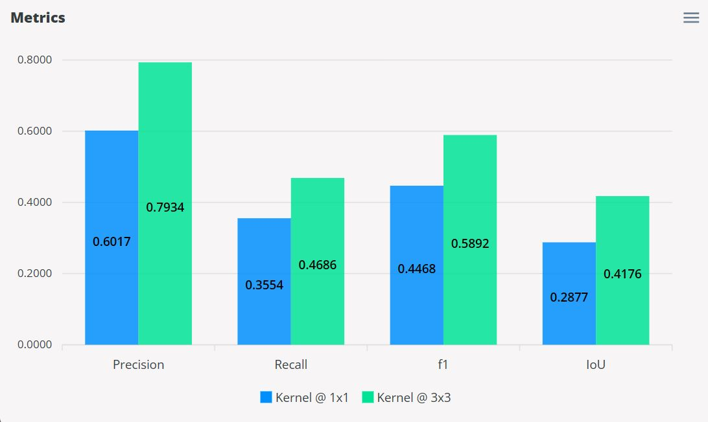
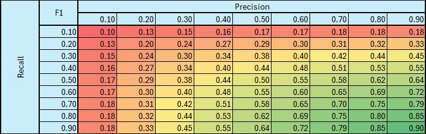
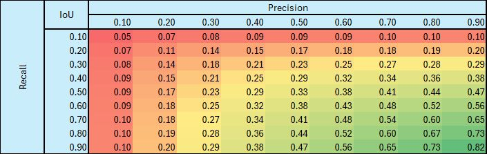
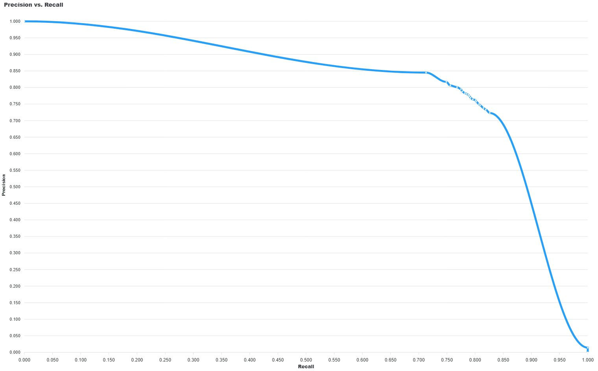
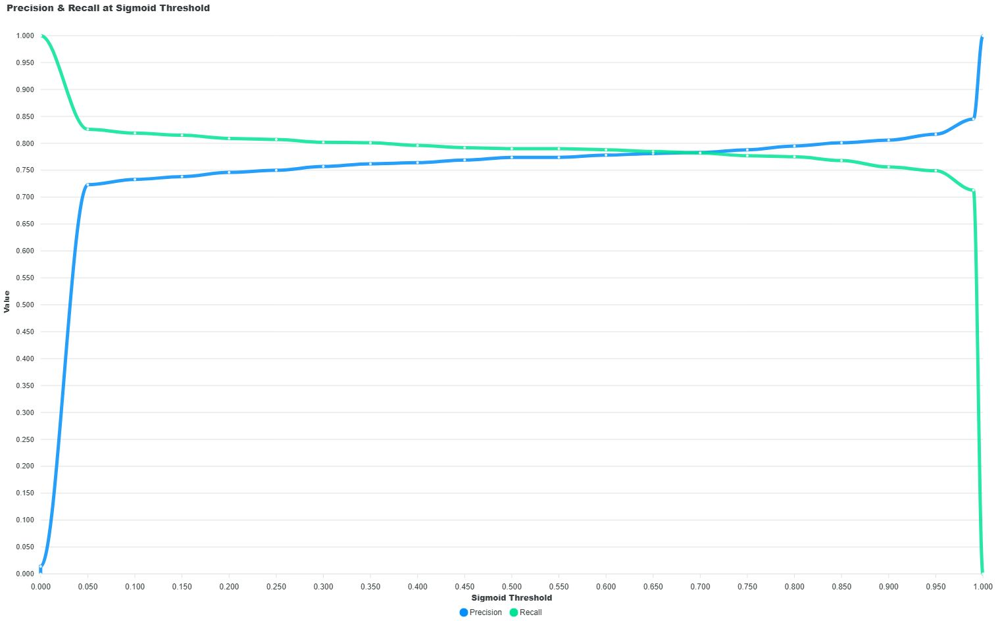
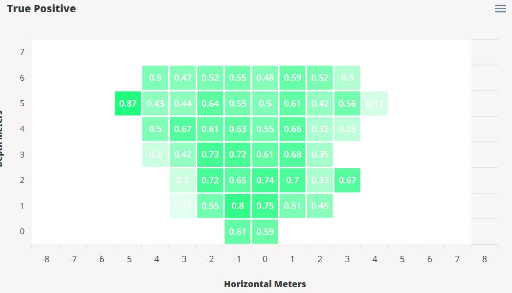
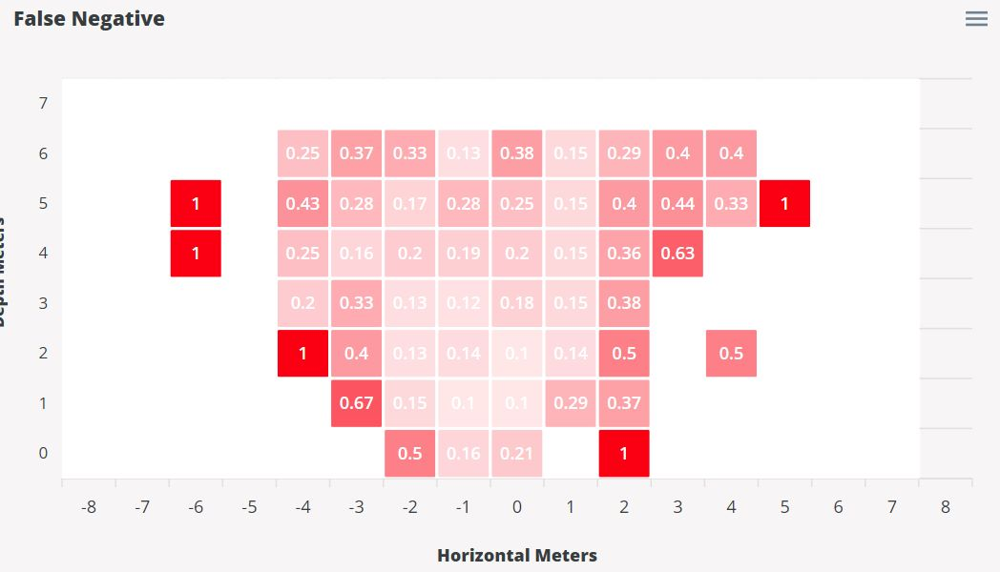
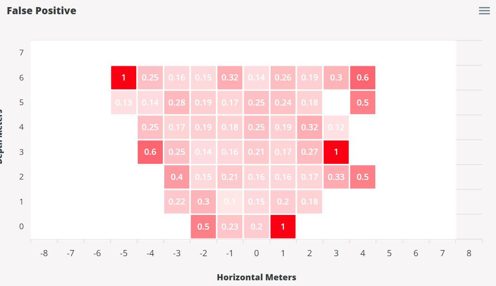
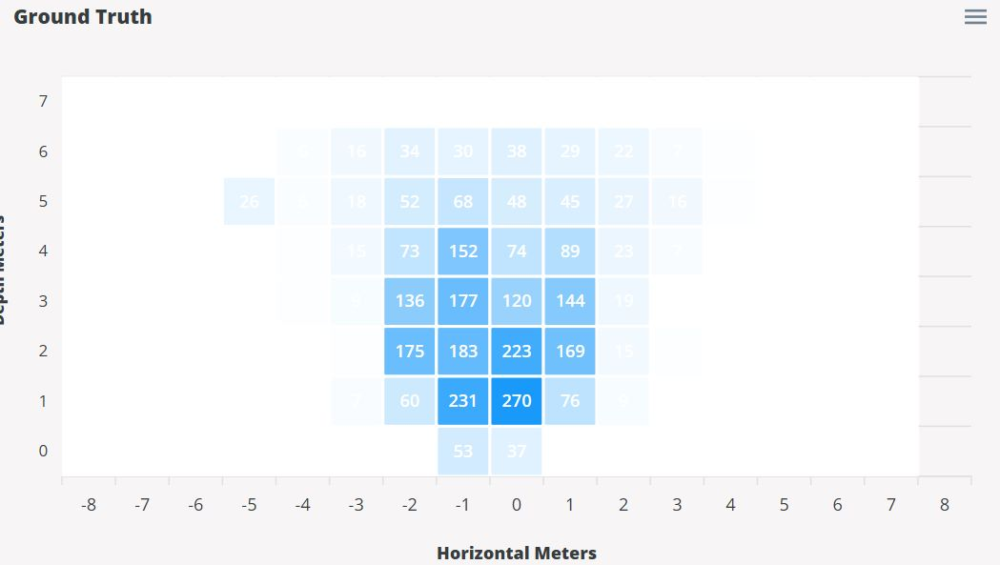

# Fusion Metrics

This section will describe the validation metrics reported in [Fusion validation sessions](../tutorials/validation.md#fusion).  

## Base Metrics

The Fusion validation sessions reports the metrics for precision, recall, F1-score, and IoU represented as a bar chart.  Shown below is an example.  

<figure markdown="span">
  { align=center }
  <figcaption>Base Metrics</figcaption>
</figure>

By default, these metrics are calculated based on the kernel sizes 1x1 and 3x3 which can be configured when starting a new session (*See [Fusion Validation](../fusion/validation.md#create-validation-session)*).  The kernel size is the window size setting where a kernel size of 1x1 indicates a 1-to-1 match between the ground truth and the model occupancy grid.  A prediction can only be correct in a 1x1 kernel if the position of the prediction is in the same position as the ground truth.  However, increasing the kernel size is more lenient by allowing predictions to be correct if their positions are within 3 meters away (3x3 kernel) from the ground truth.  

The metrics and their equations are described below.

### Precision

This metric is based on how well the model makes correct predictions.  In other words, out of the total predictions, how many of these predictions were correct.  The equation for precision is shown in the [Glossary](detection.md#glossary).

### Recall

This metric is based on how well the model finds the ground truth.  In other words, out of the total ground truth, how many were found by the model.  The equation for recall shown in the [Glossary](detection.md#glossary).

### F1-Score

This metric is based on both precision and recall.  It measures how well the model performs overall in terms of how well the model makes correct predictions and finds the ground truth.  The following table demonstrates the nature of the F1-score as a function of precision and recall.

<figure markdown="span">
  { align=center }
  <figcaption>F1-Score</figcaption>
</figure>

The table highlights how F1 is the average between precision and recall over the diagonal where both precision and recall are equal.  Furthermore, it also highlights how the F1-score needs both precision and recall to have very good scores in order to have a very good F1-score.  As an example, consider a recall of 0.90, but a precision of 0.10, the final value of the F1-score is 0.18 which is quite poor.  The same is true if the roles were switched where precision is 0.90, but recall is 0.10.  The nature of the F1-score indicates that a well performing model requires both precision and recall to be high.  

It is also important to note that for certain use-cases precision is more important over recall and vice versa.  For example, an application in the farming industry for identifying good crops versus bad crops, one would argue that precision is more important than recall.  It would be better to miss a bad crop than to identify a good crop as a bad crop.  Another example for an application in safety that requires detection of people, one would argue that recall is more important than precision.  It is better to misidentify an object for being a person than to miss an actual person in the scene.   

The equation for the F1-score is shown below.

$$
\text{F1-score} = \frac{2 * precision * recall}{precision + recall}
$$

### IoU

This metric is defined as the intersection over union.  It also measures how well the model performs overall by comparing the amount of correct predictions over the total amount of ground truths and the model predictions.  This metric, however, is not as lenient as the F1-score as demonstrated by the following table.

<figure markdown="span">
  { align=center }
  <figcaption>IoU Score</figcaption>
</figure>

Along the diagonal, it is easier to see why the IoU metric is not as lenient as the F1-score.  It shows how for an equal value of precision and recall, the final IoU score is lower than the average.  For example, a precision of 0.10 and a recall of 0.10, the IoU is 0.05 which is half of the average value.  The scores are always lower than the average between the precision and recall, but as both precision and recall increases, the final IoU score approaches the average, but still does not reach it.  Furthermore, the IoU scores also requires both precision and recall to have very high scores in order for the IoU to have a very high score.  For example, if recall is 0.90 and precision is 0.10, the final IoU score is 0.10.  The same is true if precision is 0.90 and recall is 0.10.  This shows that a well performing model have very good scores for both precision and recall.  

The equation for the IoU score is shown below.

$$
\text{IoU} = \frac{\text{intersection}}{\text{union}} = \frac{\text{true positives}}{\text{true positives} + \text{false positives} + \text{false negatives}}
$$

## Model Timings

These timings are measured in the same way as ModelPack as described under the [Model Timings](detection.md#model-timings) section.

## Precision versus Recall

The Precision versus Recall curve is based on varying detection thresholds from 0 to 1 in 0.05 steps.  The principle in practice is that for lower thresholds precision is low, but recall is high and as the threshold increases, precision increases and recall decreases.  This shows the tradeoff between precision and recall.  The nature of this tradeoff is due to increased detections at low threshold thus capturing more ground truths (high recall) but much more prone to false predictions (low precision).  The opposite is true for high thresholds.  A well performing model shows a high area under the curve of the Precision versus Recall curve.  

<figure markdown="span">
  { align=center }
  <figcaption>Precision versus Recall</figcaption>
</figure>

Another representation of the Precision versus Recall is to incorporate the varying threshold in the plot.  The following curve shows the "Precision and Recall versus Thresholds" curve.  At lower thresholds, precision is low and recall is high.  By increasing the threshold, we can see precision and recall converge.  The point of convergence indicates the ideal threshold to use for deploying the model.  This is the optimum threshold where precision and recall are balanced such that one is not sacrificing the other.  

<figure markdown="span">
  { align=center }
  <figcaption>Precision and Recall vs Thresholds</figcaption>
</figure>

## BEV Heatmaps

There are four BEV heatmaps generated.  The heatmaps are a representation of the occupancy grid that is the output of the Radar model.  This occupancy grid is the field of view of the model that represents positions in the scene in meters.  The BEV heatmaps provides indications where the model is generally making right or wrong predictions.  Furthermore, the heatmaps also indicate how the ground truth is distributed across the dataset.  

!!! note
    On a cell by cell basis, the sum of true positive, false positive, and false negative rates equals 1.

### True Positives Heatmap

<figure markdown="span">
  { align=center }
  <figcaption>True Positive Heatmap</figcaption>
</figure>

The measurement is based on each cell.  For each cell, what % of the sum of true positives, false positives, and false negatives were true positives.  The equation for this heatmap is the following.

$$
\text{cell outcome} = \frac{\text{true positives}}{\text{true positives} + \text{false positives} + \text{false negatives}}
$$

### False Negatives Heatmap

<figure markdown="span">
  { align=center }
  <figcaption>False Negative Heatmap</figcaption>
</figure>

The measurement is based on each cell.  For each cell, what % of the sum of true positives, false positives, and false negatives were false negatives.  The equation for this heatmap is the following.

$$
\text{cell outcome} = \frac{\text{false negatives}}{\text{true positives} + \text{false positives} + \text{false negatives}}
$$

### False Positives Heatmap

<figure markdown="span">
  { align=center }
  <figcaption>False Positive Heatmap</figcaption>
</figure>

This measurement is based on each cell.  For each cell, what % of the sum of true positives, false positives, and false negatives were false positives.  The equation for this heatmap is the following.

$$
\text{cell outcome} = \frac{\text{false positives}}{\text{true positives} + \text{false positives} + \text{false negatives}}
$$

### Ground Truth Heatmap

<figure markdown="span">
  { align=center }
  <figcaption>Ground Truth Heatmap</figcaption>
</figure>

This measurement is purely based on the ground truth counts.  This heatmap provides indications of the concentration of samples in the dataset.  This heatmap has no equation, it is the collection of ground truth counts throughout the experiment.